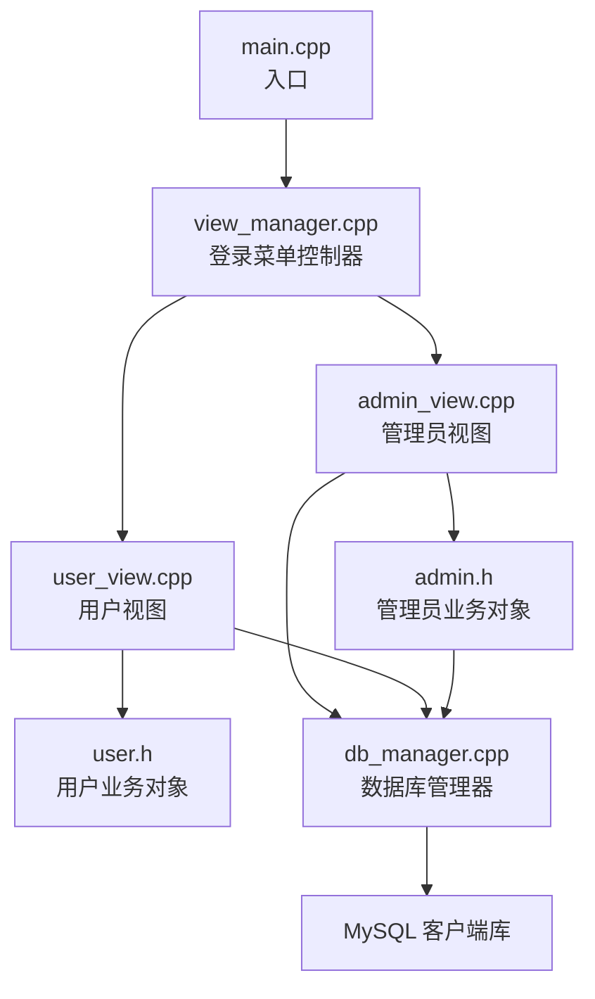
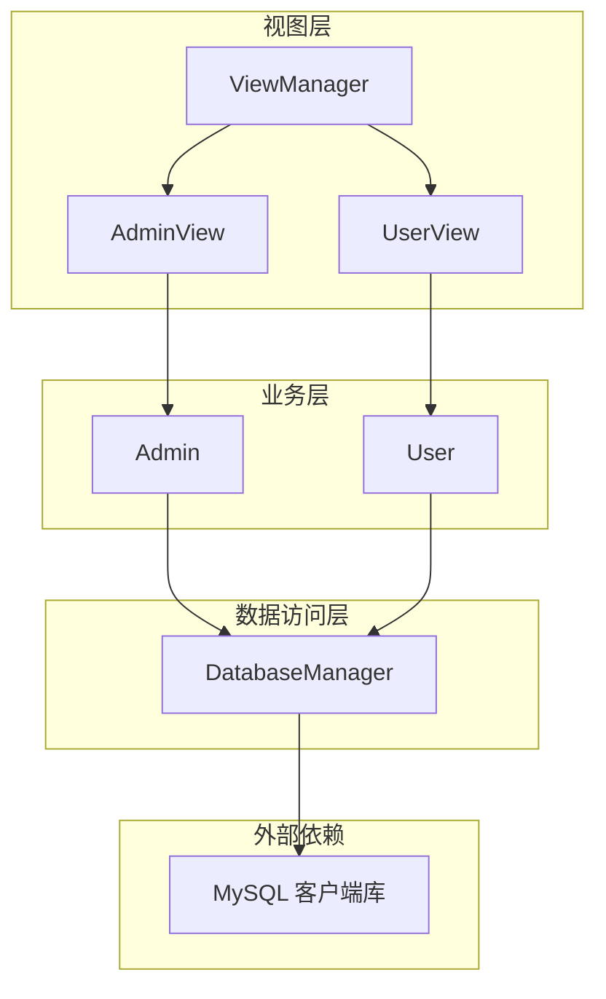
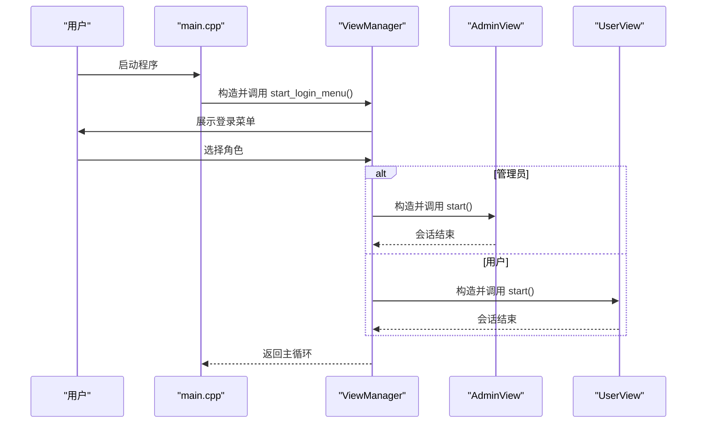
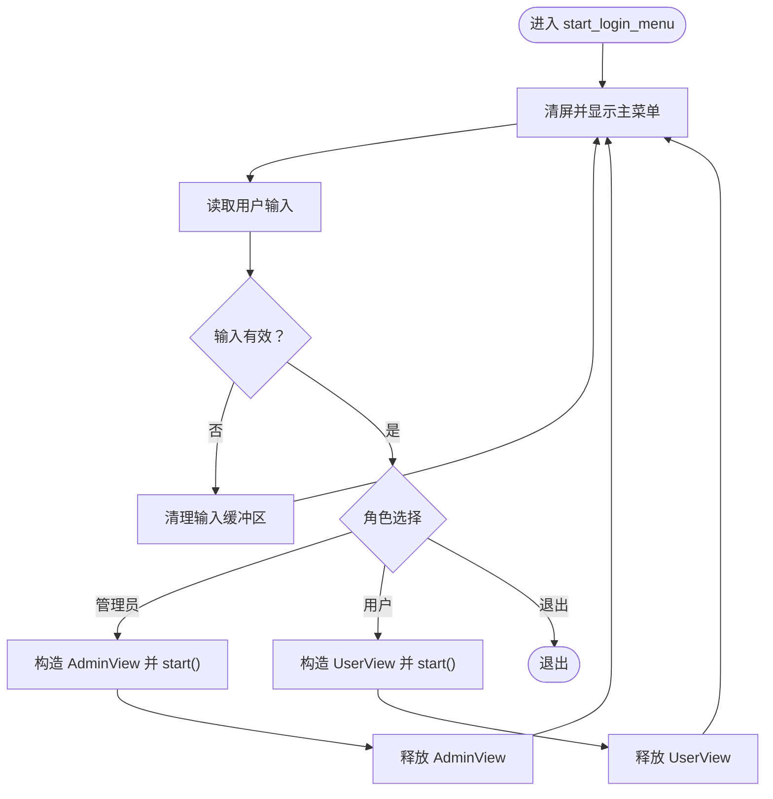
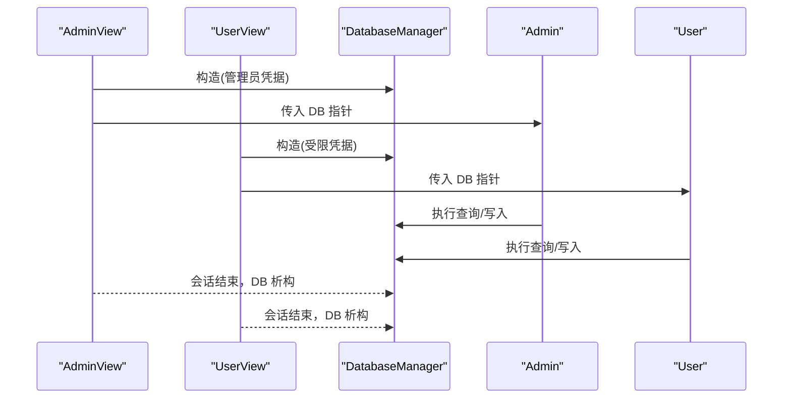
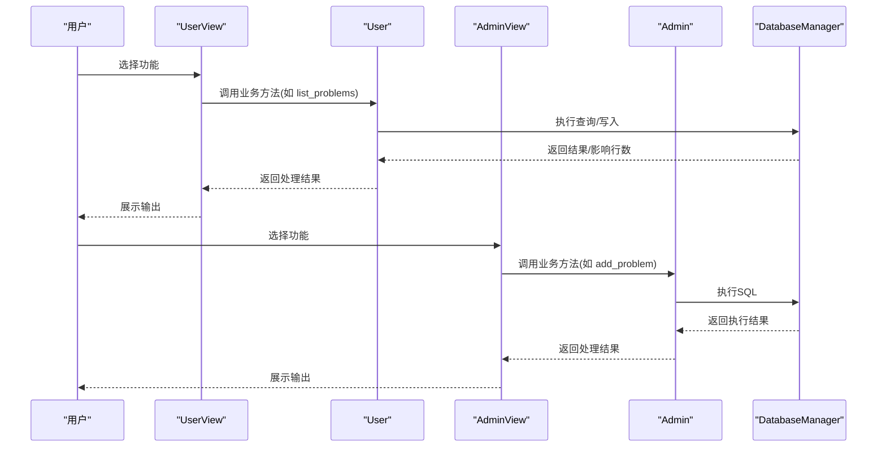
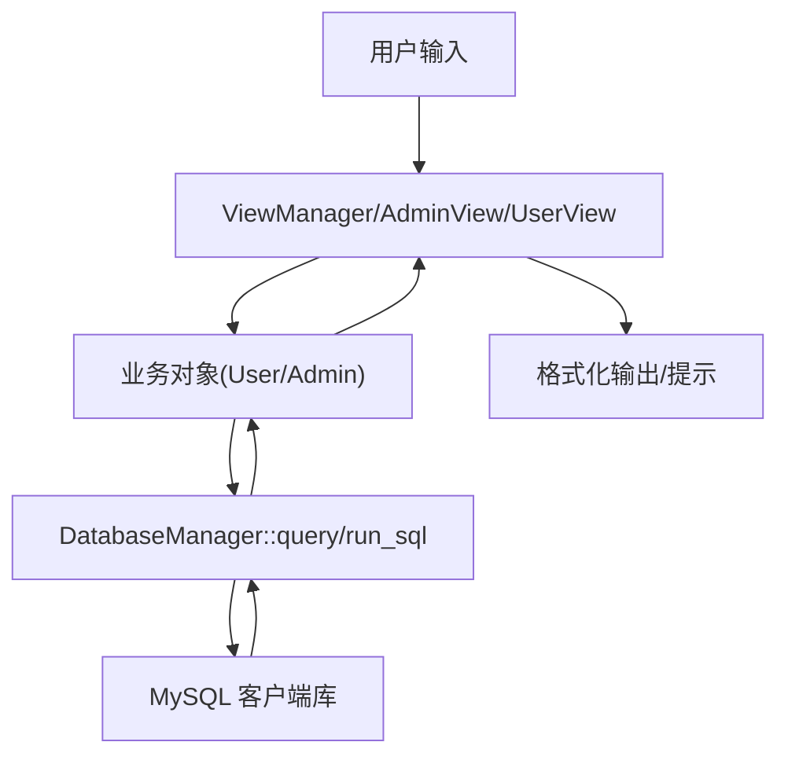
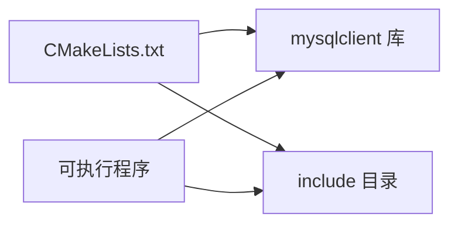

# 组件交互与数据流

<cite>
**本文引用的文件**
- [src/main.cpp](file://src/main.cpp)
- [src/view_manager.cpp](file://src/view_manager.cpp)
- [include/view_manager.h](file://include/view_manager.h)
- [src/admin_view.cpp](file://src/admin_view.cpp)
- [include/admin_view.h](file://include/admin_view.h)
- [src/user_view.cpp](file://src/user_view.cpp)
- [include/user_view.h](file://include/user_view.h)
- [include/admin.h](file://include/admin.h)
- [include/user.h](file://include/user.h)
- [src/db_manager.cpp](file://src/db_manager.cpp)
- [include/db_manager.h](file://include/db_manager.h)
- [include/color_codes.h](file://include/color_codes.h)
- [CMakeLists.txt](file://CMakeLists.txt)
- [init.sql](file://init.sql)
</cite>

## 目录
1. [简介](#简介)
2. [项目结构](#项目结构)
3. [核心组件](#核心组件)
4. [架构总览](#架构总览)
5. [详细组件分析](#详细组件分析)
6. [依赖分析](#依赖分析)
7. [性能考虑](#性能考虑)
8. [故障排查指南](#故障排查指南)
9. [结论](#结论)
10. [附录](#附录)

## 简介
本文件面向OJ系统的组件交互与数据流进行深入分析，覆盖以下主题：
- 主程序启动流程与入口点职责
- ViewManager控制流程与菜单驱动机制
- 数据库连接建立时机与连接生命周期
- 业务逻辑调用链（管理员与用户视图层到业务对象）
- 完整数据流图：从用户输入到数据库查询再到结果返回
- 组件解耦设计：接口抽象、依赖注入、错误传播
- 异步处理、并发控制与事务管理策略现状与建议
- 具体调用序列图与时序图

## 项目结构
项目采用“头文件声明 + 源文件实现”的分层组织方式，核心模块如下：
- 入口与界面控制：main.cpp、view_manager.*
- 角色视图：admin_view.*、user_view.*
- 业务对象：admin.h、user.h
- 数据访问：db_manager.*

图表来源
- [src/main.cpp:1-12](file://src/main.cpp#L1-L12)
- [src/view_manager.cpp:1-73](file://src/view_manager.cpp#L1-L73)
- [src/admin_view.cpp:1-125](file://src/admin_view.cpp#L1-L125)
- [src/user_view.cpp:1-221](file://src/user_view.cpp#L1-L221)
- [src/db_manager.cpp:1-176](file://src/db_manager.cpp#L1-L176)

章节来源
- [CMakeLists.txt:1-36](file://CMakeLists.txt#L1-L36)

## 核心组件
- ViewManager：命令行界面主控制器，负责登录菜单与角色选择，按需实例化AdminView或UserView，并在会话结束后释放资源。
- AdminView：管理员模式入口，建立管理员专用数据库连接，提供题目列表、详情查看与发布题目的操作。
- UserView：用户模式入口，建立受限权限数据库连接，提供登录/注册、题目浏览、代码提交、提交记录查看与密码修改等操作。
- Admin/User：业务对象，封装管理员与用户相关的业务逻辑，依赖DatabaseManager执行数据库操作。
- DatabaseManager：数据库访问层，封装连接、查询、执行SQL文件等功能。

章节来源
- [include/view_manager.h:1-43](file://include/view_manager.h#L1-L43)
- [include/admin_view.h:1-53](file://include/admin_view.h#L1-L53)
- [include/user_view.h:1-83](file://include/user_view.h#L1-L83)
- [include/admin.h:1-40](file://include/admin.h#L1-L40)
- [include/user.h:1-89](file://include/user.h#L1-L89)
- [include/db_manager.h:1-58](file://include/db_manager.h#L1-L58)

## 架构总览
系统采用“视图层-业务层-数据访问层”三层结构，通过ViewManager统一调度，按角色动态加载对应视图；业务对象持有DatabaseManager指针完成数据操作；数据库连接在进入具体角色视图时按需建立，避免不必要的连接开销。

图表来源
- [src/view_manager.cpp:28-66](file://src/view_manager.cpp#L28-L66)
- [src/admin_view.cpp:12-66](file://src/admin_view.cpp#L12-L66)
- [src/user_view.cpp:17-109](file://src/user_view.cpp#L17-L109)
- [src/db_manager.cpp:8-20](file://src/db_manager.cpp#L8-L20)

## 详细组件分析

### 主程序启动流程
- main函数创建ViewManager实例并启动登录菜单。
- 登录菜单根据用户选择进入管理员或用户视图。
- 视图退出后回到登录菜单，直至用户选择退出。

图表来源
- [src/main.cpp:3-11](file://src/main.cpp#L3-L11)
- [src/view_manager.cpp:28-66](file://src/view_manager.cpp#L28-L66)

章节来源
- [src/main.cpp:1-12](file://src/main.cpp#L1-L12)
- [src/view_manager.cpp:12-73](file://src/view_manager.cpp#L12-L73)

### ViewManager控制流程与菜单驱动
- 清屏与菜单展示：提供清屏、菜单显示与输入清理功能。
- 登录菜单循环：接收用户输入，分支到管理员或用户视图；异常输入进行清理与提示。
- 角色视图生命周期：构造视图对象，执行start()，随后重置指针释放资源。

图表来源
- [src/view_manager.cpp:28-66](file://src/view_manager.cpp#L28-L66)
- [src/view_manager.cpp:12-15](file://src/view_manager.cpp#L12-L15)
- [src/view_manager.cpp:68-72](file://src/view_manager.cpp#L68-L72)

章节来源
- [include/view_manager.h:11-40](file://include/view_manager.h#L11-L40)
- [src/view_manager.cpp:17-73](file://src/view_manager.cpp#L17-L73)

### 数据库连接建立时机与生命周期
- 连接建立：管理员视图与用户视图在其start()中分别以不同账号建立数据库连接。
- 连接持有：业务对象通过构造函数接收DatabaseManager指针，实现依赖注入。
- 生命周期：视图退出时显式重置智能指针，确保析构释放连接资源。

图表来源
- [src/admin_view.cpp:17-22](file://src/admin_view.cpp#L17-L22)
- [src/user_view.cpp:23-28](file://src/user_view.cpp#L23-L28)
- [src/db_manager.cpp:8-20](file://src/db_manager.cpp#L8-L20)

章节来源
- [src/admin_view.cpp:8-66](file://src/admin_view.cpp#L8-L66)
- [src/user_view.cpp:8-109](file://src/user_view.cpp#L8-L109)
- [src/db_manager.cpp:13-20](file://src/db_manager.cpp#L13-L20)

### 业务逻辑调用链
- 管理员：AdminView接收用户输入，调用Admin对象方法；Admin通过DatabaseManager执行SQL。
- 用户：UserView接收用户输入，调用User对象方法；User通过DatabaseManager执行查询/写入。

图表来源
- [src/user_view.cpp:158-161](file://src/user_view.cpp#L158-L161)
- [src/admin_view.cpp:81-84](file://src/admin_view.cpp#L81-L84)
- [src/db_manager.cpp:27-58](file://src/db_manager.cpp#L27-L58)

章节来源
- [src/user_view.cpp:138-221](file://src/user_view.cpp#L138-L221)
- [src/admin_view.cpp:81-118](file://src/admin_view.cpp#L81-L118)
- [include/user.h:45-86](file://include/user.h#L45-L86)
- [include/admin.h:22-33](file://include/admin.h#L22-L33)

### 数据流图（从输入到数据库再到返回）
该图为概念性数据流示意，展示典型用户操作的数据传递路径。

（本图为概念性流程图，无需图表来源）

### 组件解耦设计
- 接口抽象：AdminView/UserView通过构造函数注入DatabaseManager指针，业务对象通过构造函数注入DatabaseManager指针，形成清晰的依赖方向。
- 依赖注入：业务对象不直接管理连接，而是通过外部传入的DatabaseManager实例进行数据访问，便于替换与测试。
- 错误传播：DatabaseManager在连接失败、查询失败、执行失败时输出错误信息并返回布尔值或空结果，上层视图根据返回值进行提示与处理。

章节来源
- [include/admin_view.h:23-24](file://include/admin_view.h#L23-L24)
- [include/user_view.h:23-24](file://include/user_view.h#L23-L24)
- [include/admin.h:15](file://include/admin.h#L15)
- [include/user.h:16](file://include/user.h#L16)
- [src/db_manager.cpp:33-37](file://src/db_manager.cpp#L33-L37)

### 异步处理、并发控制与事务管理
- 异步处理：当前实现为同步阻塞式I/O，未见异步处理机制。
- 并发控制：数据库用户采用“单一受限账号+应用层行级隔离”的策略，通过WHERE条件限定用户可见范围，避免跨用户数据泄露。
- 事务管理：未发现显式事务开启/提交/回滚逻辑，所有SQL执行均为单条语句执行。建议在关键写入操作（如提交代码、修改密码）引入事务以保证一致性。

章节来源
- [init.sql:79-96](file://init.sql#L79-L96)
- [src/user_view.cpp:177-199](file://src/user_view.cpp#L177-L199)
- [src/user_view.cpp:201-204](file://src/user_view.cpp#L201-L204)

## 依赖分析
- 编译期依赖：CMake通过pkg-config查找mysqlclient，包含头文件目录并链接库。
- 运行期依赖：程序运行依赖MySQL服务与相应用户权限配置。

图表来源
- [CMakeLists.txt:11-31](file://CMakeLists.txt#L11-L31)

章节来源
- [CMakeLists.txt:1-36](file://CMakeLists.txt#L1-L36)

## 性能考虑
- 连接复用：当前每个会话独立建立连接，建议在用户视图层引入连接池以减少频繁连接/断开的开销。
- 查询优化：批量查询与结果集处理已具备基本能力，建议对高频查询增加索引与LIMIT限制。
- I/O吞吐：命令行交互为同步阻塞，建议在需要时引入非阻塞I/O或事件循环以提升响应性。

（本节为通用性能建议，无需章节来源）

## 故障排查指南
- 登录菜单输入异常：检查输入缓冲区清理逻辑与异常分支处理。
- 数据库连接失败：确认MySQL服务状态、凭据正确性与权限授予情况。
- 查询/执行失败：查看DatabaseManager输出的错误信息，定位具体SQL语句与字段。
- 权限问题：核对init.sql中用户权限配置，确保oj_user具备所需权限。

章节来源
- [src/view_manager.cpp:36-44](file://src/view_manager.cpp#L36-L44)
- [src/admin_view.cpp:62-66](file://src/admin_view.cpp#L62-L66)
- [src/user_view.cpp:104-109](file://src/user_view.cpp#L104-L109)
- [src/db_manager.cpp:115-120](file://src/db_manager.cpp#L115-L120)
- [src/db_manager.cpp:33-37](file://src/db_manager.cpp#L33-L37)
- [init.sql:67-96](file://init.sql#L67-L96)

## 结论
本系统通过清晰的三层架构实现了良好的职责分离：视图层负责交互与流程控制，业务层封装领域逻辑，数据访问层屏蔽底层细节。数据库连接按需建立并在会话结束时释放，配合应用层行级隔离策略满足基本安全需求。建议后续引入连接池、事务管理与异步处理机制以进一步提升性能与可靠性。

## 附录
- 初始化脚本：init.sql定义了数据库结构、示例数据与用户权限，可用于快速搭建测试环境。
- 颜色常量：color_codes.h提供ANSI颜色常量，用于美化命令行输出。

章节来源
- [init.sql:1-143](file://init.sql#L1-L143)
- [include/color_codes.h:5-15](file://include/color_codes.h#L5-L15)