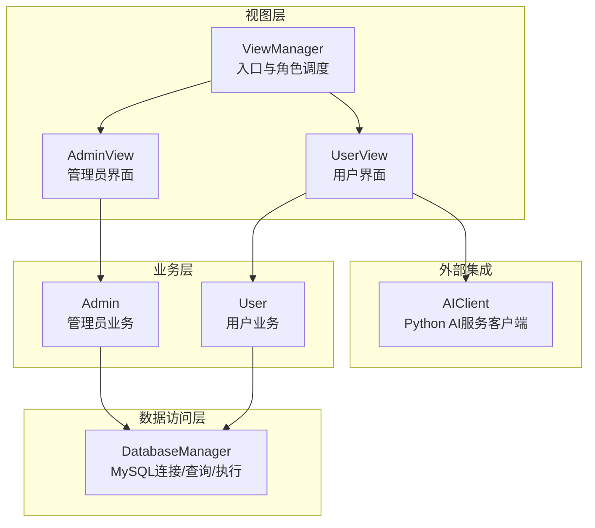
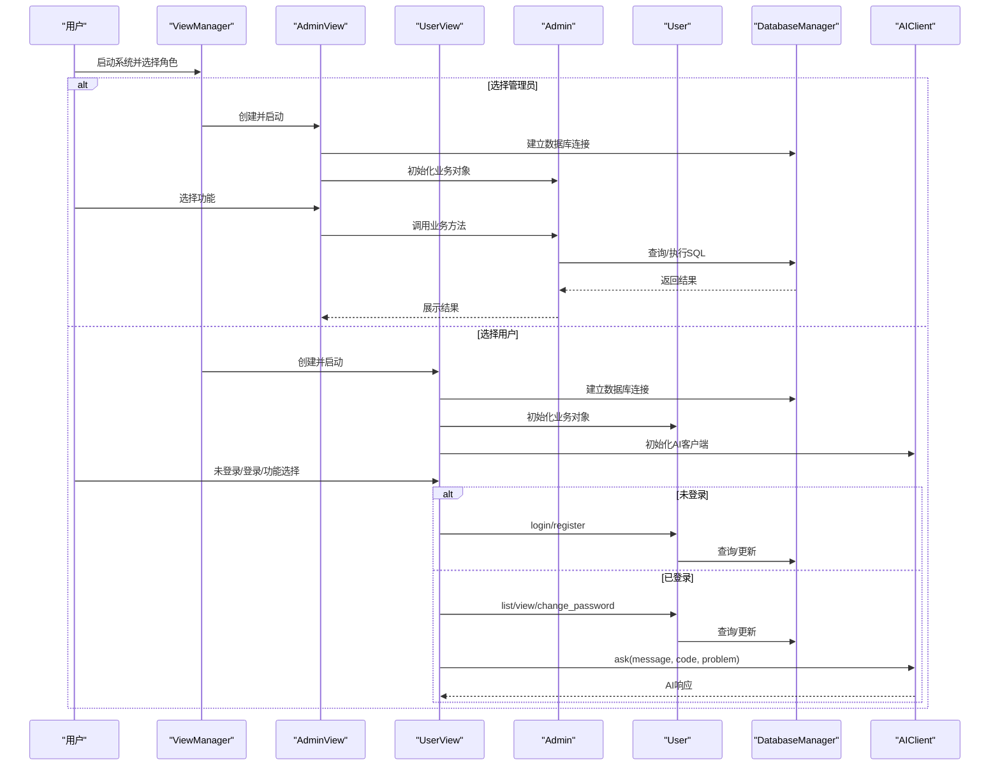
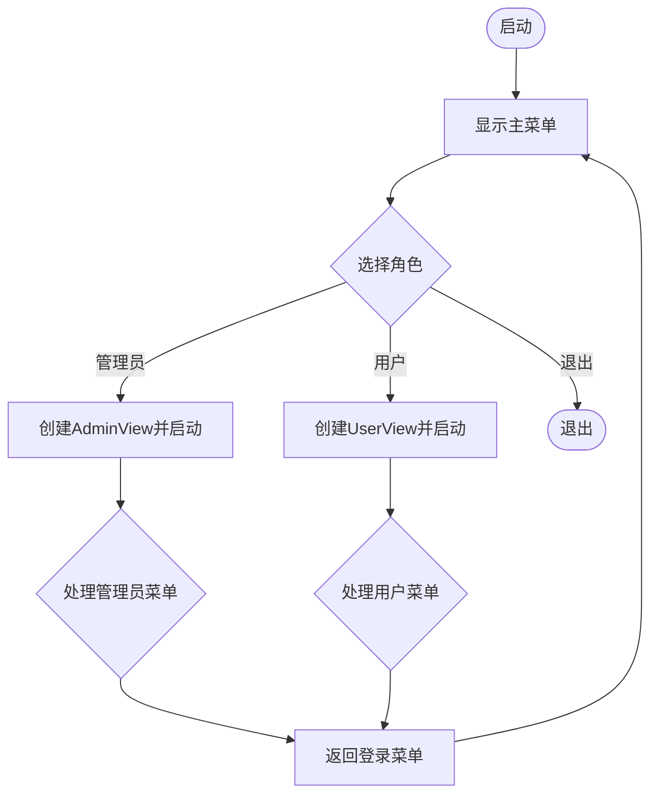
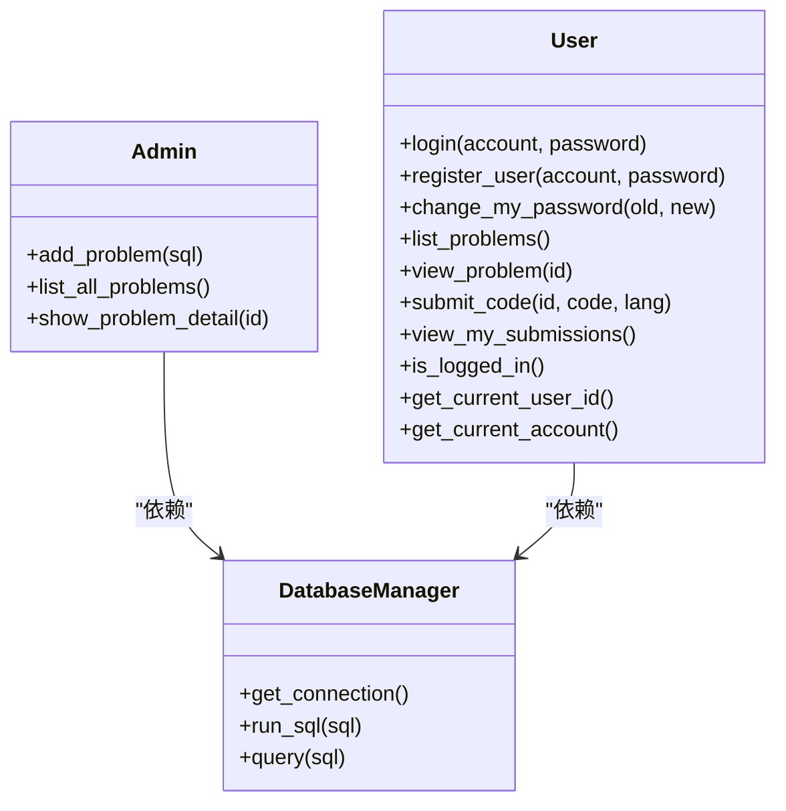
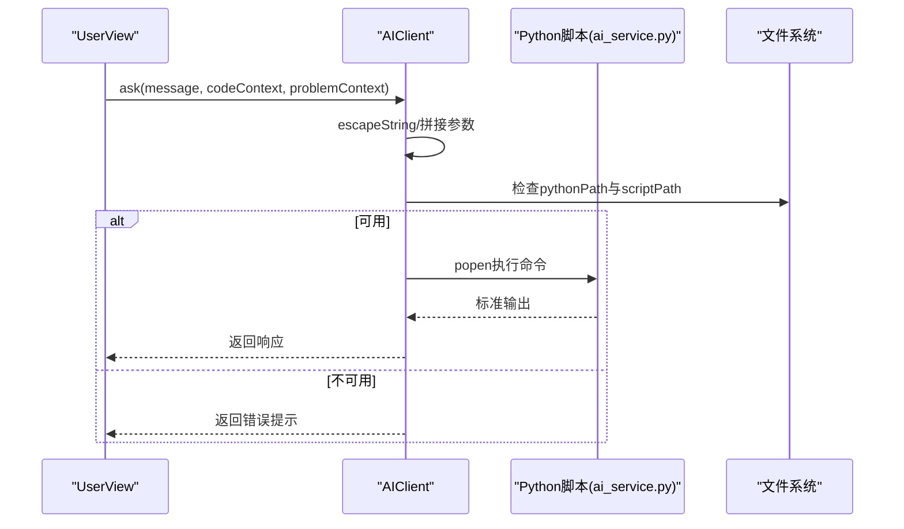
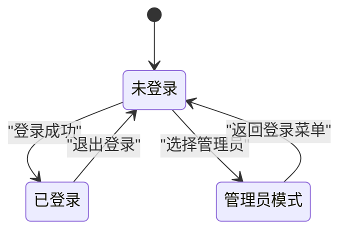
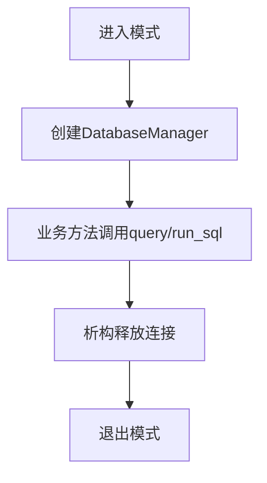
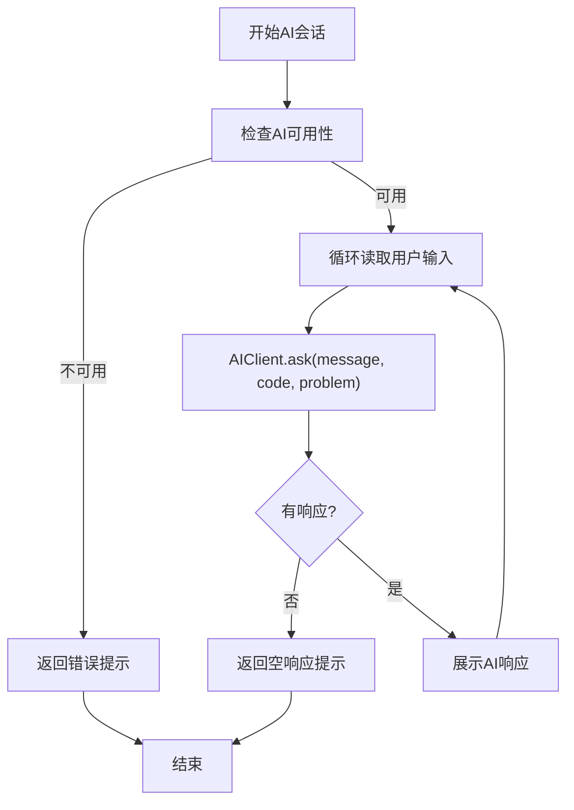
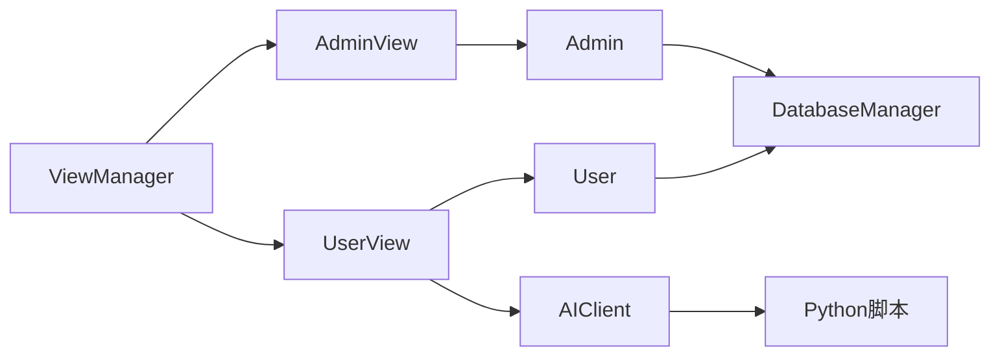

# 组件交互关系

<cite>
**本文引用的文件**
- [src/main.cpp](file://src/main.cpp)
- [src/view_manager.cpp](file://src/view_manager.cpp)
- [include/view_manager.h](file://include/view_manager.h)
- [src/admin_view.cpp](file://src/admin_view.cpp)
- [include/admin_view.h](file://include/admin_view.h)
- [src/user_view.cpp](file://src/user_view.cpp)
- [include/user_view.h](file://include/user_view.h)
- [src/admin.cpp](file://src/admin.cpp)
- [include/admin.h](file://include/admin.h)
- [src/user.cpp](file://src/user.cpp)
- [include/user.h](file://include/user.h)
- [src/db_manager.cpp](file://src/db_manager.cpp)
- [include/db_manager.h](file://include/db_manager.h)
- [src/ai_client.cpp](file://src/ai_client.cpp)
- [include/ai_client.h](file://include/ai_client.h)
</cite>

## 目录
1. [简介](#简介)
2. [项目结构](#项目结构)
3. [核心组件](#核心组件)
4. [架构总览](#架构总览)
5. [详细组件分析](#详细组件分析)
6. [依赖分析](#依赖分析)
7. [性能考虑](#性能考虑)
8. [故障排查指南](#故障排查指南)
9. [结论](#结论)
10. [附录](#附录)

## 简介
本文件面向OJ系统的组件交互关系，聚焦以下目标：
- 描述ViewManager与Admin/User模块的协作方式与控制流
- 解释业务逻辑层（Admin/User）与数据访问层（DatabaseManager）的接口调用
- 展示AI客户端（AIClient）与Python服务的外部集成流程
- 图示角色切换时的状态转换、数据库连接生命周期管理、AI服务调用的同步/异步特性
- 提供组件交互图与时序图，帮助开发者快速理解系统的动态行为与事件驱动机制

## 项目结构
系统采用分层与职责分离的设计：
- 视图层：ViewManager负责入口菜单与角色切换；AdminView/UserView分别承载管理员与用户交互逻辑
- 业务层：Admin/User封装各自业务方法（如增删改查、登录注册、密码修改、题目浏览、提交代码、查看提交记录等）
- 数据访问层：DatabaseManager封装MySQL连接、查询与执行
- 外部集成：AIClient封装对Python AI服务的调用

图表来源
- [src/view_manager.cpp:32-70](file://src/view_manager.cpp#L32-L70)
- [src/admin_view.cpp:21-76](file://src/admin_view.cpp#L21-L76)
- [src/user_view.cpp:36-131](file://src/user_view.cpp#L36-L131)
- [src/admin.cpp:10-59](file://src/admin.cpp#L10-L59)
- [src/user.cpp:11-286](file://src/user.cpp#L11-L286)
- [src/db_manager.cpp:8-100](file://src/db_manager.cpp#L8-L100)
- [src/ai_client.cpp:8-124](file://src/ai_client.cpp#L8-L124)

章节来源
- [src/main.cpp:5-12](file://src/main.cpp#L5-L12)
- [include/view_manager.h:11-43](file://include/view_manager.h#L11-L43)

## 核心组件
- ViewManager：命令行主控制器，负责启动登录菜单、接收用户选择并调度AdminView/UserView
- AdminView：管理员模式界面，负责建立数据库连接、展示菜单、调用Admin业务方法
- UserView：用户模式界面，负责建立数据库连接、登录/注册、题目浏览、提交代码、查看提交记录、调用AIClient与Python AI服务
- Admin：管理员业务逻辑，封装题目增删改查等操作
- User：用户业务逻辑，封装登录、注册、密码修改、题目浏览、提交代码、查看提交记录
- DatabaseManager：数据库连接与SQL执行封装，提供查询与执行能力
- AIClient：AI客户端，封装对Python脚本的调用，支持参数转义与管道读取

章节来源
- [include/view_manager.h:11-43](file://include/view_manager.h#L11-L43)
- [include/admin_view.h:11-58](file://include/admin_view.h#L11-L58)
- [include/user_view.h:12-92](file://include/user_view.h#L12-L92)
- [include/admin.h:10-40](file://include/admin.h#L10-L40)
- [include/user.h:10-89](file://include/user.h#L10-L89)
- [include/db_manager.h:12-53](file://include/db_manager.h#L12-L53)
- [include/ai_client.h:6-28](file://include/ai_client.h#L6-L28)

## 架构总览
系统采用“视图-业务-数据访问-外部服务”的分层架构。控制流自上而下，数据流自下而上，角色切换由ViewManager统一调度。

图表来源
- [src/view_manager.cpp:32-70](file://src/view_manager.cpp#L32-L70)
- [src/admin_view.cpp:21-76](file://src/admin_view.cpp#L21-L76)
- [src/user_view.cpp:36-131](file://src/user_view.cpp#L36-L131)
- [src/admin.cpp:10-59](file://src/admin.cpp#L10-L59)
- [src/user.cpp:11-286](file://src/user.cpp#L11-L286)
- [src/db_manager.cpp:8-100](file://src/db_manager.cpp#L8-L100)
- [src/ai_client.cpp:85-112](file://src/ai_client.cpp#L85-L112)

## 详细组件分析

### ViewManager 与 AdminView/UserView 协作
- 控制流：ViewManager在启动登录菜单后根据用户选择创建AdminView或UserView，并在其生命周期内循环处理菜单选项
- 数据流：AdminView/UserView在各自菜单中收集用户输入，调用业务对象（Admin/User），并通过DatabaseManager执行数据库操作
- 状态转换：ViewManager在角色选择后进入对应视图，退出时重置指针并返回登录菜单

图表来源
- [src/view_manager.cpp:32-70](file://src/view_manager.cpp#L32-L70)
- [src/admin_view.cpp:21-76](file://src/admin_view.cpp#L21-L76)
- [src/user_view.cpp:36-131](file://src/user_view.cpp#L36-L131)

章节来源
- [src/view_manager.cpp:32-70](file://src/view_manager.cpp#L32-L70)
- [include/view_manager.h:23-24](file://include/view_manager.h#L23-L24)

### 业务逻辑层与数据访问层接口调用
- Admin与User均持有DatabaseManager指针，在各自方法中调用query/run_sql完成数据库操作
- DatabaseManager封装MySQL连接、查询与执行，提供统一的结果集映射与错误输出
- 查询结果以向量+映射的形式返回，便于业务层按列名访问

图表来源
- [include/admin.h:10-40](file://include/admin.h#L10-L40)
- [include/user.h:10-89](file://include/user.h#L10-L89)
- [include/db_manager.h:12-53](file://include/db_manager.h#L12-L53)

章节来源
- [src/admin.cpp:10-59](file://src/admin.cpp#L10-L59)
- [src/user.cpp:11-286](file://src/user.cpp#L11-L286)
- [src/db_manager.cpp:21-57](file://src/db_manager.cpp#L21-L57)

### AI客户端与Python服务的外部集成
- AIClient负责定位Python可执行文件与Python脚本路径，支持两种运行时路径
- ask方法将消息、代码上下文、题目上下文进行转义并拼接为命令行参数，通过管道执行Python脚本
- executePython读取标准输出，去除尾部换行，返回AI响应文本
- isAvailable用于检测Python环境与脚本是否存在

图表来源
- [src/ai_client.cpp:85-112](file://src/ai_client.cpp#L85-L112)
- [src/ai_client.cpp:56-83](file://src/ai_client.cpp#L56-L83)
- [src/ai_client.cpp:114-124](file://src/ai_client.cpp#L114-L124)

章节来源
- [src/ai_client.cpp:8-124](file://src/ai_client.cpp#L8-L124)
- [include/ai_client.h:6-28](file://include/ai_client.h#L6-L28)

### 角色切换与状态转换
- 未登录态：UserView显示游客菜单，支持登录/注册/返回
- 已登录态：UserView显示用户菜单，支持题目浏览、查看题目详情、查看提交、修改密码、退出登录
- 状态转换：登录成功后刷新菜单，退出登录回到游客菜单；管理员模式独立于用户模式

图表来源
- [src/user_view.cpp:53-60](file://src/user_view.cpp#L53-L60)
- [src/user_view.cpp:159-184](file://src/user_view.cpp#L159-L184)
- [src/admin_view.cpp:21-76](file://src/admin_view.cpp#L21-L76)

章节来源
- [src/user_view.cpp:36-131](file://src/user_view.cpp#L36-L131)
- [src/admin_view.cpp:21-76](file://src/admin_view.cpp#L21-L76)

### 数据库连接生命周期管理
- 连接建立：AdminView/UserView在进入各自模式时创建DatabaseManager实例
- 连接使用：业务对象在方法中调用query/run_sql
- 连接释放：析构函数中关闭MySQL连接，避免资源泄漏

图表来源
- [src/admin_view.cpp:27-32](file://src/admin_view.cpp#L27-L32)
- [src/user_view.cpp:42-47](file://src/user_view.cpp#L42-L47)
- [src/db_manager.cpp:13-19](file://src/db_manager.cpp#L13-L19)

章节来源
- [src/db_manager.cpp:8-100](file://src/db_manager.cpp#L8-L100)

### AI服务调用的同步处理
- AIClient通过管道同步执行Python脚本，等待完整输出后返回
- 若Python脚本不可用或返回空响应，AIClient返回错误提示
- UserView在AI会话中循环读取用户输入，逐次调用AIClient.ask

图表来源
- [src/user_view.cpp:290-354](file://src/user_view.cpp#L290-L354)
- [src/ai_client.cpp:85-112](file://src/ai_client.cpp#L85-L112)

章节来源
- [src/user_view.cpp:290-354](file://src/user_view.cpp#L290-L354)
- [src/ai_client.cpp:85-112](file://src/ai_client.cpp#L85-L112)

## 依赖分析
- ViewManager依赖AdminView/UserView，二者均依赖DatabaseManager
- Admin/User依赖DatabaseManager
- UserView额外依赖AIClient
- AIClient依赖Python运行时与ai_service.py脚本

图表来源
- [include/view_manager.h:4-5](file://include/view_manager.h#L4-L5)
- [include/admin_view.h:4-5](file://include/admin_view.h#L4-L5)
- [include/user_view.h:4-6](file://include/user_view.h#L4-L6)
- [include/admin.h:4](file://include/admin.h#L4)
- [include/user.h:4](file://include/user.h#L4)
- [include/ai_client.h:4](file://include/ai_client.h#L4)

章节来源
- [include/view_manager.h:4-5](file://include/view_manager.h#L4-L5)
- [include/admin_view.h:4-5](file://include/admin_view.h#L4-L5)
- [include/user_view.h:4-6](file://include/user_view.h#L4-L6)
- [include/admin.h:4](file://include/admin.h#L4)
- [include/user.h:4](file://include/user.h#L4)
- [include/ai_client.h:4](file://include/ai_client.h#L4)

## 性能考虑
- 数据库查询：建议在高频查询场景下复用DatabaseManager实例，避免频繁创建/销毁连接
- AI调用：Python脚本执行为同步阻塞，建议在高并发场景下引入队列或异步机制
- 字符串处理：UserView在格式化题目标题时进行UTF-8宽度计算，注意大文本性能影响
- 日志与错误：DatabaseManager在失败时输出错误信息，建议在生产环境统一收集日志

## 故障排查指南
- 数据库连接失败
  - 现象：管理员/用户模式启动时报错
  - 排查：确认主机、用户名、密码、数据库名配置正确；检查MySQL服务状态
  - 参考
    - [src/admin_view.cpp:27-32](file://src/admin_view.cpp#L27-L32)
    - [src/user_view.cpp:42-47](file://src/user_view.cpp#L42-L47)
    - [src/db_manager.cpp:61-79](file://src/db_manager.cpp#L61-L79)
- AI服务不可用
  - 现象：AI助手提示服务不可用
  - 排查：确认Python可执行文件与脚本路径存在；检查虚拟环境激活与依赖安装
  - 参考
    - [src/ai_client.cpp:114-124](file://src/ai_client.cpp#L114-L124)
    - [src/ai_client.cpp:56-83](file://src/ai_client.cpp#L56-L83)
- 登录/注册失败
  - 现象：登录失败或注册失败
  - 排查：确认账号是否存在、密码哈希一致；检查数据库写入权限
  - 参考
    - [src/user.cpp:39-71](file://src/user.cpp#L39-L71)
    - [src/user.cpp:73-98](file://src/user.cpp#L73-L98)
- 提交代码/查看提交记录
  - 现象：功能占位未实现
  - 排查：等待后续实现或扩展业务逻辑
  - 参考
    - [src/user.cpp:264-286](file://src/user.cpp#L264-L286)

章节来源
- [src/admin_view.cpp:27-32](file://src/admin_view.cpp#L27-L32)
- [src/user_view.cpp:42-47](file://src/user_view.cpp#L42-L47)
- [src/db_manager.cpp:61-79](file://src/db_manager.cpp#L61-L79)
- [src/ai_client.cpp:114-124](file://src/ai_client.cpp#L114-L124)
- [src/ai_client.cpp:56-83](file://src/ai_client.cpp#L56-L83)
- [src/user.cpp:39-71](file://src/user.cpp#L39-L71)
- [src/user.cpp:73-98](file://src/user.cpp#L73-L98)
- [src/user.cpp:264-286](file://src/user.cpp#L264-L286)

## 结论
本系统通过清晰的分层设计实现了视图、业务、数据访问与外部服务的解耦。ViewManager作为入口协调角色切换，AdminView/UserView分别承载管理员与用户交互，Admin/User通过DatabaseManager完成数据操作，AIClient桥接Python AI服务。整体交互以事件驱动为主，控制流简洁明确，适合进一步扩展业务与外部集成。

## 附录
- 入口程序与启动流程参考：[src/main.cpp:5-12](file://src/main.cpp#L5-L12)
- 视图与业务类声明参考：
  - [include/view_manager.h:11-43](file://include/view_manager.h#L11-L43)
  - [include/admin_view.h:11-58](file://include/admin_view.h#L11-L58)
  - [include/user_view.h:12-92](file://include/user_view.h#L12-L92)
  - [include/admin.h:10-40](file://include/admin.h#L10-L40)
  - [include/user.h:10-89](file://include/user.h#L10-L89)
  - [include/db_manager.h:12-53](file://include/db_manager.h#L12-L53)
  - [include/ai_client.h:6-28](file://include/ai_client.h#L6-L28)