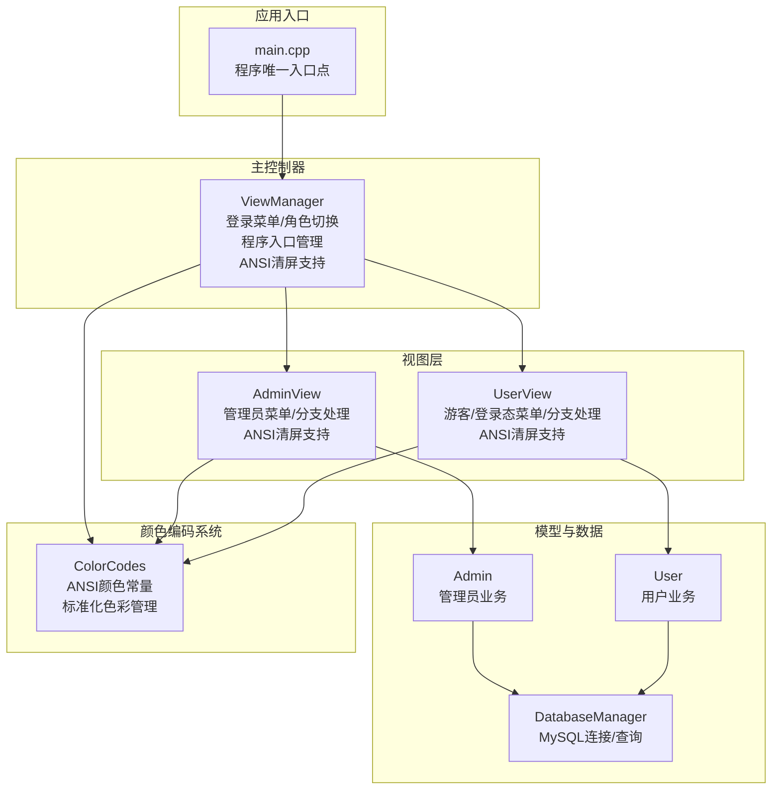
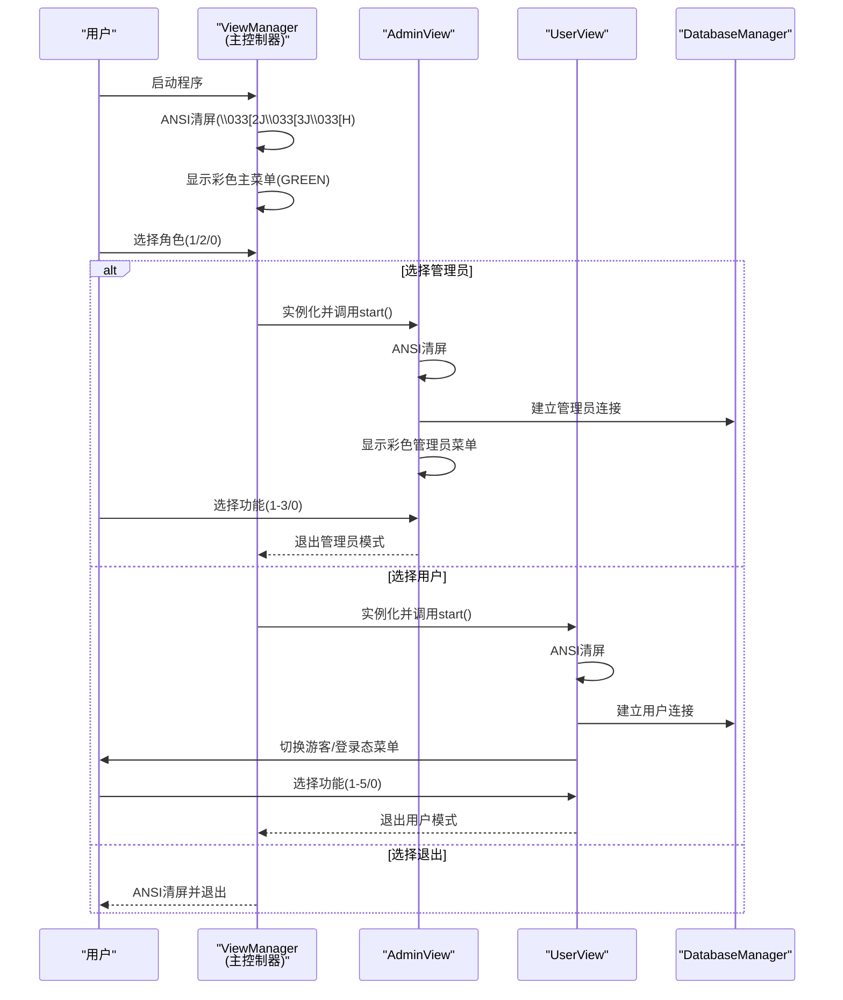
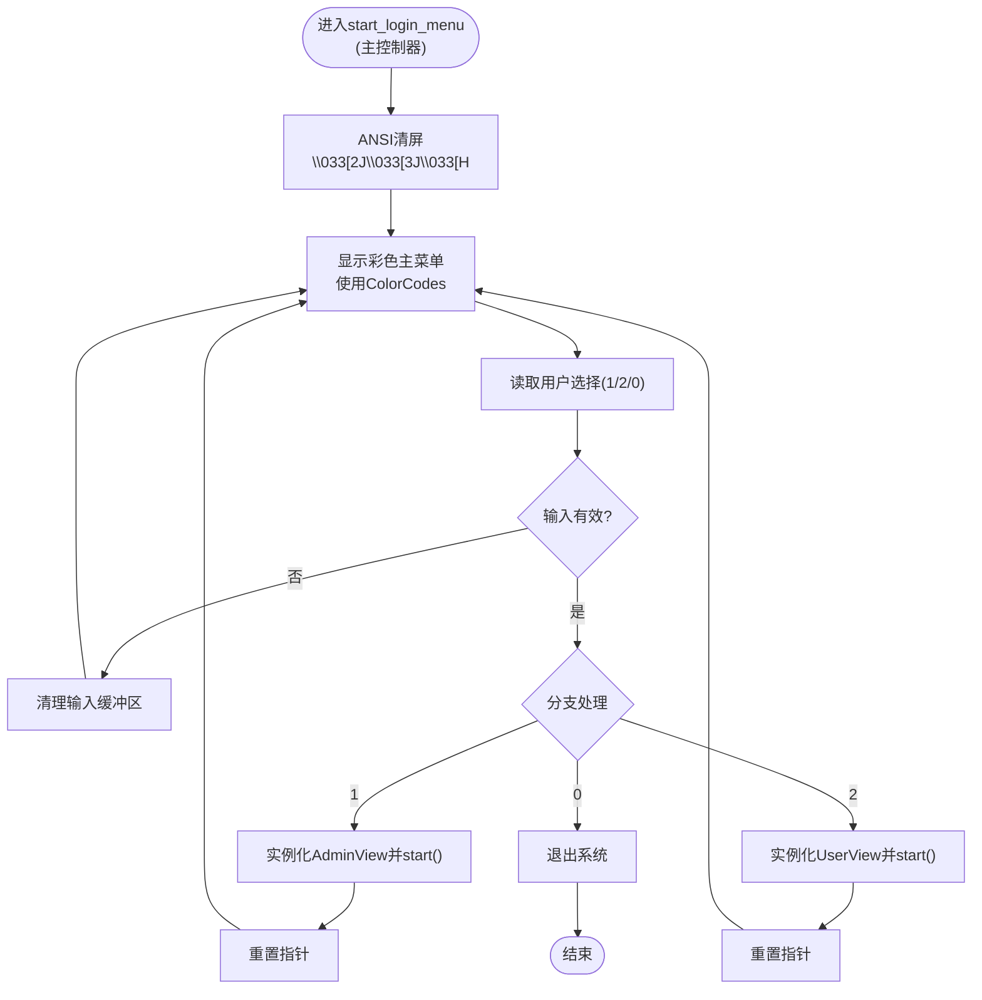
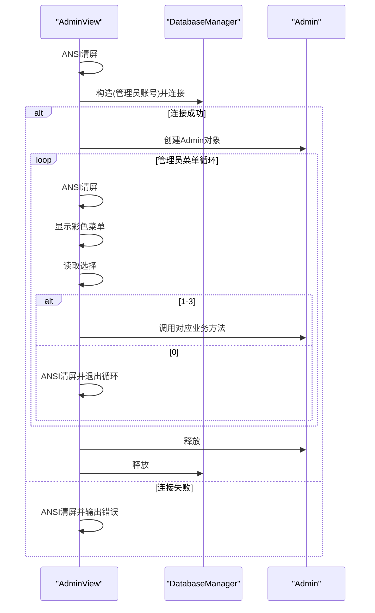
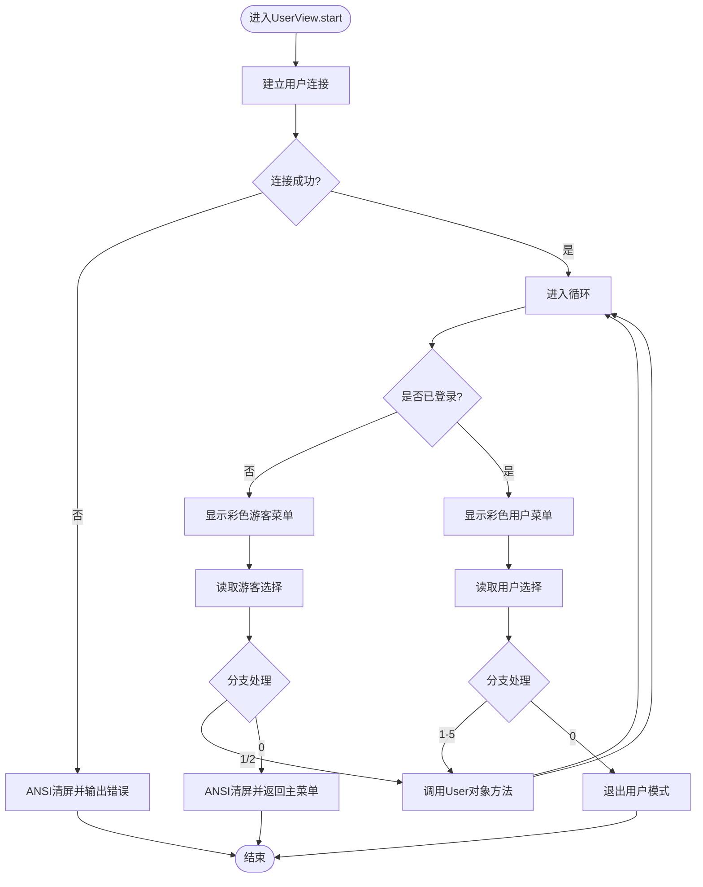
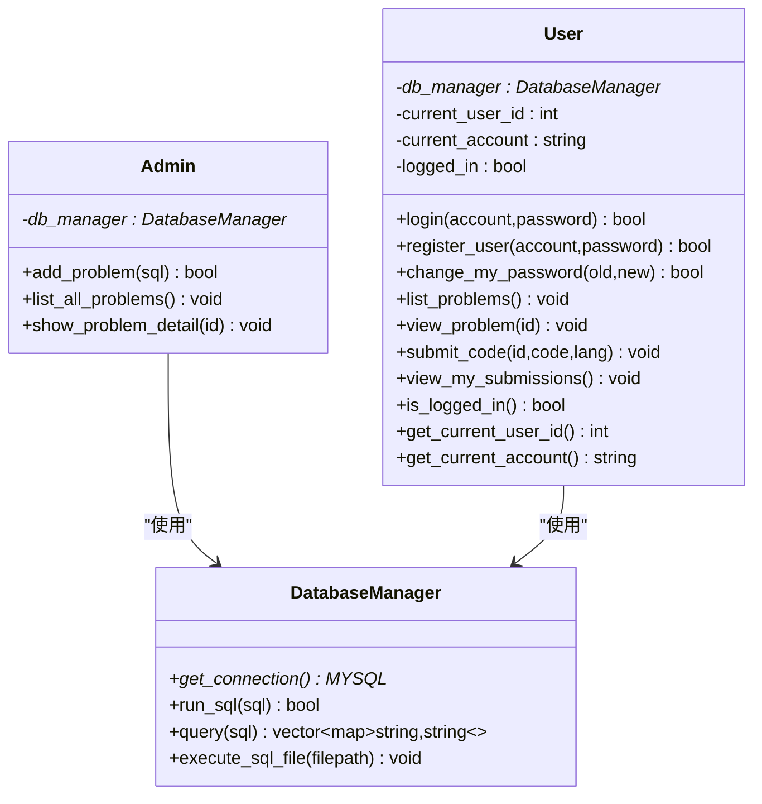
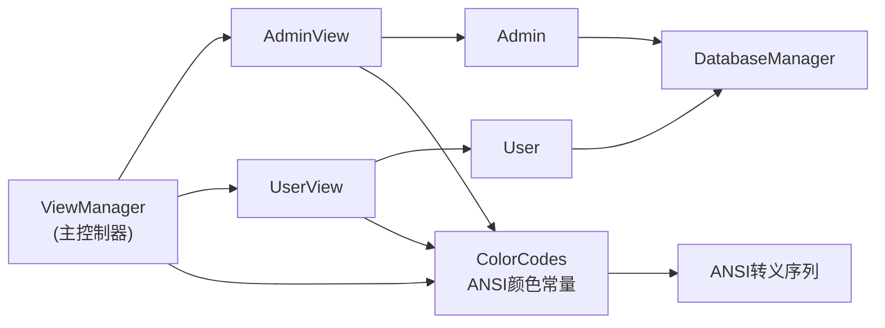

# 视图管理层设计

<cite>
**本文引用的文件**
- [main.cpp](file://src/main.cpp)
- [view_manager.h](file://include/view_manager.h)
- [view_manager.cpp](file://src/view_manager.cpp)
- [admin_view.h](file://include/admin_view.h)
- [admin_view.cpp](file://src/admin_view.cpp)
- [user_view.h](file://include/user_view.h)
- [user_view.cpp](file://src/user_view.cpp)
- [db_manager.h](file://include/db_manager.h)
- [db_manager.cpp](file://src/db_manager.cpp)
- [admin.h](file://include/admin.h)
- [user.h](file://include/user.h)
- [color_codes.h](file://include/color_codes.h)
</cite>

## 更新摘要
**变更内容**
- 新增标准化ANSI转义序列支持章节
- 更新ViewManager的屏幕清空功能实现
- 增强跨界面状态切换的一致性体验描述
- 补充颜色编码系统的完整使用说明

## 目录
1. [简介](#简介)
2. [项目结构](#项目结构)
3. [核心组件](#核心组件)
4. [架构总览](#架构总览)
5. [详细组件分析](#详细组件分析)
6. [ANSI转义序列与颜色编码系统](#ansi转义序列与颜色编码系统)
7. [依赖关系分析](#依赖关系分析)
8. [性能考虑](#性能考虑)
9. [故障排查指南](#故障排查指南)
10. [结论](#结论)
11. [附录](#附录)

## 简介
本设计文档围绕OJ系统的ViewManager模块展开，系统采用命令行界面（CLI）架构，通过ViewManager作为主控制器统一管理程序入口、角色选择与菜单导航。ViewManager作为真正的程序入口控制器，负责启动登录菜单、根据用户选择实例化AdminView或UserView，并在各自视图内部完成业务流程的循环控制与分支处理。该设计遵循"控制器-视图-模型"分离原则，将用户交互、界面状态管理与数据访问解耦，提升可维护性与扩展性。

**更新** 新版本增强了ANSI转义序列支持和标准化屏幕清空功能，提供一致性的跨界面状态切换体验。

## 项目结构
系统采用头文件与源文件分离的组织方式，核心模块如下：
- 入口与控制器：main.cpp、view_manager.h/.cpp
- 视图层：admin_view.h/.cpp、user_view.h/.cpp
- 模型与数据访问：admin.h、user.h、db_manager.h/.cpp
- 辅助：color_codes.h（ANSI颜色常量）

**图表来源**
- [main.cpp:3-8](file://src/main.cpp#L3-L8)
- [view_manager.h:11-40](file://include/view_manager.h#L11-L40)
- [admin_view.h:11-50](file://include/admin_view.h#L11-L50)
- [user_view.h:11-80](file://include/user_view.h#L11-L80)
- [admin.h:10-37](file://include/admin.h#L10-L37)
- [user.h:10-86](file://include/user.h#L10-L86)
- [db_manager.h:12-51](file://include/db_manager.h#L12-L51)
- [color_codes.h:4-15](file://include/color_codes.h#L4-L15)

**章节来源**
- [main.cpp:1-12](file://src/main.cpp#L1-L12)
- [view_manager.h:11-40](file://include/view_manager.h#L11-L40)
- [admin_view.h:11-50](file://include/admin_view.h#L11-L50)
- [user_view.h:11-80](file://include/user_view.h#L11-L80)
- [db_manager.h:12-51](file://include/db_manager.h#L12-L51)
- [color_codes.h:1-18](file://include/color_codes.h#L1-L18)

## 核心组件
- ViewManager：**作为主控制器**，负责程序入口管理、清屏、显示主菜单、接收用户角色选择并驱动AdminView/UserView的生命周期；提供输入缓冲区清理工具。
- AdminView：管理员模式视图，负责显示管理员菜单、处理题目列表、详情查看、新增题目等；在进入时建立管理员数据库连接。
- UserView：用户模式视图，负责游客态（未登录）与登录态两套菜单，处理登录、注册、查看题目、提交代码、查看提交记录、修改密码等；在进入时建立普通用户数据库连接。
- DatabaseManager：数据库连接与SQL执行封装，提供查询、执行、文件批量执行能力。
- Admin/User：面向业务的领域对象，封装管理员与用户的核心操作，依赖DatabaseManager执行数据访问。
- **ColorCodes**：**新增** ANSI颜色编码系统，提供标准化的颜色常量定义，支持多种颜色输出增强用户体验。

**章节来源**
- [view_manager.h:11-40](file://include/view_manager.h#L11-L40)
- [admin_view.h:11-50](file://include/admin_view.h#L11-L50)
- [user_view.h:11-80](file://include/user_view.h#L11-L80)
- [db_manager.h:12-51](file://include/db_manager.h#L12-L51)
- [admin.h:10-37](file://include/admin.h#L10-L37)
- [user.h:10-86](file://include/user.h#L10-L86)
- [color_codes.h:4-15](file://include/color_codes.h#L4-L15)

## 架构总览
ViewManager作为**真正的主控制器**，承担以下职责：
- **程序入口管理**：在main中初始化ViewManager并调用start_login_menu()启动循环。
- **角色选择处理**：显示主菜单，解析用户输入，实例化AdminView或UserView并调用其start()。
- **菜单系统导航**：在各视图内部维持独立循环，根据登录状态动态切换菜单项，分支处理具体业务。
- **视图切换机制**：通过智能指针管理AdminView/UserView生命周期，在视图退出后自动释放资源。
- **界面状态管理**：清屏与彩色输出增强用户体验；输入缓冲区清理避免格式错误导致的死循环。
- **ANSI转义序列支持**：**新增** 统一的屏幕清屏和颜色编码标准，提供跨界面一致的视觉体验。

**图表来源**
- [view_manager.cpp:28-66](file://src/view_manager.cpp#L28-L66)
- [admin_view.cpp:12-66](file://src/admin_view.cpp#L12-L66)
- [user_view.cpp:17-109](file://src/user_view.cpp#L17-L109)
- [db_manager.cpp:8-20](file://src/db_manager.cpp#L8-L20)

## 详细组件分析

### ViewManager组件分析
- **设计要点**
  - **单一职责**：集中处理登录菜单与角色分发，不直接参与业务逻辑。
  - **生命周期管理**：使用智能指针确保AdminView/UserView在退出后自动析构。
  - **输入健壮性**：提供clear_input()清理无效输入，避免格式错误导致的死循环。
  - **界面体验**：**增强** clear_screen()使用ANSI转义序列实现标准化清屏，show_main_menu()统一风格。
- **关键方法**
  - start_login_menu()：**主循环**，负责显示菜单、读取输入、分支到AdminView/UserView或退出。
  - **clear_screen()**：**新增** 使用ANSI转义序列"\033[2J\033[3J\033[H"实现标准化清屏。
  - show_main_menu()：打印主菜单文本与装饰，使用ColorCodes::GREEN进行颜色编码。
  - clear_input()：重置cin状态并忽略剩余输入。
- **交互流程**
  - ANSI清屏 -> 显示彩色菜单 -> 读取整数 -> 校验 -> 分支 -> 调用对应视图start() -> 视图退出后重置指针 -> 继续循环或退出。

**图表来源**
- [view_manager.cpp:28-66](file://src/view_manager.cpp#L28-L66)
- [view_manager.cpp:68-72](file://src/view_manager.cpp#L68-L72)

**章节来源**
- [view_manager.h:11-40](file://include/view_manager.h#L11-L40)
- [view_manager.cpp:12-15](file://src/view_manager.cpp#L12-L15)
- [view_manager.cpp:17-26](file://src/view_manager.cpp#L17-L26)
- [view_manager.cpp:28-66](file://src/view_manager.cpp#L28-L66)
- [view_manager.cpp:68-72](file://src/view_manager.cpp#L68-L72)

### AdminView组件分析
- **设计要点**
  - 独立循环：在start()内维护管理员菜单循环，支持多次操作直至返回主菜单。
  - 权限隔离：使用管理员账号连接数据库，确保具备发布题目的权限。
  - 输入校验：针对ID等数值输入进行类型检查与提示。
  - 错误处理：数据库连接失败时给出明确提示并释放资源。
  - **界面一致性**：**增强** 所有操作前使用ANSI清屏，确保界面整洁统一。
- **关键方法**
  - start()：建立连接、进入循环、分支处理功能、退出时释放资源。
  - **clear_screen()**：**新增** 使用ANSI转义序列实现标准化清屏。
  - show_menu()：打印管理员菜单，使用ColorCodes进行颜色编码。
  - handle_list_problems()/handle_show_problem()/handle_add_problem()：委托Admin对象执行业务。
  - clear_input()：清理输入缓冲区。
- **交互流程**
  - ANSI清屏 -> 连接成功 -> 显示彩色菜单 -> 读取选择 -> 分支处理 -> 循环或退出。

**图表来源**
- [admin_view.cpp:12-66](file://src/admin_view.cpp#L12-L66)
- [admin_view.cpp:68-79](file://src/admin_view.cpp#L68-L79)
- [admin_view.cpp:81-98](file://src/admin_view.cpp#L81-L98)
- [admin_view.cpp:100-118](file://src/admin_view.cpp#L100-L118)
- [admin_view.cpp:120-124](file://src/admin_view.cpp#L120-L124)

**章节来源**
- [admin_view.h:11-50](file://include/admin_view.h#L11-L50)
- [admin_view.cpp:8-10](file://src/admin_view.cpp#L8-L10)
- [admin_view.cpp:12-66](file://src/admin_view.cpp#L12-L66)
- [admin_view.cpp:68-79](file://src/admin_view.cpp#L68-L79)
- [admin_view.cpp:81-98](file://src/admin_view.cpp#L81-L98)
- [admin_view.cpp:100-118](file://src/admin_view.cpp#L100-L118)
- [admin_view.cpp:120-124](file://src/admin_view.cpp#L120-L124)

### UserView组件分析
- **设计要点**
  - 双态菜单：根据登录状态动态切换游客菜单与用户菜单，体现界面状态管理。
  - 完整业务流：登录、注册、查看题目、提交代码、查看提交记录、修改密码。
  - 代码输入：支持多行代码输入，以特定标记结束，便于用户编写C++代码。
  - 输入健壮性：对ID等数值输入进行类型检查，防止异常。
  - **界面一致性**：**增强** 所有操作前使用ANSI清屏，确保界面整洁统一。
- **关键方法**
  - start()：建立连接、判断登录状态、循环处理菜单、退出时释放资源。
  - **clear_screen()**：**新增** 使用ANSI转义序列实现标准化清屏。
  - show_guest_menu()/show_user_menu()：根据登录状态显示不同菜单，使用ColorCodes进行颜色编码。
  - handle_login()/handle_register()：调用User对象进行认证与注册。
  - handle_list_problems()/handle_view_problem()/handle_submit_code()/handle_view_submissions()/handle_change_password()：委托User对象执行业务。
  - clear_input()：清理输入缓冲区。
- **交互流程**
  - ANSI清屏 -> 连接成功 -> 判断登录状态 -> 显示对应彩色菜单 -> 读取选择 -> 分支处理 -> 循环或退出。

**图表来源**
- [user_view.cpp:17-109](file://src/user_view.cpp#L17-L109)
- [user_view.cpp:111-136](file://src/user_view.cpp#L111-L136)
- [user_view.cpp:138-156](file://src/user_view.cpp#L138-L156)
- [user_view.cpp:158-175](file://src/user_view.cpp#L158-L175)
- [user_view.cpp:177-199](file://src/user_view.cpp#L177-L199)
- [user_view.cpp:201-204](file://src/user_view.cpp#L201-L204)
- [user_view.cpp:206-214](file://src/user_view.cpp#L206-L214)
- [user_view.cpp:216-220](file://src/user_view.cpp#L216-L220)

**章节来源**
- [user_view.h:11-80](file://include/user_view.h#L11-L80)
- [user_view.cpp:8-10](file://src/user_view.cpp#L8-L10)
- [user_view.cpp:17-109](file://src/user_view.cpp#L17-L109)
- [user_view.cpp:111-136](file://src/user_view.cpp#L111-L136)
- [user_view.cpp:138-156](file://src/user_view.cpp#L138-L156)
- [user_view.cpp:158-175](file://src/user_view.cpp#L158-L175)
- [user_view.cpp:177-199](file://src/user_view.cpp#L177-L199)
- [user_view.cpp:201-204](file://src/user_view.cpp#L201-L204)
- [user_view.cpp:206-214](file://src/user_view.cpp#L206-L214)
- [user_view.cpp:216-220](file://src/user_view.cpp#L216-L220)

### 数据访问层分析
- **DatabaseManager**
  - 职责：封装MySQL连接、SQL执行、查询结果集转换、SQL文件批量执行。
  - 关键接口：构造/析构、run_sql()、query()、execute_sql_file()。
  - 设计模式：适配器/封装器，向上提供简洁接口，向下屏蔽底层细节。
- **Admin/User**
  - 职责：面向业务的方法封装，Admin负责题目管理，User负责登录、注册、提交等。
  - 依赖：均依赖DatabaseManager执行数据访问。

**图表来源**
- [db_manager.h:12-51](file://include/db_manager.h#L12-L51)
- [admin.h:10-37](file://include/admin.h#L10-L37)
- [user.h:10-86](file://include/user.h#L10-L86)

**章节来源**
- [db_manager.h:12-51](file://include/db_manager.h#L12-L51)
- [db_manager.cpp:8-20](file://src/db_manager.cpp#L8-L20)
- [db_manager.cpp:22-58](file://src/db_manager.cpp#L22-L58)
- [db_manager.cpp:60-101](file://src/db_manager.cpp#L60-L101)
- [db_manager.cpp:105-124](file://src/db_manager.cpp#L105-L124)
- [db_manager.cpp:126-175](file://src/db_manager.cpp#L126-L175)
- [admin.h:10-37](file://include/admin.h#L10-L37)
- [user.h:10-86](file://include/user.h#L10-L86)

## ANSI转义序列与颜色编码系统

**新增章节** 本节详细介绍ViewManager模块中增强的ANSI转义序列支持和标准化颜色编码系统。

### ANSI转义序列支持
所有视图组件都实现了标准化的屏幕清空功能，使用ANSI转义序列实现跨平台兼容的清屏效果：

- **清屏序列**：`\033[2J\033[3J\033[H`
  - `\033[2J`：清屏并清除滚动缓冲区
  - `\033[3J`：清除滚动缓冲区（额外保证）
  - `\033[H`：将光标移动到屏幕左上角位置(1,1)

### 颜色编码系统
ColorCodes.h提供了完整的ANSI颜色常量定义，支持多种颜色输出：

- **基础颜色**：RED(31m)、GREEN(32m)、YELLOW(33m)、BLUE(34m)、MAGENTA(35m)、CYAN(36m)、WHITE(37m)
- **重置常量**：RESET(0m)，用于恢复默认颜色
- **使用方式**：通过Color命名空间访问，如Color::GREEN、Color::RESET

### 跨界面一致性体验
- **统一清屏标准**：ViewManager、AdminView、UserView都使用相同的ANSI序列实现清屏
- **标准化颜色使用**：所有菜单和提示信息都使用ColorCodes进行颜色编码
- **一致的用户体验**：用户在不同界面间切换时获得统一的视觉反馈

**章节来源**
- [view_manager.cpp:14-19](file://src/view_manager.cpp#L14-L19)
- [admin_view.cpp:14-19](file://src/admin_view.cpp#L14-L19)
- [user_view.cpp:14-19](file://src/user_view.cpp#L14-L19)
- [color_codes.h:4-15](file://include/color_codes.h#L4-L15)

## 依赖关系分析
- **控制器-视图耦合**
  - ViewManager与AdminView/UserView为组合关系，通过智能指针管理生命周期，降低耦合度。
  - 视图内部自持DatabaseManager与业务对象，形成清晰的职责边界。
  - **新增** 所有视图都依赖ColorCodes进行颜色编码，但不直接依赖其他视图。
- **视图-模型依赖**
  - AdminView依赖Admin，UserView依赖User，二者均依赖DatabaseManager。
  - Admin/User仅依赖DatabaseManager接口，便于替换或测试。
- **外部依赖**
  - MySQL C API封装于DatabaseManager，提供统一的查询与执行接口。
  - **新增** ANSI颜色常量用于增强界面可读性和一致性体验。

**图表来源**
- [view_manager.h:23-24](file://include/view_manager.h#L23-L24)
- [admin_view.h:23-24](file://include/admin_view.h#L23-L24)
- [user_view.h:23-24](file://include/user_view.h#L23-L24)
- [admin.h:36](file://include/admin.h#L36)
- [user.h:82](file://include/user.h#L82)
- [db_manager.h:50](file://include/db_manager.h#L50)
- [color_codes.h:4-15](file://include/color_codes.h#L4-L15)

**章节来源**
- [view_manager.h:23-24](file://include/view_manager.h#L23-L24)
- [admin_view.h:23-24](file://include/admin_view.h#L23-L24)
- [user_view.h:23-24](file://include/user_view.h#L23-L24)
- [db_manager.h:50](file://include/db_manager.h#L50)
- [color_codes.h:4-15](file://include/color_codes.h#L4-L15)

## 性能考虑
- **I/O与缓冲区**
  - 输入读取采用cin/cin.ignore，配合clear_input()清理无效输入，避免阻塞与重复读取。
  - **新增** ANSI转义序列清屏操作频繁，建议在高并发场景下减少清屏频率或使用更高效的终端控制。
- **数据库连接**
  - 视图启动时建立连接，退出时释放，避免长连接占用资源。
  - 对于高频查询，可考虑在业务层增加缓存策略（例如题目列表缓存）。
- **字符串处理**
  - 用户代码输入采用多行拼接，注意内存增长与超长输入的处理。
- **颜色输出**
  - **新增** ANSI颜色常量仅用于增强界面可读性，不影响核心逻辑性能。
  - 颜色编码使用静态常量，避免运行时分配开销。

## 故障排查指南
- **输入格式错误**
  - 现象：输入非数字导致循环卡死。
  - 处理：调用clear_input()清理缓冲区，提示用户重新输入。
  - 参考路径：[view_manager.cpp:38-43](file://src/view_manager.cpp#L38-L43)、[admin_view.cpp:30-35](file://src/admin_view.cpp#L30-L35)、[user_view.cpp:44-49](file://src/user_view.cpp#L44-L49)
- **数据库连接失败**
  - 现象：管理员/用户连接失败。
  - 处理：检查账号、密码、主机与数据库名配置；查看错误输出。
  - 参考路径：[admin_view.cpp:19-22](file://src/admin_view.cpp#L19-L22)、[user_view.cpp:25-28](file://src/user_view.cpp#L25-L28)、[db_manager.cpp:115-120](file://src/db_manager.cpp#L115-L120)
- **SQL执行失败**
  - 现象：新增题目或查询失败。
  - 处理：检查SQL语法与权限；查看错误输出。
  - 参考路径：[db_manager.cpp:133-137](file://src/db_manager.cpp#L133-L137)、[db_manager.cpp:33-37](file://src/db_manager.cpp#L33-L37)
- **代码输入异常**
  - 现象：提交代码时无法正确结束。
  - 处理：确认以特定标记结束输入；检查输入缓冲区清理。
  - 参考路径：[user_view.cpp:189-196](file://src/user_view.cpp#L189-L196)、[user_view.cpp:216-220](file://src/user_view.cpp#L216-L220)
- ****新增** ANSI清屏问题**
  - 现象：清屏后界面显示异常或光标位置错误。
  - 处理：检查终端是否支持ANSI转义序列；确认使用了正确的清屏序列。
  - 参考路径：[view_manager.cpp:14-19](file://src/view_manager.cpp#L14-L19)、[admin_view.cpp:14-19](file://src/admin_view.cpp#L14-L19)、[user_view.cpp:14-19](file://src/user_view.cpp#L14-L19)
- ****新增** 颜色显示问题**
  - 现象：颜色输出异常或终端不支持颜色。
  - 处理：检查终端设置；确认ColorCodes.h中的ANSI常量定义正确。
  - 参考路径：[color_codes.h:4-15](file://include/color_codes.h#L4-L15)

**章节来源**
- [view_manager.cpp:38-43](file://src/view_manager.cpp#L38-L43)
- [admin_view.cpp:19-22](file://src/admin_view.cpp#L19-L22)
- [user_view.cpp:25-28](file://src/user_view.cpp#L25-L28)
- [db_manager.cpp:115-120](file://src/db_manager.cpp#L115-L120)
- [db_manager.cpp:133-137](file://src/db_manager.cpp#L133-L137)
- [db_manager.cpp:33-37](file://src/db_manager.cpp#L33-L37)
- [user_view.cpp:189-196](file://src/user_view.cpp#L189-L196)
- [user_view.cpp:216-220](file://src/user_view.cpp#L216-L220)
- [view_manager.cpp:14-19](file://src/view_manager.cpp#L14-L19)
- [admin_view.cpp:14-19](file://src/admin_view.cpp#L14-L19)
- [user_view.cpp:14-19](file://src/user_view.cpp#L14-L19)
- [color_codes.h:4-15](file://include/color_codes.h#L4-L15)

## 结论
ViewManager模块通过清晰的职责划分与稳健的输入处理，实现了OJ系统的**真正主控制器**角色。作为程序唯一入口点，ViewManager负责统一管理程序入口、角色选择与菜单导航，AdminView与UserView分别承载管理员与用户业务，结合DatabaseManager提供的数据访问能力，形成了稳定的CLI架构。

**更新** 新版本通过标准化的ANSI转义序列支持和ColorCodes颜色编码系统，显著提升了用户体验的一致性和视觉效果。所有视图组件都实现了统一的屏幕清屏标准和颜色编码规范，确保用户在不同界面间切换时获得一致的视觉反馈和操作体验。该设计易于扩展新的角色或功能，同时保持良好的可维护性与用户体验。

## 附录
- **关键方法参考路径**
  - [start_login_menu():28-66](file://src/view_manager.cpp#L28-L66)
  - [clear_screen():14-19](file://src/view_manager.cpp#L14-L19)
  - [show_main_menu():21-30](file://src/view_manager.cpp#L21-L30)
  - [clear_input():72-77](file://src/view_manager.cpp#L72-L77)
  - [AdminView::start():21-76](file://src/admin_view.cpp#L21-L76)
  - [AdminView::clear_screen():14-19](file://src/admin_view.cpp#L14-L19)
  - [UserView::start():21-115](file://src/user_view.cpp#L21-L115)
  - [UserView::clear_screen():14-19](file://src/user_view.cpp#L14-L19)
  - [DatabaseManager::run_sql():22-25](file://src/db_manager.cpp#L22-L25)
  - [DatabaseManager::query():27-58](file://src/db_manager.cpp#L27-L58)
  - [ColorCodes::ANSI常量:4-15](file://include/color_codes.h#L4-L15)