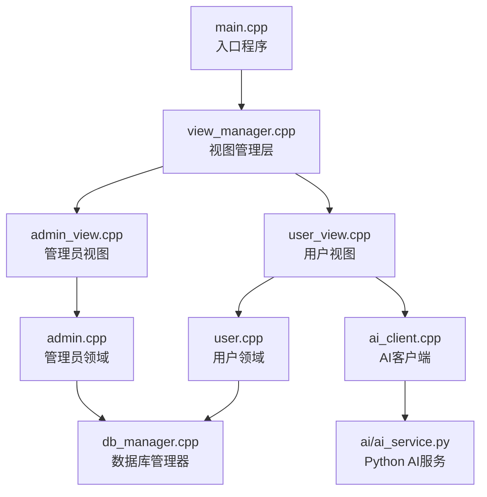
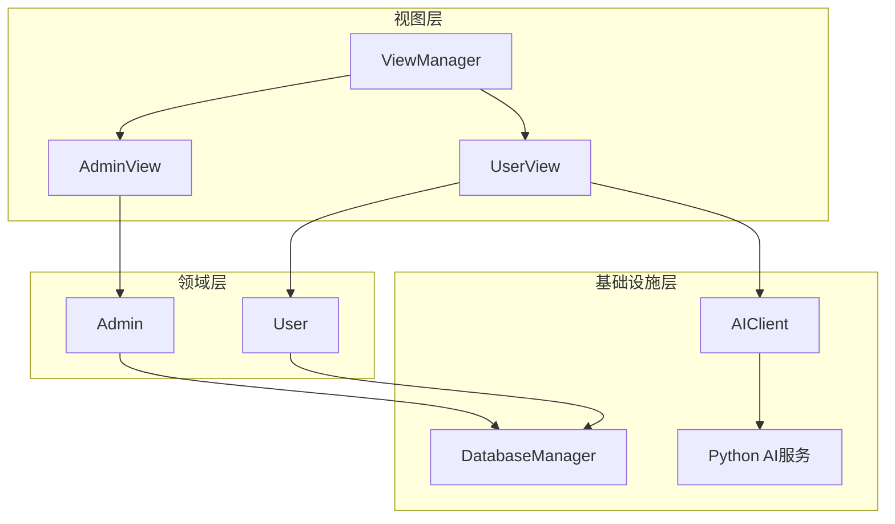
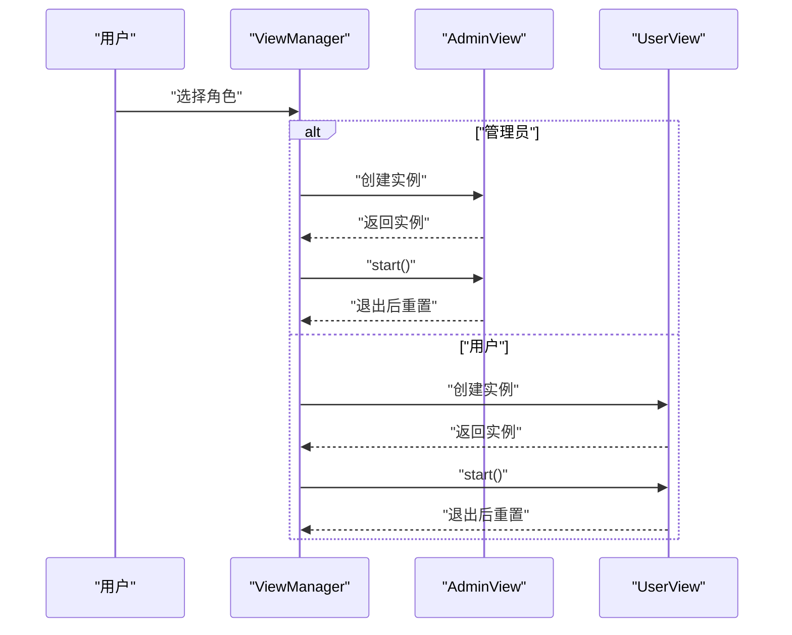
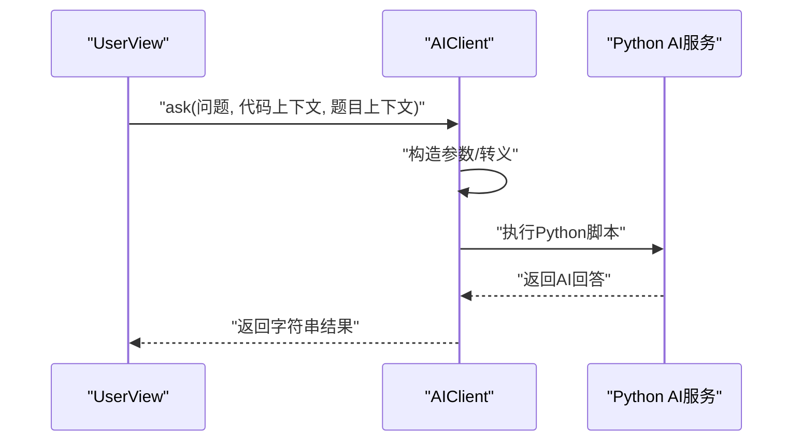
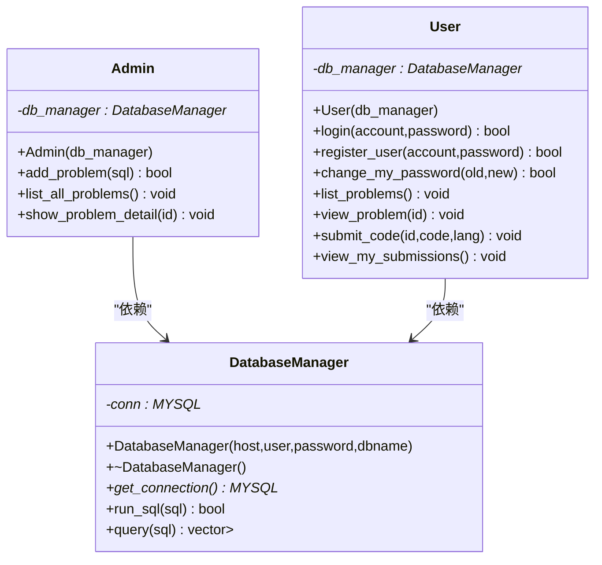
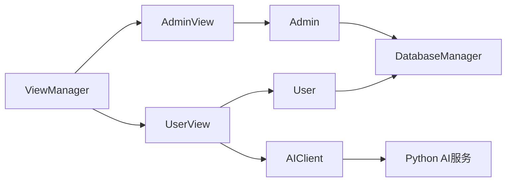
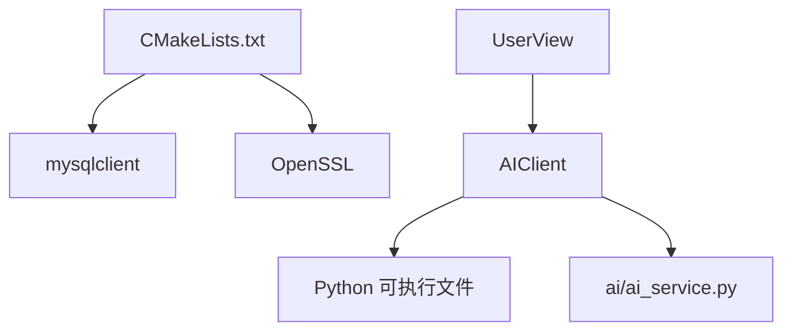

# 设计模式实现

<cite>
**本文引用的文件**
- [src/main.cpp](file://src/main.cpp)
- [src/view_manager.cpp](file://src/view_manager.cpp)
- [include/view_manager.h](file://include/view_manager.h)
- [src/admin_view.cpp](file://src/admin_view.cpp)
- [include/admin_view.h](file://include/admin_view.h)
- [src/user_view.cpp](file://src/user_view.cpp)
- [include/user_view.h](file://include/user_view.h)
- [src/db_manager.cpp](file://src/db_manager.cpp)
- [include/db_manager.h](file://include/db_manager.h)
- [src/admin.cpp](file://src/admin.cpp)
- [include/admin.h](file://include/admin.h)
- [src/user.cpp](file://src/user.cpp)
- [include/user.h](file://include/user.h)
- [src/ai_client.cpp](file://src/ai_client.cpp)
- [include/ai_client.h](file://include/ai_client.h)
- [ai/ai_service.py](file://ai/ai_service.py)
- [CMakeLists.txt](file://CMakeLists.txt)
</cite>

## 目录
1. [引言](#引言)
2. [项目结构](#项目结构)
3. [核心组件](#核心组件)
4. [架构总览](#架构总览)
5. [详细组件分析](#详细组件分析)
6. [依赖分析](#依赖分析)
7. [性能考虑](#性能考虑)
8. [故障排查指南](#故障排查指南)
9. [结论](#结论)
10. [附录](#附录)

## 引言
本文件聚焦于OJ系统中应用的设计模式，围绕以下目标展开：
- 工厂模式在角色切换中的应用：通过视图管理层根据用户选择动态创建并管理不同角色的视图对象。
- 适配器模式在AI服务集成中的使用：通过AIClient适配外部Python脚本服务，屏蔽底层调用细节，向上层提供统一接口。
- 单例模式在数据库管理中的实现：DatabaseManager以单例形式提供全局唯一的数据库连接，避免重复连接与资源浪费。

同时，文档解释每种设计模式解决的问题、实现方式、带来的优势，并给出协作关系与最佳实践建议。

## 项目结构
系统采用分层+视图分离的组织方式：
- 入口程序负责启动视图管理层，由其协调管理员与用户两种角色的交互流程。
- 视图层(View)负责用户交互与流程控制，按需创建领域对象(Admin/User)与基础设施对象(AIClient/DatabaseManager)。
- 领域层(Admin/User)封装业务逻辑，依赖数据库管理器执行数据访问。
- 基础设施层(AI客户端/数据库管理器)提供跨语言与跨模块的通用能力。

图表来源
- [src/main.cpp:1-14](file://src/main.cpp#L1-L14)
- [src/view_manager.cpp:1-77](file://src/view_manager.cpp#L1-L77)
- [src/admin_view.cpp:1-138](file://src/admin_view.cpp#L1-L138)
- [src/user_view.cpp:1-352](file://src/user_view.cpp#L1-L352)
- [src/admin.cpp:1-59](file://src/admin.cpp#L1-L59)
- [src/user.cpp:1-223](file://src/user.cpp#L1-L223)
- [src/db_manager.cpp:1-100](file://src/db_manager.cpp#L1-L100)
- [src/ai_client.cpp:1-124](file://src/ai_client.cpp#L1-L124)
- [ai/ai_service.py:1-113](file://ai/ai_service.py#L1-L113)

章节来源
- [src/main.cpp:1-14](file://src/main.cpp#L1-L14)
- [CMakeLists.txt:1-40](file://CMakeLists.txt#L1-L40)

## 核心组件
- 视图管理层(ViewManager)：负责登录菜单与角色选择，按需创建AdminView或UserView实例，体现“工厂”式角色创建与生命周期管理。
- 管理员视图(AdminView)与用户视图(UserView)：分别承载管理员与用户交互流程；在各自视图内创建领域对象与基础设施对象。
- 领域对象(Admin/User)：封装业务逻辑，依赖DatabaseManager执行数据访问。
- 数据库管理器(DatabaseManager)：提供数据库连接、查询与执行能力，作为全局唯一资源，体现单例特性。
- AI客户端(AIClient)：封装Python脚本调用，屏蔽参数转义、进程执行等细节，向上提供统一的ask接口，体现适配器模式。

章节来源
- [include/view_manager.h:1-43](file://include/view_manager.h#L1-L43)
- [src/view_manager.cpp:1-77](file://src/view_manager.cpp#L1-L77)
- [include/admin_view.h:1-58](file://include/admin_view.h#L1-L58)
- [src/admin_view.cpp:1-138](file://src/admin_view.cpp#L1-L138)
- [include/user_view.h:1-92](file://include/user_view.h#L1-L92)
- [src/user_view.cpp:1-352](file://src/user_view.cpp#L1-L352)
- [include/admin.h:1-40](file://include/admin.h#L1-L40)
- [src/admin.cpp:1-59](file://src/admin.cpp#L1-L59)
- [include/user.h:1-89](file://include/user.h#L1-L89)
- [src/user.cpp:1-223](file://src/user.cpp#L1-L223)
- [include/db_manager.h:1-53](file://include/db_manager.h#L1-L53)
- [src/db_manager.cpp:1-100](file://src/db_manager.cpp#L1-L100)
- [include/ai_client.h:1-28](file://include/ai_client.h#L1-L28)
- [src/ai_client.cpp:1-124](file://src/ai_client.cpp#L1-L124)

## 架构总览
系统采用“视图-领域-基础设施”的分层架构：
- 视图层仅负责交互与流程编排，不直接持有业务数据。
- 领域层专注业务规则，通过依赖注入获得基础设施。
- 基础设施层提供跨语言/跨模块能力，向上抽象为统一接口。

图表来源
- [src/view_manager.cpp:1-77](file://src/view_manager.cpp#L1-L77)
- [src/admin_view.cpp:1-138](file://src/admin_view.cpp#L1-L138)
- [src/user_view.cpp:1-352](file://src/user_view.cpp#L1-L352)
- [src/admin.cpp:1-59](file://src/admin.cpp#L1-L59)
- [src/user.cpp:1-223](file://src/user.cpp#L1-L223)
- [src/db_manager.cpp:1-100](file://src/db_manager.cpp#L1-L100)
- [src/ai_client.cpp:1-124](file://src/ai_client.cpp#L1-L124)
- [ai/ai_service.py:1-113](file://ai/ai_service.py#L1-L113)

## 详细组件分析

### 工厂模式：角色切换中的动态创建
- 解决的问题：在登录后根据用户选择动态创建管理员或用户视图，避免硬编码分支与重复实例化逻辑。
- 实现方式：ViewManager在用户选择后，使用智能指针创建AdminView或UserView实例，并在其生命周期结束后自动释放。
- 优势：降低耦合、提升扩展性（新增角色只需新增视图类并接入ViewManager）。
- 协作关系：ViewManager作为“工厂”，AdminView/UserView作为“产品”，彼此通过头文件声明相互依赖。

图表来源
- [src/view_manager.cpp:32-70](file://src/view_manager.cpp#L32-L70)
- [include/admin_view.h:11-25](file://include/admin_view.h#L11-L25)
- [include/user_view.h:12-27](file://include/user_view.h#L12-L27)

章节来源
- [src/view_manager.cpp:10-70](file://src/view_manager.cpp#L10-L70)
- [include/view_manager.h:11-40](file://include/view_manager.h#L11-L40)

### 适配器模式：AI服务集成
- 解决的问题：将Python脚本服务封装为C++可调用接口，屏蔽命令行参数构造、进程执行、输出解析等复杂细节。
- 实现方式：AIClient提供ask方法，内部构造参数字符串、转义特殊字符、执行Python脚本并读取标准输出，向上返回统一字符串结果。
- 优势：对外暴露简洁接口，便于在用户视图中直接调用；便于替换底层实现（如改为HTTP API）。
- 协作关系：AIClient依赖Python脚本(ai/ai_service.py)，UserView通过AIClient与AI交互。

图表来源
- [src/user_view.cpp:275-311](file://src/user_view.cpp#L275-L311)
- [src/ai_client.cpp:85-112](file://src/ai_client.cpp#L85-L112)
- [ai/ai_service.py:93-113](file://ai/ai_service.py#L93-L113)

章节来源
- [src/ai_client.cpp:1-124](file://src/ai_client.cpp#L1-L124)
- [include/ai_client.h:6-25](file://include/ai_client.h#L6-L25)
- [src/user_view.cpp:275-311](file://src/user_view.cpp#L275-L311)
- [ai/ai_service.py:1-113](file://ai/ai_service.py#L1-L113)

### 单例模式：数据库管理
- 解决的问题：避免多处重复创建数据库连接，集中管理连接生命周期，减少资源消耗与连接泄漏风险。
- 实现方式：DatabaseManager提供构造函数用于建立连接，并在析构时关闭连接；通过全局唯一实例在Admin/User中共享使用。
- 优势：统一的数据访问入口，简化事务与并发控制；便于集中日志与监控。
- 协作关系：Admin/User均通过构造函数注入DatabaseManager指针，形成“依赖注入”的单例使用方式。

图表来源
- [include/db_manager.h:12-46](file://include/db_manager.h#L12-L46)
- [src/db_manager.cpp:8-19](file://src/db_manager.cpp#L8-L19)
- [src/db_manager.cpp:21-57](file://src/db_manager.cpp#L21-L57)
- [include/admin.h:10-37](file://include/admin.h#L10-L37)
- [src/admin.cpp:10](file://src/admin.cpp#L10)
- [include/user.h:10-86](file://include/user.h#L10-L86)
- [src/user.cpp:11](file://src/user.cpp#L11)

章节来源
- [include/db_manager.h:1-53](file://include/db_manager.h#L1-L53)
- [src/db_manager.cpp:1-100](file://src/db_manager.cpp#L1-L100)
- [src/admin.cpp:1-59](file://src/admin.cpp#L1-L59)
- [src/user.cpp:1-223](file://src/user.cpp#L1-L223)

### 模式协作关系
- 工厂模式(视图层) + 依赖注入(领域层)：ViewManager创建AdminView/UserView，后者在构造时注入DatabaseManager/AIClient，形成清晰的依赖链。
- 适配器模式(基础设施层)：AIClient屏蔽Python脚本细节，使上层无需关心跨语言调用细节。
- 单例模式(基础设施层)：DatabaseManager以全局唯一实例被多个领域对象共享，保证连接一致性与资源可控。

图表来源
- [src/view_manager.cpp:1-77](file://src/view_manager.cpp#L1-L77)
- [src/admin_view.cpp:1-138](file://src/admin_view.cpp#L1-L138)
- [src/user_view.cpp:1-352](file://src/user_view.cpp#L1-L352)
- [src/admin.cpp:1-59](file://src/admin.cpp#L1-L59)
- [src/user.cpp:1-223](file://src/user.cpp#L1-L223)
- [src/db_manager.cpp:1-100](file://src/db_manager.cpp#L1-L100)
- [src/ai_client.cpp:1-124](file://src/ai_client.cpp#L1-L124)
- [ai/ai_service.py:1-113](file://ai/ai_service.py#L1-L113)

## 依赖分析
- 编译期依赖：CMakeLists通过PkgConfig查找mysqlclient与OpenSSL，确保编译时链接正确。
- 运行时依赖：AIClient在运行时检测Python可执行文件与脚本是否存在，若缺失则判定AI不可用。
- 组件耦合：Admin/User对DatabaseManager强依赖；UserView对AIClient强依赖；ViewManager对AdminView/User弱依赖（仅在选择角色时创建）。

图表来源
- [CMakeLists.txt:11-34](file://CMakeLists.txt#L11-L34)
- [src/ai_client.cpp:14-23](file://src/ai_client.cpp#L14-L23)
- [src/user_view.cpp:275-286](file://src/user_view.cpp#L275-L286)

章节来源
- [CMakeLists.txt:1-40](file://CMakeLists.txt#L1-L40)
- [src/ai_client.cpp:1-124](file://src/ai_client.cpp#L1-L124)
- [src/user_view.cpp:1-352](file://src/user_view.cpp#L1-L352)

## 性能考虑
- 连接复用：DatabaseManager以单例形式提供连接，避免频繁建立/销毁连接带来的开销。
- I/O优化：AIClient在执行Python脚本时使用管道读取标准输出，减少额外中间缓冲。
- 内存管理：视图层使用智能指针管理对象生命周期，避免悬挂指针与内存泄漏。
- 建议：在高并发场景下，可引入连接池与异步调用，进一步提升吞吐量。

## 故障排查指南
- AI服务不可用
  - 现象：UserView提示AI服务不可用。
  - 排查：确认Python可执行文件与脚本路径存在；检查DEEPSEEK_API_KEY环境变量是否配置。
  - 参考路径：[src/ai_client.cpp:114-123](file://src/ai_client.cpp#L114-L123)、[src/user_view.cpp:275-286](file://src/user_view.cpp#L275-L286)、[ai/ai_service.py:42-44](file://ai/ai_service.py#L42-L44)
- 数据库连接失败
  - 现象：AdminView/UserView提示连接失败。
  - 排查：核对主机、用户名、密码、数据库名；确认MySQL服务运行正常。
  - 参考路径：[src/admin_view.cpp:26-33](file://src/admin_view.cpp#L26-L33)、[src/user_view.cpp:26-33](file://src/user_view.cpp#L26-L33)、[src/db_manager.cpp:61-79](file://src/db_manager.cpp#L61-L79)
- 输入异常
  - 现象：菜单输入非数字或空输入。
  - 排查：使用clear_input清理输入缓冲；对非法输入给出明确提示。
  - 参考路径：[src/view_manager.cpp:72-76](file://src/view_manager.cpp#L72-L76)、[src/admin_view.cpp:39-46](file://src/admin_view.cpp#L39-L46)、[src/user_view.cpp:48-55](file://src/user_view.cpp#L48-L55)

章节来源
- [src/ai_client.cpp:114-123](file://src/ai_client.cpp#L114-L123)
- [src/user_view.cpp:275-286](file://src/user_view.cpp#L275-L286)
- [ai/ai_service.py:42-44](file://ai/ai_service.py#L42-L44)
- [src/admin_view.cpp:26-33](file://src/admin_view.cpp#L26-L33)
- [src/user_view.cpp:26-33](file://src/user_view.cpp#L26-L33)
- [src/db_manager.cpp:61-79](file://src/db_manager.cpp#L61-L79)
- [src/view_manager.cpp:72-76](file://src/view_manager.cpp#L72-L76)
- [src/admin_view.cpp:39-46](file://src/admin_view.cpp#L39-L46)
- [src/user_view.cpp:48-55](file://src/user_view.cpp#L48-L55)

## 结论
本系统通过工厂模式实现角色切换的灵活创建，通过适配器模式屏蔽AI服务的跨语言调用复杂度，通过单例模式集中管理数据库连接，三者协同提升了系统的可维护性与扩展性。建议在后续迭代中引入连接池、异步I/O与更完善的错误恢复机制，以进一步增强性能与稳定性。

## 附录
- 设计模式选择与应用指导原则
  - 何时使用工厂模式：当对象创建逻辑复杂或存在多种变体时，通过工厂集中管理创建过程。
  - 何时使用适配器模式：当需要对接第三方服务或已有系统，且接口不兼容时，通过适配器统一对外接口。
  - 何时使用单例模式：当资源稀缺且需要全局唯一实例时，确保资源可控与一致性。
  - 注意事项：避免过度设计；保持单一职责；对外暴露稳定接口；关注异常与资源回收。