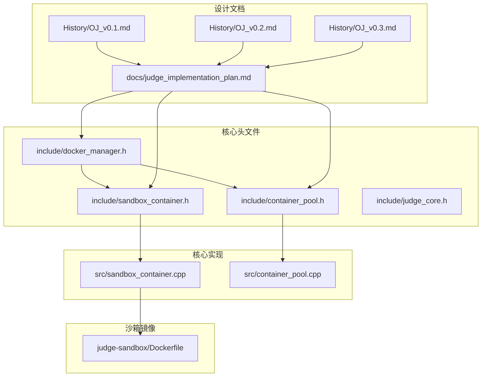
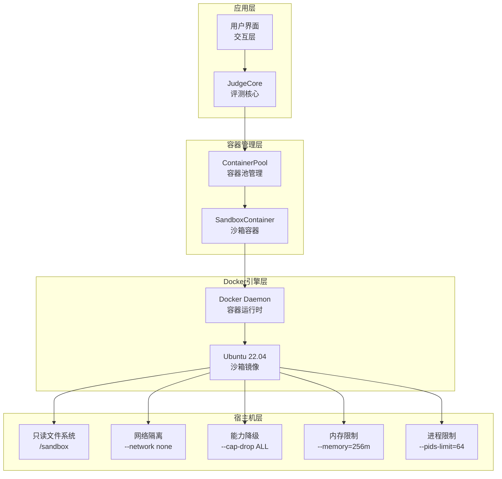
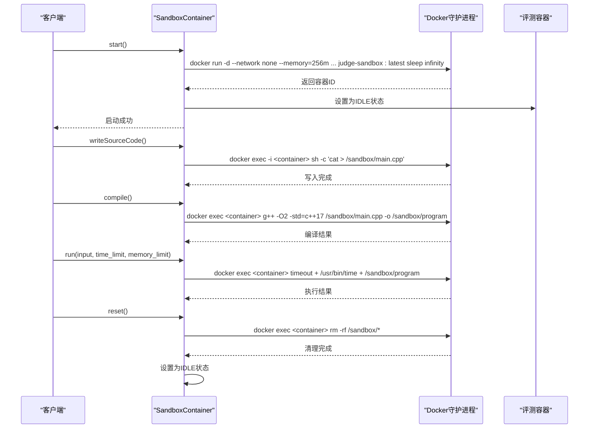
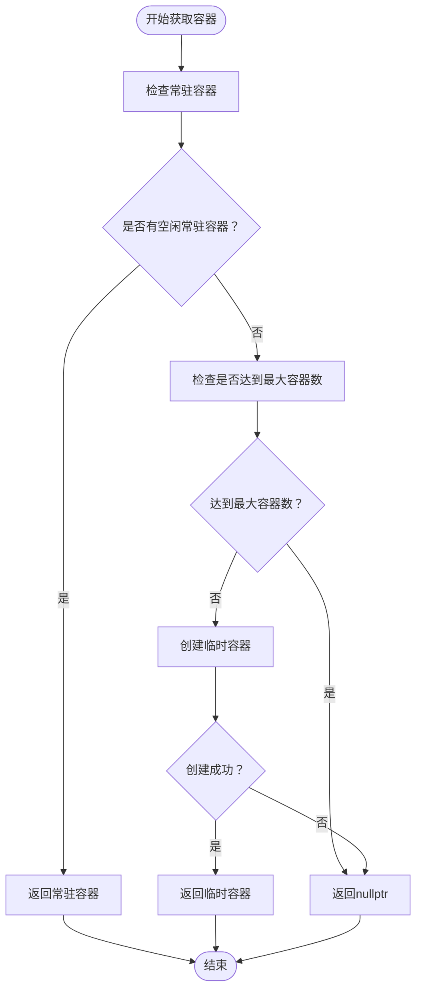
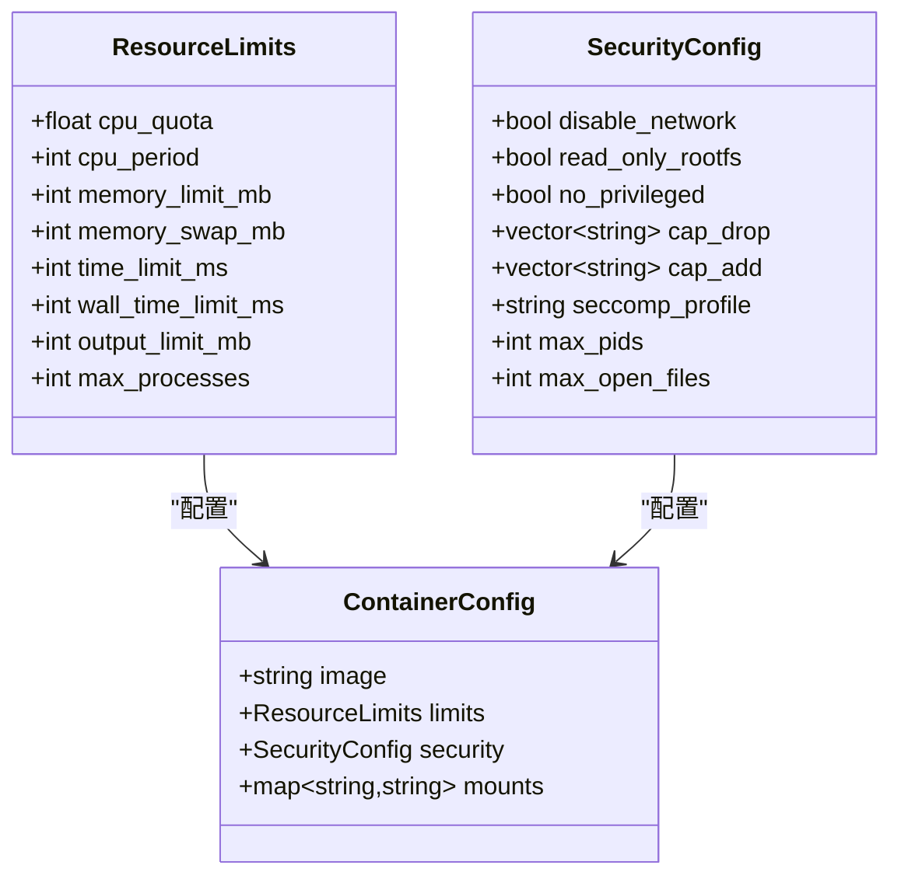
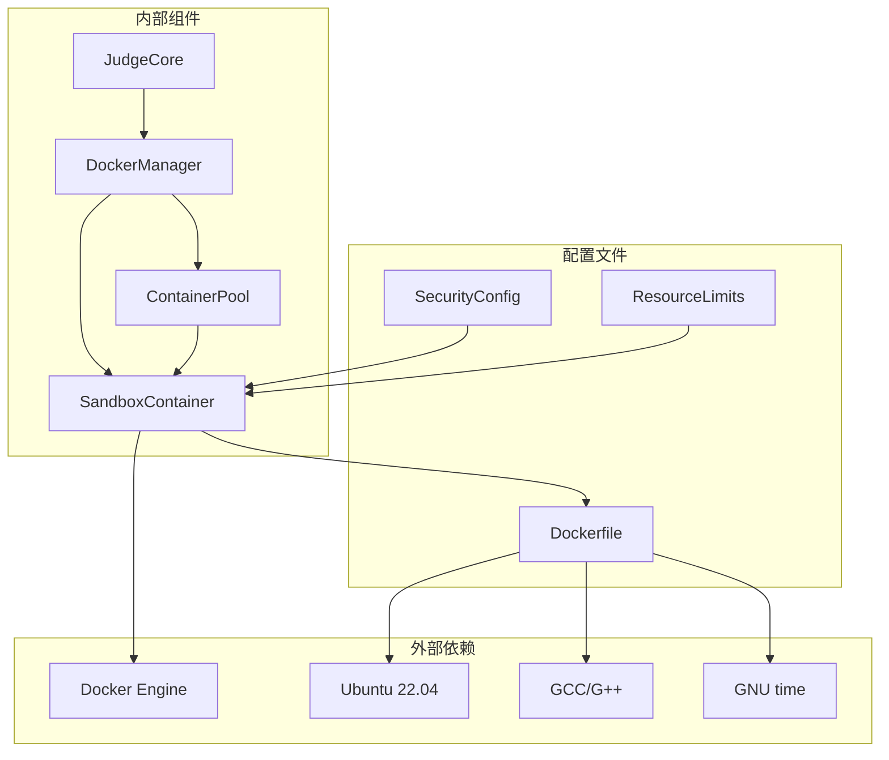

# Docker沙箱架构设计

<cite>
**本文档引用的文件**
- [docker_manager.h](file://include/docker_manager.h)
- [sandbox_container.h](file://include/sandbox_container.h)
- [sandbox_container.cpp](file://src/sandbox_container.cpp)
- [container_pool.h](file://include/container_pool.h)
- [container_pool.cpp](file://src/container_pool.cpp)
- [judge_core.h](file://include/judge_core.h)
- [Dockerfile](file://judge-sandbox/Dockerfile)
- [judge_implementation_plan.md](file://docs/judge_implementation_plan.md)
- [OJ_v0.1.md](file://History/OJ_v0.1.md)
- [OJ_v0.2.md](file://History/OJ_v0.2.md)
- [OJ_v0.3.md](file://History/OJ_v0.3.md)
</cite>

## 目录
1. [引言](#引言)
2. [项目结构](#项目结构)
3. [核心组件](#核心组件)
4. [架构概览](#架构概览)
5. [详细组件分析](#详细组件分析)
6. [依赖分析](#依赖分析)
7. [性能考虑](#性能考虑)
8. [故障排查指南](#故障排查指南)
9. [结论](#结论)
10. [附录](#附录)

## 引言

本项目基于Docker容器化技术构建安全沙箱架构，为在线评测系统提供隔离、可控、可扩展的代码执行环境。本文档深入解析沙箱容器的安全隔离机制、启动参数配置、生命周期管理、容器间数据隔离与资源共享策略，并提供最佳实践和故障排查方法。

## 项目结构

项目采用模块化设计，核心围绕Docker沙箱容器展开，主要文件组织如下：



**图表来源**
- [docker_manager.h:1-18](file://include/docker_manager.h#L1-L18)
- [sandbox_container.h:1-122](file://include/sandbox_container.h#L1-L122)
- [container_pool.h:1-85](file://include/container_pool.h#L1-L85)
- [Dockerfile:1-29](file://judge-sandbox/Dockerfile#L1-L29)

**章节来源**
- [docker_manager.h:1-18](file://include/docker_manager.h#L1-L18)
- [sandbox_container.h:1-122](file://include/sandbox_container.h#L1-L122)
- [container_pool.h:1-85](file://include/container_pool.h#L1-L85)
- [Dockerfile:1-29](file://judge-sandbox/Dockerfile#L1-L29)

## 核心组件

### 沙箱容器管理器

沙箱容器管理器负责单个容器的生命周期管理，包括启动、停止、重启、状态检查和资源清理。其核心特性包括：

- **常驻模式**：容器以"sleep infinity"保持存活，通过docker exec执行评测任务
- **只读文件系统**：通过--read-only确保容器根文件系统不可写
- **内存限制**：设置合理的内存上限，防止资源滥用
- **进程数限制**：通过--pids-limit限制容器内进程数量
- **能力降级**：使用--cap-drop=ALL丢弃所有Linux capabilities
- **网络隔离**：通过--network none完全禁用网络访问
- **内存文件系统**：使用--tmpfs挂载沙箱目录，支持可执行权限

### 容器池管理器

容器池管理器提供容器的批量管理能力，支持预创建常驻容器和按需创建临时容器：

- **预热机制**：系统启动时创建min_size个常驻容器
- **动态扩容**：当常驻容器不足时按需创建临时容器
- **健康检查**：定期检查容器存活状态，自动重建失联容器
- **资源控制**：限制最大容器总数，避免资源耗尽
- **复用策略**：评测完成后重置容器状态，实现容器复用

### 安全配置结构体

系统提供了全面的安全配置选项，确保评测环境的绝对安全：

- **网络隔离**：disable_network=true完全禁止网络访问
- **文件系统安全**：read_only_rootfs=true启用只读根文件系统
- **特权控制**：no_privileged=true禁止特权模式运行
- **能力管理**：cap_drop={"ALL"}丢弃所有capabilities
- **Seccomp配置**：支持自定义Seccomp安全配置文件
- **进程限制**：max_pids=50限制最大进程数
- **文件描述符限制**：max_open_files=64限制最大打开文件数

**章节来源**
- [sandbox_container.cpp:65-95](file://src/sandbox_container.cpp#L65-L95)
- [container_pool.cpp:30-50](file://src/container_pool.cpp#L30-L50)
- [judge_core.h:54-64](file://include/judge_core.h#L54-L64)

## 架构概览

系统采用分层架构设计，从上到下分别为应用层、容器管理层、Docker引擎层：



**图表来源**
- [judge_implementation_plan.md:9-41](file://docs/judge_implementation_plan.md#L9-L41)
- [sandbox_container.cpp:65-95](file://src/sandbox_container.cpp#L65-L95)
- [container_pool.cpp:30-50](file://src/container_pool.cpp#L30-L50)

## 详细组件分析

### 沙箱容器生命周期管理

沙箱容器的生命周期管理遵循严格的流程控制，确保每次评测都在受控环境中进行：



**图表来源**
- [sandbox_container.cpp:65-95](file://src/sandbox_container.cpp#L65-L95)
- [sandbox_container.cpp:119-131](file://src/sandbox_container.cpp#L119-L131)
- [sandbox_container.cpp:133-184](file://src/sandbox_container.cpp#L133-L184)
- [sandbox_container.cpp:186-193](file://src/sandbox_container.cpp#L186-L193)

### 容器池调度策略

容器池采用智能调度算法，在保证性能的同时最大化资源利用率：



**图表来源**
- [container_pool.cpp:56-91](file://src/container_pool.cpp#L56-L91)

### 安全隔离机制

系统通过多层次的安全机制确保评测环境的绝对隔离：

#### 文件系统隔离
- **只读根文件系统**：--read-only确保容器无法修改系统文件
- **内存文件系统**：--tmpfs /sandbox:exec,size=128m,mode=1777提供高性能的沙箱环境
- **受限挂载**：沙箱目录通过tmpfs挂载，支持执行权限但限制大小

#### 网络隔离
- **完全禁用网络**：--network none阻止容器访问任何网络资源
- **无外部通信**：容器无法发起或接收任何网络连接

#### 进程权限限制
- **能力降级**：--cap-drop=ALL丢弃所有Linux capabilities
- **进程数限制**：--pids-limit=64防止fork炸弹攻击
- **用户隔离**：容器内运行在非特权runner用户下

#### 资源限制配置



**图表来源**
- [judge_core.h:39-49](file://include/judge_core.h#L39-L49)
- [judge_core.h:54-64](file://include/judge_core.h#L54-L64)
- [judge_core.h:28-34](file://include/judge_core.h#L28-L34)

**章节来源**
- [sandbox_container.cpp:65-95](file://src/sandbox_container.cpp#L65-L95)
- [container_pool.cpp:56-91](file://src/container_pool.cpp#L56-L91)
- [judge_core.h:39-64](file://include/judge_core.h#L39-L64)

## 依赖分析

系统各组件之间的依赖关系清晰明确，遵循高内聚、低耦合的设计原则：



**图表来源**
- [docker_manager.h:14-15](file://include/docker_manager.h#L14-L15)
- [sandbox_container.h:28-121](file://include/sandbox_container.h#L28-L121)
- [container_pool.h:20-82](file://include/container_pool.h#L20-L82)
- [Dockerfile:4-28](file://judge-sandbox/Dockerfile#L4-L28)

**章节来源**
- [docker_manager.h:14-15](file://include/docker_manager.h#L14-L15)
- [sandbox_container.h:28-121](file://include/sandbox_container.h#L28-L121)
- [container_pool.h:20-82](file://include/container_pool.h#L20-L82)

## 性能考虑

系统在保证安全性的同时，充分考虑了性能优化：

### 容器预热机制
- **启动时间优化**：通过预创建常驻容器，避免评测时的启动延迟
- **内存占用控制**：每个容器内存限制为256MB，适合大多数评测场景
- **CPU资源分配**：默认CPU配额为1.0核心，可根据需要调整

### 并发评测优化
- **容器池管理**：支持最多4个容器并发评测，提高系统吞吐量
- **动态扩容**：根据负载动态创建临时容器，避免资源瓶颈
- **健康检查**：定期检查容器状态，确保系统稳定性

### 资源监控
- **实时监控**：通过/usr/bin/time获取精确的执行时间和内存使用
- **超时控制**：使用timeout命令确保评测不会无限期占用资源
- **内存保护**：结合cgroup内存限制，防止内存泄漏导致系统崩溃

## 故障排查指南

### 常见问题及解决方案

#### 容器启动失败
**症状**：容器ID为空，启动失败
**原因**：Docker守护进程异常或权限不足
**解决**：
1. 检查Docker服务状态：`systemctl status docker`
2. 确认用户具有docker组权限：`sudo usermod -aG docker $USER`
3. 重新构建沙箱镜像：`docker build -t judge-sandbox:latest .`

#### 网络访问异常
**症状**：容器无法访问网络资源
**原因**：网络隔离配置生效
**解决**：
1. 确认--network none参数正确应用
2. 如需网络访问，需在设计层面重新评估安全策略

#### 内存不足
**症状**：评测过程中出现内存限制错误
**解决**：
1. 增加容器内存限制：`--memory=512m`
2. 优化评测程序内存使用
3. 检查是否存在内存泄漏

#### 进程过多
**症状**：容器内进程数超过限制
**解决**：
1. 检查程序是否存在无限循环
2. 增加--pids-limit参数值
3. 优化程序结构，减少子进程创建

### 调试技巧

#### 日志分析
- 查看Docker容器日志：`docker logs <container_id>`
- 检查系统日志：`journalctl -u docker.service`
- 分析评测输出：检查/sandbox/output.txt和/sandbox/time.txt

#### 性能监控
- 监控容器资源使用：`docker stats <container_id>`
- 检查系统负载：`top`或`htop`
- 分析Docker事件：`docker events --since 1h`

**章节来源**
- [sandbox_container.cpp:82-84](file://src/sandbox_container.cpp#L82-L84)
- [container_pool.cpp:119-135](file://src/container_pool.cpp#L119-L135)

## 结论

本Docker沙箱架构通过多层次的安全隔离机制、精细的资源配置和智能化的容器管理，为在线评测系统提供了安全、可靠、高效的代码执行环境。系统的核心优势包括：

1. **绝对安全隔离**：通过Docker容器、Seccomp、能力降级等多重机制确保评测环境安全
2. **资源精确控制**：CPU、内存、时间、磁盘等资源限制确保系统稳定运行
3. **智能容器管理**：容器池动态管理、健康检查、自动恢复机制
4. **高性能设计**：容器预热、复用、并发优化提升系统吞吐量
5. **易维护性**：清晰的架构设计和完善的故障排查机制

该架构适用于各种在线评测场景，可根据具体需求调整资源配置和安全策略，在保证安全性的前提下最大化系统性能。

## 附录

### Docker配置最佳实践

#### 安全配置模板
```bash
docker run -d \
    --name judge-container \
    --network none \
    --memory=256m \
    --pids-limit=64 \
    --cap-drop=ALL \
    --read-only \
    --tmpfs /sandbox:exec,size=128m,mode=1777 \
    --tmpfs /tmp:noexec,nosuid,size=64m \
    -v /host/data:/sandbox/data:ro \
    judge-sandbox:latest sleep infinity
```

#### 资源限制配置
- **CPU配额**：根据评测程序复杂度设置，一般1.0-2.0核心
- **内存限制**：建议256-512MB，避免内存泄漏影响系统
- **进程数限制**：64-128个进程，防止fork炸弹
- **磁盘空间**：沙箱目录128MB，临时目录64MB

#### 安全加固建议
1. 定期更新Docker和Ubuntu系统
2. 使用专用的非特权用户运行容器
3. 配置适当的日志轮转策略
4. 定期备份重要数据
5. 监控容器资源使用情况