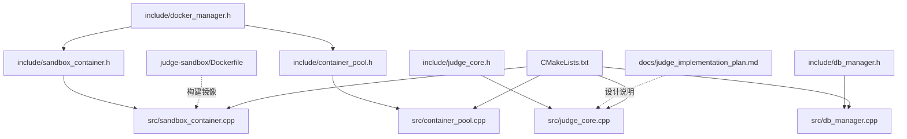
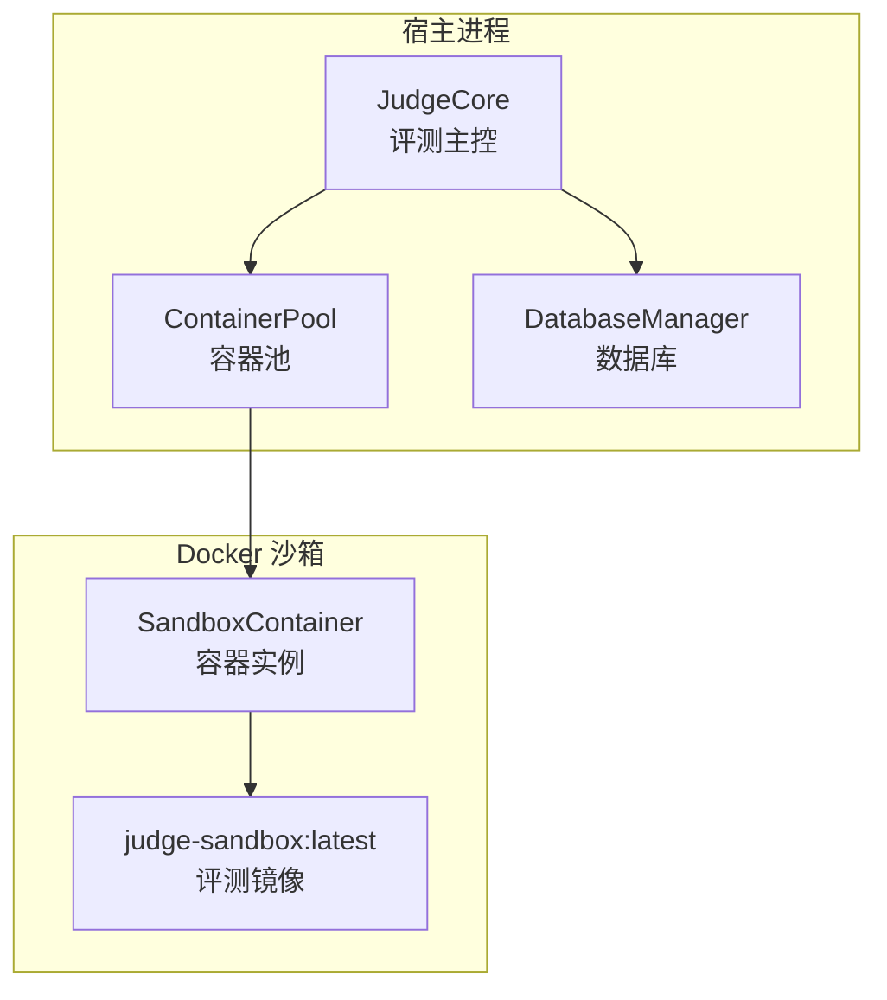
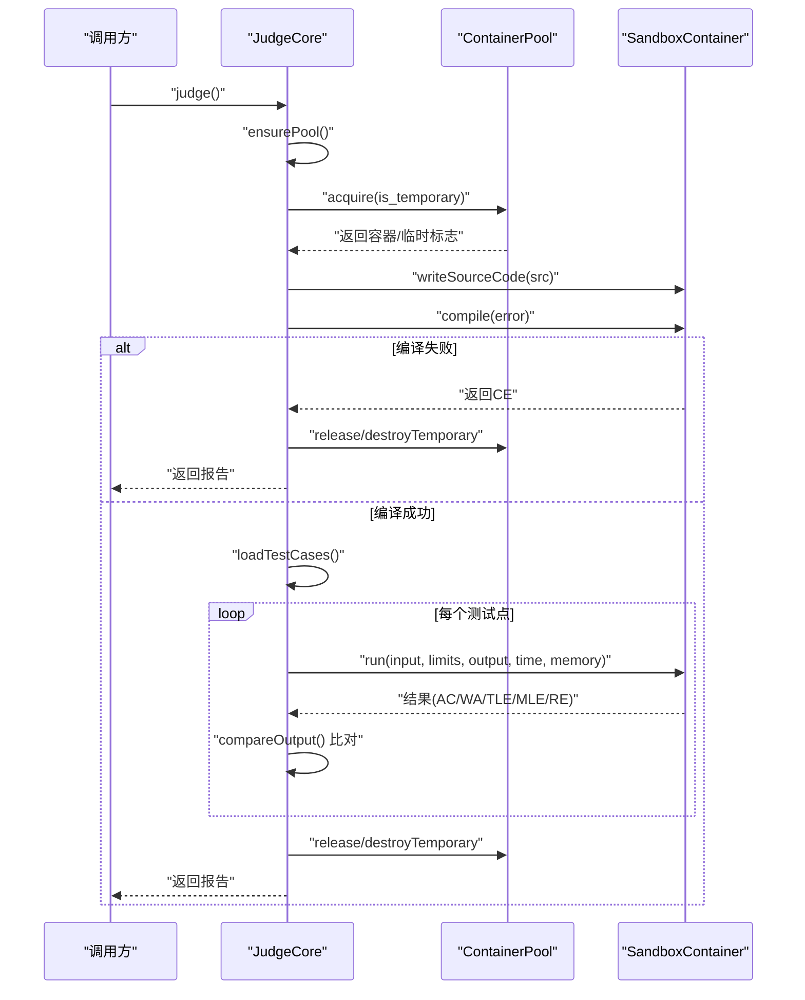
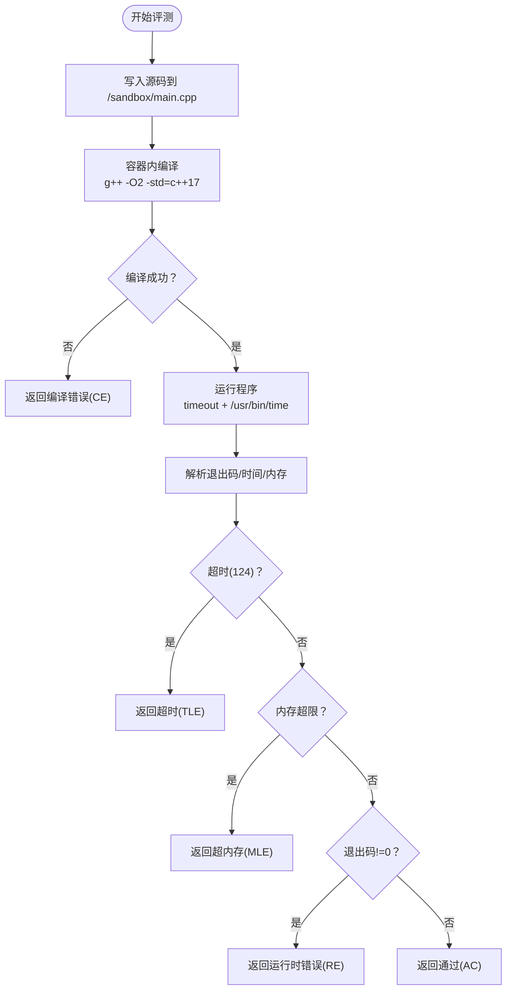
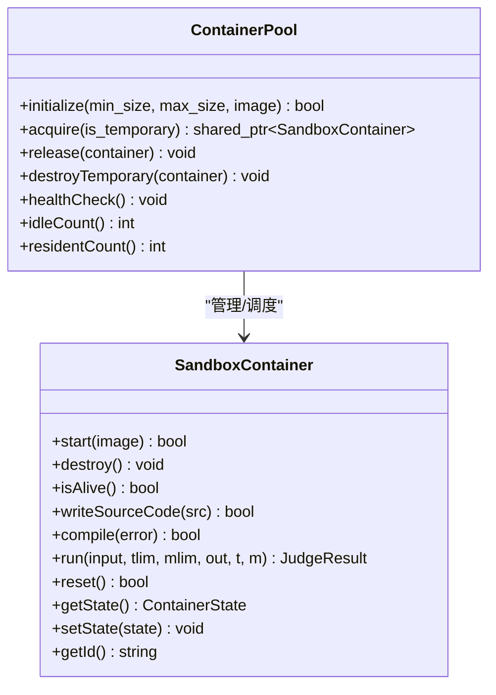
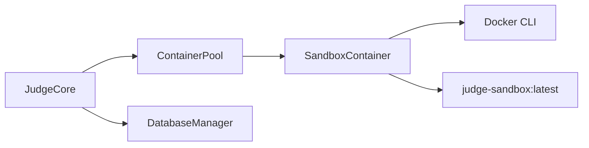

# 评测系统技术设计

<cite>
**本文引用的文件**
- [README.md](file://README.md)
- [CMakeLists.txt](file://CMakeLists.txt)
- [docs/judge_implementation_plan.md](file://docs/judge_implementation_plan.md)
- [include/judge_core.h](file://include/judge_core.h)
- [include/sandbox_container.h](file://include/sandbox_container.h)
- [include/container_pool.h](file://include/container_pool.h)
- [include/docker_manager.h](file://include/docker_manager.h)
- [include/db_manager.h](file://include/db_manager.h)
- [src/judge_core.cpp](file://src/judge_core.cpp)
- [src/sandbox_container.cpp](file://src/sandbox_container.cpp)
- [src/container_pool.cpp](file://src/container_pool.cpp)
- [src/db_manager.cpp](file://src/db_manager.cpp)
- [judge-sandbox/Dockerfile](file://judge-sandbox/Dockerfile)
</cite>

## 目录
1. [引言](#引言)
2. [项目结构](#项目结构)
3. [核心组件](#核心组件)
4. [架构总览](#架构总览)
5. [详细组件分析](#详细组件分析)
6. [依赖关系分析](#依赖关系分析)
7. [性能考量](#性能考量)
8. [故障排查指南](#故障排查指南)
9. [结论](#结论)
10. [附录](#附录)

## 引言
本文件面向OJ在线评测系统的评测核心，围绕“Docker沙箱架构”与“JudgeCore评测核心模块”的实现进行系统化技术说明。重点涵盖：
- 沙箱容器的安全隔离机制（只读根文件系统、禁用网络、丢弃capabilities、Seccomp限制）
- 资源限制策略（CPU配额、内存限制、进程数限制、墙上时间限制、输出大小限制）
- 网络隔离配置（完全禁止网络）
- 评测核心模块（JudgeCore）的编译流程、测试执行调度与结果比对算法
- 沙箱容器生命周期控制与资源回收（reset/destroy）
- 容器池（ContainerPool）并发管理与资源复用策略
- 评测过程中的安全防护与性能优化方案
- 故障诊断方法与常见问题定位

## 项目结构
项目采用“头文件接口 + 源文件实现”的分层组织方式，核心接口位于include目录，实现位于src目录；评测专用沙箱镜像位于judge-sandbox目录；评测实现方案文档位于docs目录。

图示来源
- [CMakeLists.txt:1-40](file://CMakeLists.txt#L1-L40)
- [docs/judge_implementation_plan.md:1-748](file://docs/judge_implementation_plan.md#L1-L748)
- [include/judge_core.h:1-189](file://include/judge_core.h#L1-L189)
- [include/sandbox_container.h:1-122](file://include/sandbox_container.h#L1-L122)
- [include/container_pool.h:1-85](file://include/container_pool.h#L1-L85)
- [include/docker_manager.h:1-18](file://include/docker_manager.h#L1-L18)
- [include/db_manager.h:1-60](file://include/db_manager.h#L1-L60)
- [src/judge_core.cpp:1-264](file://src/judge_core.cpp#L1-L264)
- [src/sandbox_container.cpp:1-194](file://src/sandbox_container.cpp#L1-L194)
- [src/container_pool.cpp:1-156](file://src/container_pool.cpp#L1-L156)
- [src/db_manager.cpp:1-110](file://src/db_manager.cpp#L1-L110)
- [judge-sandbox/Dockerfile:1-29](file://judge-sandbox/Dockerfile#L1-L29)

章节来源
- [CMakeLists.txt:1-40](file://CMakeLists.txt#L1-L40)
- [README.md:1-2](file://README.md#L1-L2)

## 核心组件
- JudgeCore：评测主控制器，负责配置设置、测试数据加载、逐点评测、结果汇总与持久化。
- SandboxContainer：单个沙箱容器的生命周期与评测操作封装，支持写入源码、编译、运行、重置与销毁。
- ContainerPool：容器池管理器，负责常驻容器预热、按需扩容、健康检查与回收。
- DockerManager：容器相关组件聚合头文件，统一对外暴露容器能力。
- DatabaseManager：数据库访问封装，提供连接、查询与转义等基础能力。

章节来源
- [include/judge_core.h:105-186](file://include/judge_core.h#L105-L186)
- [include/sandbox_container.h:28-122](file://include/sandbox_container.h#L28-L122)
- [include/container_pool.h:20-85](file://include/container_pool.h#L20-L85)
- [include/docker_manager.h:4-18](file://include/docker_manager.h#L4-L18)
- [include/db_manager.h:12-60](file://include/db_manager.h#L12-L60)

## 架构总览
评测系统采用“宿主进程 + Docker沙箱容器”的架构。宿主进程通过JudgeCore协调容器池，容器内完成编译与运行，借助宿主侧的资源限制与安全策略确保评测的公平、安全与稳定。

图示来源
- [src/judge_core.cpp:126-249](file://src/judge_core.cpp#L126-L249)
- [src/container_pool.cpp:56-91](file://src/container_pool.cpp#L56-L91)
- [src/sandbox_container.cpp:65-95](file://src/sandbox_container.cpp#L65-L95)
- [judge-sandbox/Dockerfile:1-29](file://judge-sandbox/Dockerfile#L1-L29)

## 详细组件分析

### JudgeCore 评测核心
职责与流程
- 配置接口：设置评测配置（时间/内存/输出限制、语言）、源代码、测试数据路径、工作目录、安全配置。
- 评测主流程：惰性初始化容器池 → 获取容器（优先常驻，否则临时）→ 写入源码 → 编译 → 加载测试数据 → 逐点运行并比对 → 汇总结果 → 归还或销毁容器 → 保存结果。
- 结果持久化：将评测报告转换为数据库字段并输出（TODO：实际写库）。
- 资源清理：触发容器池健康检查。

关键数据结构
- JudgeConfig：评测配置（时间/内存/输出限制、语言）。
- SecurityConfig：安全配置（禁网、只读根、禁特权、capabilities、Seccomp、进程/文件句柄限制）。
- ResourceLimits：资源限制（CPU配额、内存、时间/墙上时间、输出大小、进程数）。
- JudgeReport/TestCaseResult：评测报告与单点结果。

实现要点
- 惰性初始化容器池，首次评测时创建1个常驻容器，最多扩容至4个。
- 逐点评测遇到首个失败点即短路停止，保证公平性与一致性。
- 输出比对算法：忽略行尾空白后比较期望与实际输出。

图示来源
- [src/judge_core.cpp:126-249](file://src/judge_core.cpp#L126-L249)
- [src/container_pool.cpp:56-91](file://src/container_pool.cpp#L56-L91)
- [src/sandbox_container.cpp:133-184](file://src/sandbox_container.cpp#L133-L184)

章节来源
- [src/judge_core.cpp:126-249](file://src/judge_core.cpp#L126-L249)
- [include/judge_core.h:28-102](file://include/judge_core.h#L28-L102)

### SandboxContainer 沙箱容器
职责与能力
- 生命周期：start（常驻模式，sleep infinity）、isAlive、destroy。
- 评测操作：writeSourceCode、compile、run（含时间/内存统计）、reset。
- 文件交互：通过临时文件+docker exec管道写入容器，规避只读文件系统限制。

安全与隔离
- 启动参数：禁网、只读根、丢弃全部capabilities、限制PID数、tmpfs挂载沙箱目录。
- 容器内非特权用户运行，降低攻击面。

资源限制与监控
- 运行阶段使用timeout与/usr/bin/time统计实际耗时与峰值内存，结合内存限制判断MLE。
- 时间限制采用wall-clock（timeout），内存限制采用容器级限制与统计双保险。

图示来源
- [src/sandbox_container.cpp:119-184](file://src/sandbox_container.cpp#L119-L184)
- [judge-sandbox/Dockerfile:17-24](file://judge-sandbox/Dockerfile#L17-L24)

章节来源
- [include/sandbox_container.h:28-122](file://include/sandbox_container.h#L28-L122)
- [src/sandbox_container.cpp:65-194](file://src/sandbox_container.cpp#L65-L194)
- [judge-sandbox/Dockerfile:1-29](file://judge-sandbox/Dockerfile#L1-L29)

### ContainerPool 容器池
职责与策略
- 预创建min_size个常驻容器，提升响应速度。
- 评测请求优先分配空闲且存活的常驻容器；当常驻满载时按需创建临时容器（不加入常驻池，评测后立即销毁）。
- 最大并发容器总数不超过max_size。
- 健康检查：发现失联容器则销毁并重建。

图示来源
- [include/container_pool.h:20-85](file://include/container_pool.h#L20-L85)
- [src/container_pool.cpp:30-156](file://src/container_pool.cpp#L30-L156)
- [include/sandbox_container.h:28-122](file://include/sandbox_container.h#L28-L122)

章节来源
- [include/container_pool.h:10-85](file://include/container_pool.h#L10-L85)
- [src/container_pool.cpp:30-156](file://src/container_pool.cpp#L30-L156)

### DockerManager 聚合头文件
作用：统一包含容器相关类，便于上层直接引入使用。

章节来源
- [include/docker_manager.h:4-18](file://include/docker_manager.h#L4-L18)

### DatabaseManager 数据库访问
职责：封装MySQL连接、查询、转义等通用能力，为评测结果持久化提供基础。

章节来源
- [include/db_manager.h:12-60](file://include/db_manager.h#L12-L60)
- [src/db_manager.cpp:9-110](file://src/db_manager.cpp#L9-L110)

## 依赖关系分析
- JudgeCore依赖ContainerPool与SandboxContainer，间接依赖Docker CLI（通过SandboxContainer内部调用）。
- ContainerPool内部持有SandboxContainer集合，负责状态与生命周期管理。
- DatabaseManager提供数据库能力，JudgeCore预留保存接口。
- judge-sandbox/Dockerfile定义评测镜像，SandboxContainer通过docker run/exec与之交互。

图示来源
- [src/judge_core.cpp:119-124](file://src/judge_core.cpp#L119-L124)
- [src/container_pool.cpp:18-24](file://src/container_pool.cpp#L18-L24)
- [src/sandbox_container.cpp:34-39](file://src/sandbox_container.cpp#L34-L39)
- [judge-sandbox/Dockerfile:1-29](file://judge-sandbox/Dockerfile#L1-L29)

章节来源
- [src/judge_core.cpp:119-124](file://src/judge_core.cpp#L119-L124)
- [src/container_pool.cpp:18-24](file://src/container_pool.cpp#L18-L24)
- [src/sandbox_container.cpp:34-39](file://src/sandbox_container.cpp#L34-L39)

## 性能考量
- 容器预热：系统启动时创建少量常驻容器，显著降低首次评测延迟。
- 容器复用：评测完成后reset而非销毁，减少频繁创建销毁开销。
- 并发控制：通过max_size限制总并发，避免资源争抢导致抖动。
- 编译优化：容器内使用-O2优化编译参数，缩短运行时间。
- 统计精度：结合timeout（墙钟）与/usr/bin/time（CPU时间）统计，提高判题稳定性。

章节来源
- [src/container_pool.cpp:30-50](file://src/container_pool.cpp#L30-L50)
- [src/container_pool.cpp:97-103](file://src/container_pool.cpp#L97-L103)
- [src/sandbox_container.cpp:124-131](file://src/sandbox_container.cpp#L124-L131)
- [docs/judge_implementation_plan.md:641-685](file://docs/judge_implementation_plan.md#L641-L685)

## 故障排查指南
常见问题与定位
- 容器池初始化失败：检查Docker可用性与镜像是否存在；关注stderr输出。
- 无可用容器：确认max_size是否过小或常驻容器均失联；执行healthCheck重建。
- 写入源码失败：检查只读根文件系统与docker exec权限；确认临时文件写入路径。
- 编译错误（CE）：查看容器内编译输出；确认语言与编译参数。
- 超时（TLE）/超内存（MLE）：核对时间/内存限制配置；检查程序复杂度与IO阻塞。
- 运行时错误（RE）：查看容器内错误输出；定位信号或异常。
- 结果比对失败（WA）：确认忽略行尾空白策略；检查输出格式差异。

诊断步骤
- 检查容器状态：isAlive()与healthCheck()。
- 手动进入容器验证：docker exec -it <id> bash。
- 查看容器日志：docker logs <id>。
- 核对资源限制：docker inspect <id> 的Resources字段。
- 逐步缩小范围：先单点测试，再全量评测。

章节来源
- [src/judge_core.cpp:132-147](file://src/judge_core.cpp#L132-L147)
- [src/container_pool.cpp:119-135](file://src/container_pool.cpp#L119-L135)
- [src/sandbox_container.cpp:106-113](file://src/sandbox_container.cpp#L106-L113)

## 结论
本评测系统通过Docker沙箱实现强隔离与高安全性，结合容器池的并发调度与资源限制策略，能够在保证公平性的前提下高效完成大规模评测任务。JudgeCore作为评测主控，清晰地串联了编译、运行、比对与结果汇总流程；SandboxContainer与ContainerPool分别承担容器生命周期与并发管理职责，形成稳定可靠的评测流水线。后续可在数据库写入、监控指标采集与更多语言支持等方面持续演进。

## 附录

### 关键配置参数说明
- 评测配置（JudgeConfig）
  - time_limit_ms：时间限制（毫秒）
  - memory_limit_mb：内存限制（MB）
  - output_limit_mb：输出文件大小限制（MB）
  - language：编程语言（当前支持C++）

- 安全配置（SecurityConfig）
  - disable_network：是否禁用网络
  - read_only_rootfs：是否只读根文件系统
  - no_privileged：是否禁用特权模式
  - cap_drop/cap_add：capabilities丢弃/添加列表
  - seccomp_profile：Seccomp配置文件路径
  - max_pids/max_open_files：最大进程数/最大打开文件数

- 资源限制（ResourceLimits）
  - cpu_quota/cpu_period：CPU配额与调度周期
  - memory_limit_mb/memory_swap_mb：内存限制与交换限制
  - time_limit_ms/wall_time_limit_ms：CPU时间与墙上时间限制
  - output_limit_mb：输出大小限制
  - max_processes：最大进程数

章节来源
- [include/judge_core.h:28-64](file://include/judge_core.h#L28-L64)
- [include/judge_core.h:39-49](file://include/judge_core.h#L39-L49)
- [include/judge_core.h:54-64](file://include/judge_core.h#L54-L64)

### 评测流程与结果字段
- 评测流程：配置设置 → 容器获取 → 写源码 → 编译 → 加载测试数据 → 逐点运行与比对 → 汇总 → 保存 → 返回。
- 结果字段：总体结果、最大时间/内存使用、错误信息、通过/总测试点数、每个测试点的详细结果（时间/内存/差异信息）。

章节来源
- [src/judge_core.cpp:126-249](file://src/judge_core.cpp#L126-L249)
- [include/judge_core.h:93-102](file://include/judge_core.h#L93-L102)