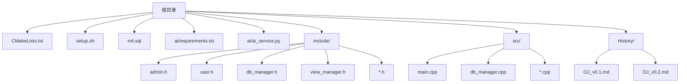
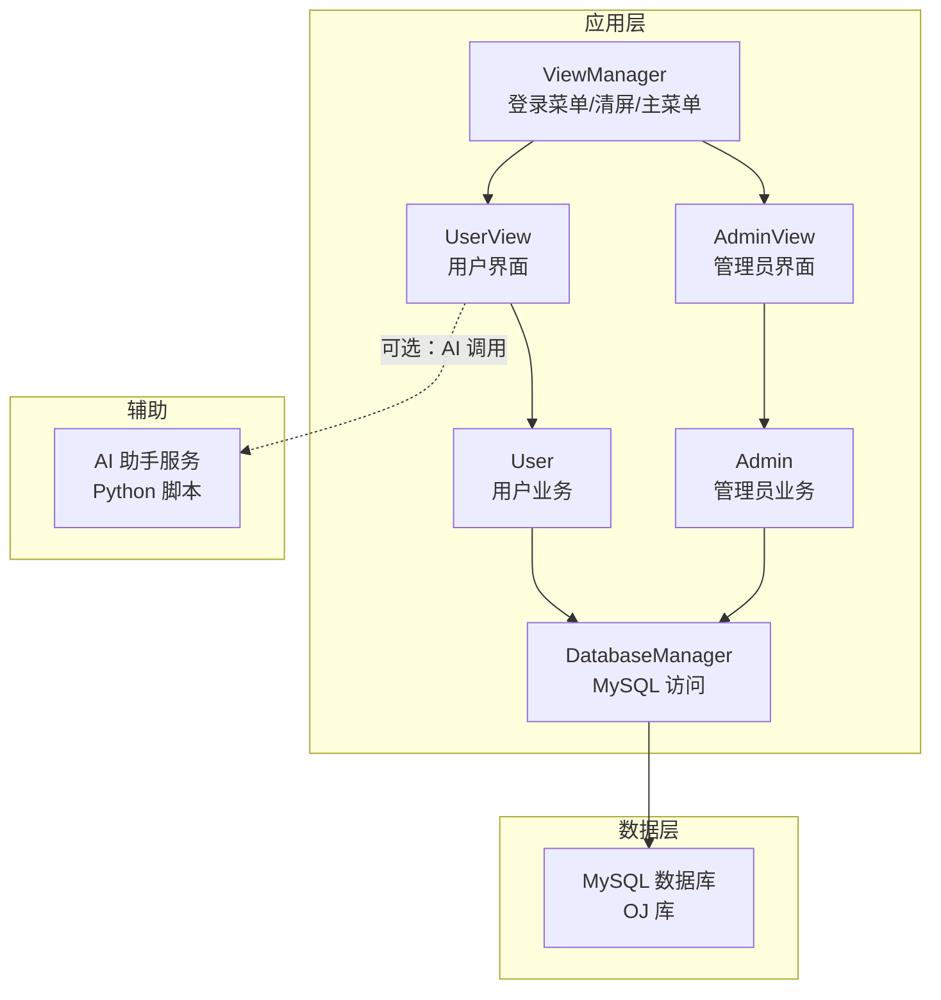
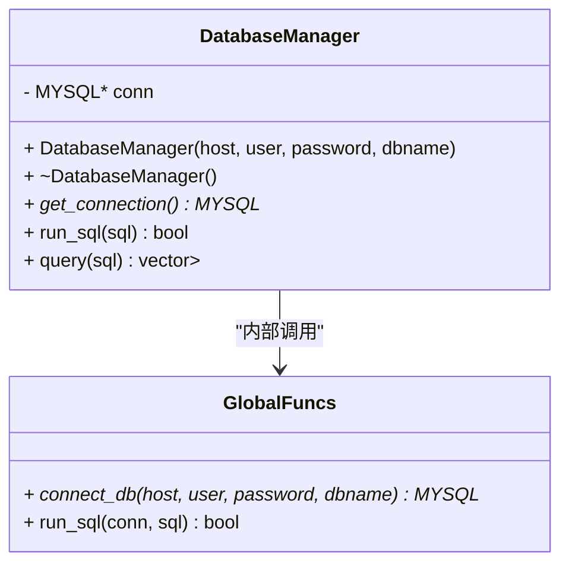
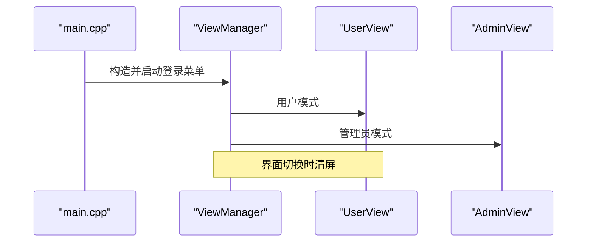
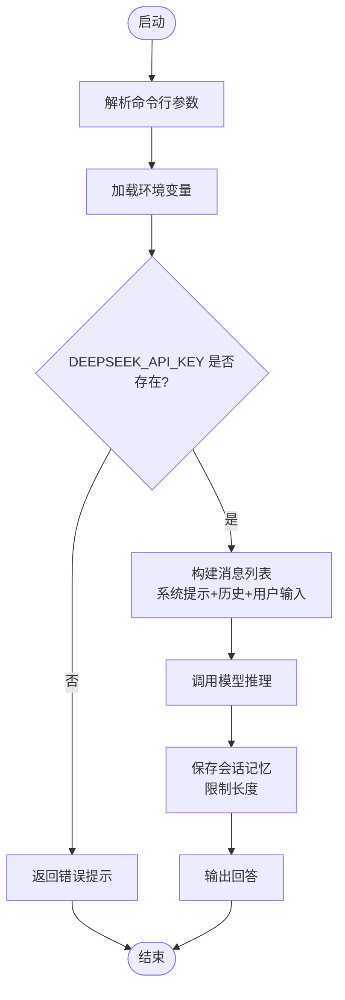
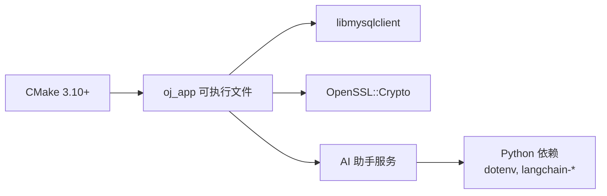

# 部署与配置

<cite>
**本文引用的文件**
- [README.md](file://README.md)
- [setup.sh](file://setup.sh)
- [CMakeLists.txt](file://CMakeLists.txt)
- [init.sql](file://init.sql)
- [ai/requirements.txt](file://ai/requirements.txt)
- [ai/ai_service.py](file://ai/ai_service.py)
- [src/main.cpp](file://src/main.cpp)
- [include/db_manager.h](file://include/db_manager.h)
- [src/db_manager.cpp](file://src/db_manager.cpp)
- [History/OJ_v0.1.md](file://History/OJ_v0.1.md)
- [History/OJ_v0.2.md](file://History/OJ_v0.2.md)
</cite>

## 目录
1. [简介](#简介)
2. [项目结构](#项目结构)
3. [核心组件](#核心组件)
4. [架构总览](#架构总览)
5. [详细组件分析](#详细组件分析)
6. [依赖关系分析](#依赖关系分析)
7. [性能考虑](#性能考虑)
8. [故障排除指南](#故障排除指南)
9. [结论](#结论)
10. [附录](#附录)

## 简介
本指南面向运维与开发人员，提供 OJ 在线判题系统从环境准备、一键部署、构建编译到系统配置的完整流程说明。内容涵盖：
- 环境要求与操作系统兼容性
- 软件依赖与硬件建议
- 安装步骤与配置项
- 不同部署场景（开发/测试/生产）的差异化配置
- 故障排除、性能优化、安全与监控建议

## 项目结构
OJ 采用 C++17 + CMake 构建，使用 MySQL 作为持久化存储，并通过 Python 实现 AI 助手能力。核心目录与文件如下：
- 根目录：一键部署脚本、构建配置、数据库初始化脚本
- include/：各模块头文件（视图、业务、数据库等）
- src/：对应实现文件
- ai/：AI 助手 Python 依赖与服务脚本
- History/：版本演进文档

图表来源
- [CMakeLists.txt:1-40](file://CMakeLists.txt#L1-L40)
- [setup.sh:1-41](file://setup.sh#L1-L41)
- [init.sql:1-143](file://init.sql#L1-L143)
- [ai/requirements.txt:1-7](file://ai/requirements.txt#L1-L7)
- [ai/ai_service.py:1-113](file://ai/ai_service.py#L1-L113)
- [src/main.cpp:1-14](file://src/main.cpp#L1-L14)
- [include/db_manager.h:1-53](file://include/db_manager.h#L1-L53)
- [src/db_manager.cpp:1-100](file://src/db_manager.cpp#L1-L100)
- [History/OJ_v0.1.md:296-320](file://History/OJ_v0.1.md#L296-L320)
- [History/OJ_v0.2.md:269-294](file://History/OJ_v0.2.md#L269-L294)

章节来源
- [CMakeLists.txt:1-40](file://CMakeLists.txt#L1-L40)
- [setup.sh:1-41](file://setup.sh#L1-L41)
- [History/OJ_v0.1.md:296-320](file://History/OJ_v0.1.md#L296-L320)
- [History/OJ_v0.2.md:269-294](file://History/OJ_v0.2.md#L269-L294)

## 核心组件
- 程序入口与界面控制器：main.cpp 与 ViewManager 负责启动登录菜单与角色切换
- 数据库访问层：DatabaseManager 封装 MySQL 连接与查询执行
- 业务模块：Admin 与 User 提供管理员与用户功能
- AI 助手：Python 脚本通过环境变量与参数接收问题，调用大模型返回指导性回答

章节来源
- [src/main.cpp:1-14](file://src/main.cpp#L1-L14)
- [include/view_manager.h:1-43](file://include/view_manager.h#L1-L43)
- [include/db_manager.h:1-53](file://include/db_manager.h#L1-L53)
- [src/db_manager.cpp:1-100](file://src/db_manager.cpp#L1-L100)
- [include/admin.h:1-40](file://include/admin.h#L1-L40)
- [include/user.h:1-89](file://include/user.h#L1-L89)
- [ai/ai_service.py:1-113](file://ai/ai_service.py#L1-L113)

## 架构总览
OJ 的运行时架构由“界面层（View）—业务层（User/Admin）—数据访问层（DatabaseManager）—数据库（MySQL）”构成；AI 助手以独立进程/服务形式存在，通过环境变量与参数与前端交互。

图表来源
- [src/main.cpp:1-14](file://src/main.cpp#L1-L14)
- [include/view_manager.h:1-43](file://include/view_manager.h#L1-L43)
- [include/user.h:1-89](file://include/user.h#L1-L89)
- [include/admin.h:1-40](file://include/admin.h#L1-L40)
- [include/db_manager.h:1-53](file://include/db_manager.h#L1-L53)
- [ai/ai_service.py:1-113](file://ai/ai_service.py#L1-L113)

## 详细组件分析

### 数据库访问层（DatabaseManager）
- 职责：封装 MySQL 连接、执行 SQL、查询结果集解析
- 关键点：
  - 构造函数中完成连接初始化
  - run_sql 静默执行，失败时输出错误
  - query 将结果集转换为字段名到值的映射列表
  - 析构函数负责关闭连接

图表来源
- [include/db_manager.h:1-53](file://include/db_manager.h#L1-L53)
- [src/db_manager.cpp:1-100](file://src/db_manager.cpp#L1-L100)

章节来源
- [include/db_manager.h:1-53](file://include/db_manager.h#L1-L53)
- [src/db_manager.cpp:1-100](file://src/db_manager.cpp#L1-L100)

### 程序入口与界面控制器（main.cpp / ViewManager）
- main.cpp：初始化 ViewManager 并启动登录菜单
- ViewManager：负责主菜单、清屏、输入缓冲区清理

图表来源
- [src/main.cpp:1-14](file://src/main.cpp#L1-L14)
- [include/view_manager.h:1-43](file://include/view_manager.h#L1-L43)

章节来源
- [src/main.cpp:1-14](file://src/main.cpp#L1-L14)
- [include/view_manager.h:1-43](file://include/view_manager.h#L1-L43)

### AI 助手服务（ai/ai_service.py）
- 通过命令行参数接收问题、会话ID、代码上下文与题目上下文
- 读取环境变量 DEEPSEEK_API_KEY 调用大模型
- 保存会话记忆，限制最多 10 轮对话

图表来源
- [ai/ai_service.py:1-113](file://ai/ai_service.py#L1-L113)

章节来源
- [ai/ai_service.py:1-113](file://ai/ai_service.py#L1-L113)

## 依赖关系分析
- 构建工具链：CMake 3.10+、C++17 标准
- 运行时依赖：MySQL 客户端库、OpenSSL
- AI 助手：Python 3.x、dotenv、langchain 生态

图表来源
- [CMakeLists.txt:1-40](file://CMakeLists.txt#L1-L40)
- [ai/requirements.txt:1-7](file://ai/requirements.txt#L1-L7)

章节来源
- [CMakeLists.txt:1-40](file://CMakeLists.txt#L1-L40)
- [ai/requirements.txt:1-7](file://ai/requirements.txt#L1-L7)

## 性能考虑
- 数据库性能
  - 合理设置索引：users.account、users.created_at、submissions.user_id、submissions.problem_id
  - 控制查询范围与排序，避免全表扫描
  - 对频繁查询的题目列表与提交记录进行分页
- 应用层性能
  - 避免在 UI 层做复杂计算，将逻辑下沉至业务层
  - 使用连接池减少连接开销（可在后续版本引入）
- AI 助手
  - 控制会话记忆长度，避免过长上下文导致延迟
  - 合理设置温度与最大 token，平衡创造性与稳定性

[本节为通用建议，无需特定文件引用]

## 故障排除指南
- 数据库初始化失败
  - 现象：执行初始化脚本报错或提示权限不足
  - 排查：确认 MySQL 服务已启动；root 密码正确；init.sql 文件存在
  - 参考：一键部署脚本中的初始化流程与错误提示
- 数据库连接失败
  - 现象：运行时报错无法连接数据库
  - 排查：确认 DatabaseManager 的连接参数（主机、用户名、密码、库名）正确；网络连通性；MySQL 用户权限
  - 参考：DatabaseManager 的连接与错误输出
- 构建失败
  - 现象：cmake 或 make 报错
  - 排查：确保已安装 libmysqlclient 开发包与 OpenSSL 开发包；CMake 版本满足要求
  - 参考：CMakeLists.txt 中的依赖查找与链接
- AI 助手不可用
  - 现象：AI 功能报错或无响应
  - 排查：确认 DEEPSEEK_API_KEY 环境变量已设置；网络可达；Python 依赖已安装
  - 参考：AI 服务脚本的参数解析与异常处理

章节来源
- [setup.sh:14-29](file://setup.sh#L14-L29)
- [src/db_manager.cpp:61-79](file://src/db_manager.cpp#L61-L79)
- [CMakeLists.txt:11-34](file://CMakeLists.txt#L11-L34)
- [ai/ai_service.py:42-91](file://ai/ai_service.py#L42-L91)

## 结论
本指南提供了 OJ 系统从环境准备到部署运行的完整路径，明确了依赖、配置与故障排查要点。建议在不同环境中根据实际需求调整数据库与 AI 服务的部署方式，并持续关注后续版本的功能扩展（如评测核心、沙箱、Docker 支持等）。

[本节为总结性内容，无需特定文件引用]

## 附录

### 环境要求与兼容性
- 操作系统
  - Linux（推荐 Ubuntu/Debian/CentOS）
  - macOS（部分依赖可能需要额外配置）
- 软件依赖
  - CMake 3.10+
  - MySQL 客户端库（libmysqlclient）
  - OpenSSL 开发包
  - Python 3.x（用于 AI 助手）
- 硬件建议
  - CPU：多核 2 核以上
  - 内存：至少 2GB（开发/测试），生产建议更高
  - 存储：数据库与测试数据目录容量充足

章节来源
- [CMakeLists.txt:1-10](file://CMakeLists.txt#L1-L10)
- [CMakeLists.txt:12-14](file://CMakeLists.txt#L12-L14)
- [ai/requirements.txt:1-7](file://ai/requirements.txt#L1-L7)

### 安装步骤（一键部署）
- 准备工作
  - 安装 MySQL 并确保服务可用
  - 安装构建工具与依赖库（CMake、libmysqlclient、OpenSSL）
- 执行一键部署
  - 运行脚本创建目录并初始化数据库
  - 按提示输入 root 密码
- 编译与运行
  - 进入 build 目录，执行 cmake、make
  - 运行可执行文件

章节来源
- [setup.sh:1-41](file://setup.sh#L1-L41)
- [CMakeLists.txt:24-34](file://CMakeLists.txt#L24-L34)

### 数据库初始化与权限
- 初始化脚本会创建数据库、表与示例数据
- 创建两个数据库用户：oj_admin（全权限）、oj_user（受限权限）
- 建议在生产环境修改默认密码并限制访问来源

章节来源
- [init.sql:8-94](file://init.sql#L8-L94)

### 配置选项与参数
- 数据库连接参数
  - 主机、用户名、密码、数据库名（在 DatabaseManager 中传入）
- AI 助手参数
  - 通过命令行参数传递问题、会话ID、代码上下文、题目上下文
  - 通过环境变量设置 DEEPSEEK_API_KEY
- CMake 构建参数
  - C++ 标准版本、导出编译命令、依赖查找与链接

章节来源
- [src/db_manager.cpp:61-79](file://src/db_manager.cpp#L61-L79)
- [ai/ai_service.py:93-113](file://ai/ai_service.py#L93-L113)
- [CMakeLists.txt:4-10](file://CMakeLists.txt#L4-L10)

### 不同部署场景的配置差异
- 开发环境
  - 使用本地 MySQL 与默认凭据
  - 可启用更宽松的日志与调试输出
- 测试环境
  - 使用独立数据库实例，模拟真实负载
  - 配置合理的索引与查询缓存
- 生产环境
  - 强化数据库权限与网络访问控制
  - 部署 AI 助手服务并配置 API 密钥与网络策略
  - 监控数据库与应用性能指标

[本节为通用建议，无需特定文件引用]

### 安全配置最佳实践
- 数据库
  - 修改默认密码，限制用户权限
  - 使用防火墙限制数据库访问来源
- 应用
  - 严格校验输入参数，避免注入风险
  - 使用 HTTPS/加密通道（如后续扩展 Web 层）
- AI 助手
  - 限制会话记忆长度，避免敏感信息泄露
  - 通过环境变量集中管理密钥

[本节为通用建议，无需特定文件引用]

### 监控配置
- 数据库层面
  - 监控慢查询、连接数、锁等待
  - 定期备份与恢复演练
- 应用层面
  - 记录关键操作日志（登录、提交、管理操作）
  - 监控内存与 CPU 使用率
- AI 助手
  - 记录调用次数与响应时间
  - 监控异常与错误日志

[本节为通用建议，无需特定文件引用]