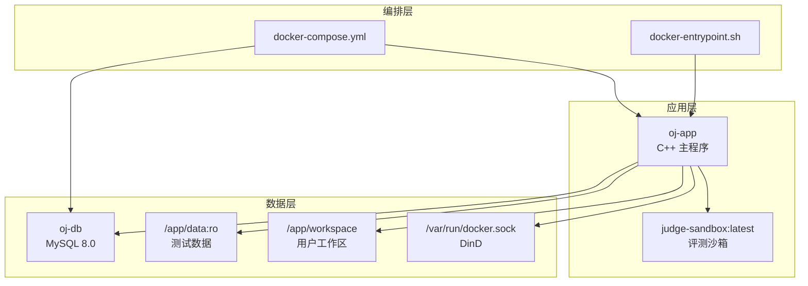
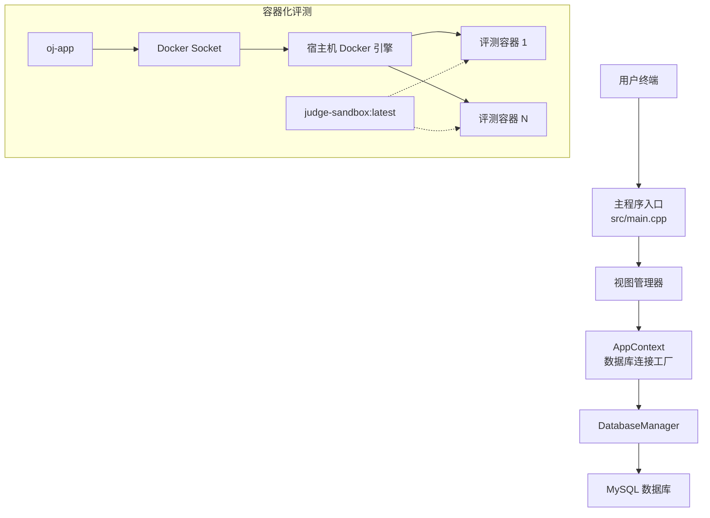
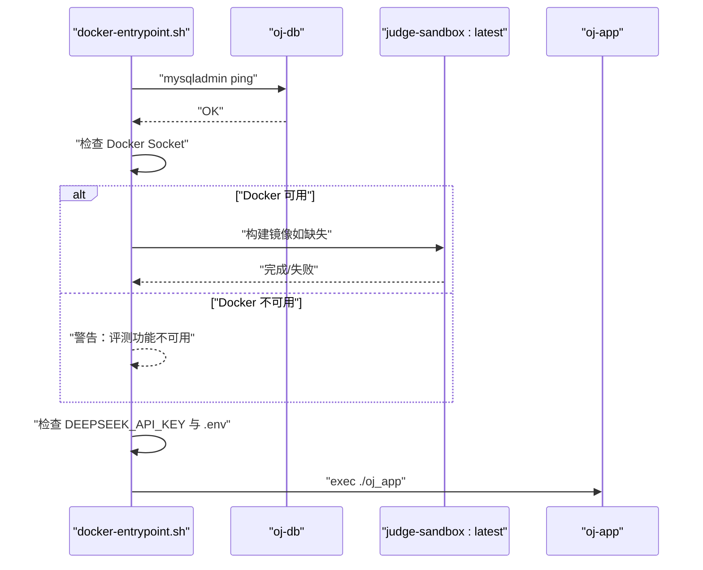
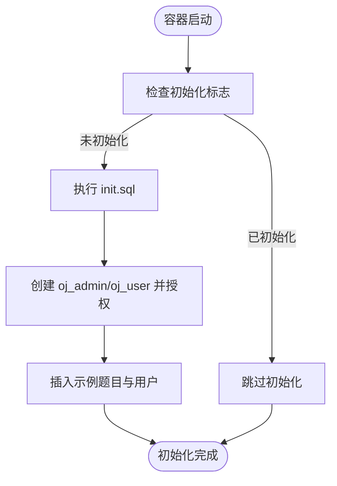
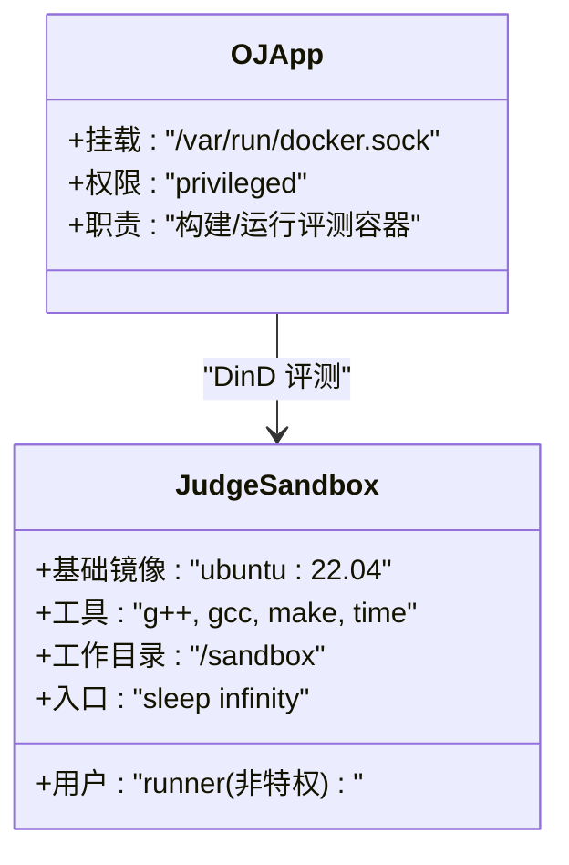
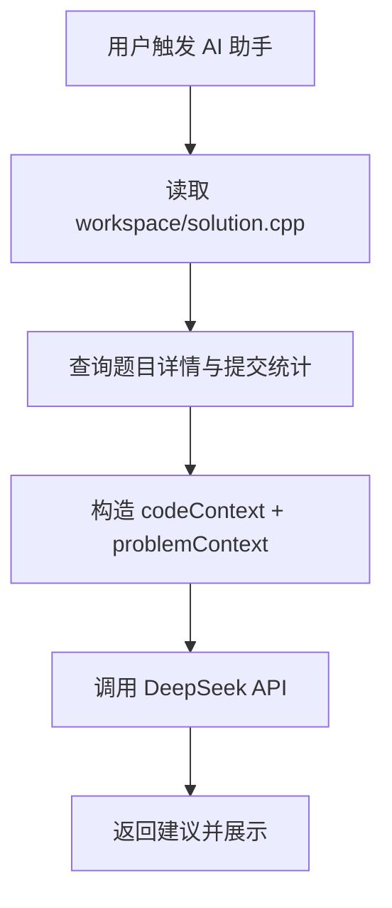
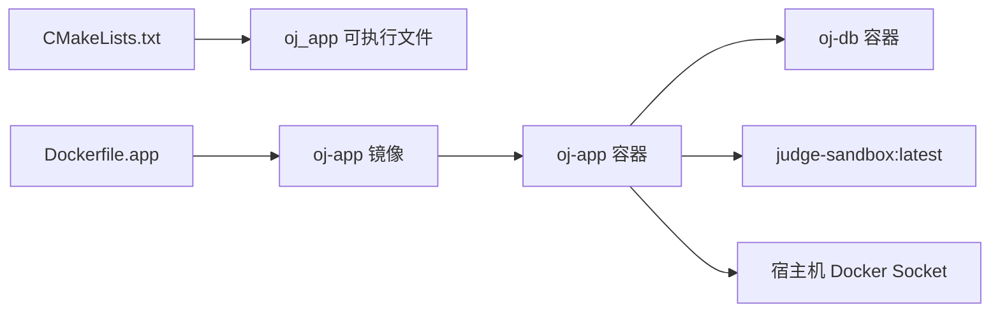

# 部署指南

<cite>
**本文引用的文件**   
- [docker-compose.yml](file://docker-compose.yml)
- [docker-entrypoint.sh](file://docker-entrypoint.sh)
- [.dockerignore](file://.dockerignore)
- [CMakeLists.txt](file://CMakeLists.txt)
- [init.sql](file://init.sql)
- [Dockerfile.app](file://Dockerfile.app)
- [judge-sandbox/Dockerfile](file://judge-sandbox/Dockerfile)
- [ai/requirements.txt](file://ai/requirements.txt)
- [docs/code_submission_design.md](file://docs/code_submission_design.md)
- [docs/judge_implementation_plan.md](file://docs/judge_implementation_plan.md)
- [src/main.cpp](file://src/main.cpp)
- [include/app_context.h](file://include/app_context.h)
- [src/app_context.cpp](file://src/app_context.cpp)
</cite>

## 目录
1. [简介](#简介)
2. [项目结构](#项目结构)
3. [核心组件](#核心组件)
4. [架构总览](#架构总览)
5. [详细组件分析](#详细组件分析)
6. [依赖关系分析](#依赖关系分析)
7. [性能考量](#性能考量)
8. [故障排查指南](#故障排查指南)
9. [结论](#结论)
10. [附录](#附录)

## 简介
本指南面向生产环境部署 OJ 在线评测系统，涵盖 Docker 镜像构建、服务编排、环境变量与安全配置、网络与存储、日志策略、CI/CD 集成、监控告警、故障恢复与灾难备份、运维检查清单以及扩展性适配方法。系统采用 Docker Compose 编排，包含 MySQL 数据库与主应用（oj-app），oj-app 通过共享宿主机 Docker Socket 实现 DinD（Docker-in-Docker）评测沙箱能力。

## 项目结构
- 顶层编排与入口
  - docker-compose.yml：定义 oj-db 与 oj-app 服务、网络、数据卷与健康检查
  - docker-entrypoint.sh：容器启动入口脚本，负责数据库等待、沙箱镜像检查、AI 配置提示与主程序启动
  - .dockerignore：构建排除项，避免敏感与无关文件进入镜像
- 应用构建与运行
  - CMakeLists.txt：C++ 应用构建配置（C++17、MySQL 与 OpenSSL 链接）
  - Dockerfile.app：oj-app 镜像构建上下文与步骤（位于仓库根目录）
  - judge-sandbox/Dockerfile：评测沙箱镜像（Ubuntu 基础、编译工具、非特权用户）
- 数据与权限
  - init.sql：数据库初始化脚本（创建库、表、用户与示例数据）
  - include/app_context.h、src/app_context.cpp：数据库连接工厂（管理员与受限用户）
- AI 与功能设计
  - ai/requirements.txt：AI 服务依赖（LangChain、DeepSeek 等）
  - docs/code_submission_design.md：工作区文件、历史下载、AI 上下文增强等设计
  - docs/judge_implementation_plan.md：容器化评测方案、安全隔离、资源监控与部署配置

图表来源
- [docker-compose.yml:13-81](file://docker-compose.yml#L13-L81)
- [docker-entrypoint.sh:26-92](file://docker-entrypoint.sh#L26-L92)

章节来源
- [docker-compose.yml:1-81](file://docker-compose.yml#L1-L81)
- [docker-entrypoint.sh:1-92](file://docker-entrypoint.sh#L1-L92)
- [.dockerignore:1-29](file://.dockerignore#L1-L29)

## 核心组件
- oj-db（MySQL 8.0）
  - 环境变量：根密码、数据库名、字符集
  - 挂载：持久化卷 oj-db-data、初始化 SQL
  - 健康检查：通过 mysqladmin ping 检测
- oj-app（C++ 主程序）
  - 构建：基于 Dockerfile.app
  - 权限：privileged（DinD 评测沙箱）
  - 环境变量：数据库主机/端口、AI API Key（可选）
  - 挂载：只读测试数据、可写工作区、共享 Docker Socket
  - 依赖：oj-db 健康
- 评测沙箱（judge-sandbox:latest）
  - 基于 Ubuntu 22.04，安装 g++/gcc/make/time
  - 非特权用户 runner，工作目录 /sandbox
  - CMD sleep infinity，便于容器内执行编译与运行
- AI 服务（可选）
  - 通过 DEEPSEEK_API_KEY 与 ai/.env 注入
  - Python 依赖见 ai/requirements.txt

章节来源
- [docker-compose.yml:16-71](file://docker-compose.yml#L16-L71)
- [judge-sandbox/Dockerfile:1-29](file://judge-sandbox/Dockerfile#L1-L29)
- [docker-entrypoint.sh:26-92](file://docker-entrypoint.sh#L26-L92)
- [ai/requirements.txt:1-7](file://ai/requirements.txt#L1-L7)

## 架构总览
系统采用“主应用 + 数据库 + 评测沙箱”的三层架构。oj-app 通过 Docker Socket 与宿主机 Docker 引擎交互，动态创建与销毁评测容器，实现隔离与并行评测。数据库通过独立服务提供统一的数据访问与权限控制。

图表来源
- [src/main.cpp:1-14](file://src/main.cpp#L1-L14)
- [include/app_context.h:15-32](file://include/app_context.h#L15-L32)
- [src/app_context.cpp:5-15](file://src/app_context.cpp#L5-L15)
- [docker-compose.yml:42-71](file://docker-compose.yml#L42-L71)

## 详细组件分析

### 组件 A：容器启动与初始化流程
- 启动顺序
  - docker-entrypoint.sh 等待 oj-db 就绪
  - 检查并构建 judge-sandbox:latest（若缺失）
  - 检查 DEEPSEEK_API_KEY 与 ai/.env
  - 启动 ./oj_app
- 关键行为
  - 数据库连接超时保护与健康检查
  - DinD 权限提示与沙箱镜像存在性校验
  - AI 功能可用性提示

图表来源
- [docker-entrypoint.sh:26-92](file://docker-entrypoint.sh#L26-L92)
- [docker-compose.yml:42-71](file://docker-compose.yml#L42-L71)

章节来源
- [docker-entrypoint.sh:26-92](file://docker-entrypoint.sh#L26-L92)
- [docker-compose.yml:42-71](file://docker-compose.yml#L42-L71)

### 组件 B：数据库初始化与权限模型
- 初始化脚本
  - 创建数据库 OJ 与字符集
  - 创建 problems、users、submissions 表
  - 创建 oj_admin（全权限）与 oj_user（受限权限）
  - 插入示例题目与示例用户
- 权限模型
  - oj_admin：对 OJ.* 具有 SELECT/INSERT/UPDATE/DELETE 权限
  - oj_user：对 problems（只读）、users/submissions（受限写入）授权
- 运行时注入
  - docker-compose 将 init.sql 挂载至 /docker-entrypoint-initdb.d，随容器首次启动自动执行

图表来源
- [init.sql:8-95](file://init.sql#L8-L95)
- [docker-compose.yml:27-31](file://docker-compose.yml#L27-L31)

章节来源
- [init.sql:8-95](file://init.sql#L8-L95)
- [docker-compose.yml:27-31](file://docker-compose.yml#L27-L31)

### 组件 C：评测沙箱镜像与 DinD 配置
- 镜像特性
  - 基础系统：Ubuntu 22.04
  - 工具链：g++/gcc/make/time
  - 安全：runner 非特权用户，工作目录 /sandbox
  - 常驻：CMD sleep infinity
- DinD 依赖
  - oj-app 挂载 /var/run/docker.sock，具备 privileged 权限
  - docker-entrypoint.sh 在首次运行时尝试构建 judge-sandbox:latest

图表来源
- [judge-sandbox/Dockerfile:1-29](file://judge-sandbox/Dockerfile#L1-L29)
- [docker-compose.yml:64-71](file://docker-compose.yml#L64-L71)
- [docker-entrypoint.sh:46-67](file://docker-entrypoint.sh#L46-L67)

章节来源
- [judge-sandbox/Dockerfile:1-29](file://judge-sandbox/Dockerfile#L1-L29)
- [docker-compose.yml:64-71](file://docker-compose.yml#L64-L71)
- [docker-entrypoint.sh:46-67](file://docker-entrypoint.sh#L46-L67)

### 组件 D：AI 功能与上下文增强（可选）
- 配置方式
  - 环境变量 DEEPSEEK_API_KEY 或 ai/.env
  - docker-compose env_file: ./ai/.env（可选）
- 上下文增强
  - 读取 workspace/solution.cpp 作为 codeContext
  - 携带题目信息与用户提交统计，形成 problemContext
- Python 依赖
  - ai/requirements.txt 包含 langchain、langchain-core、langchain-deepseek 等

图表来源
- [docker-compose.yml:55-67](file://docker-compose.yml#L55-L67)
- [docs/code_submission_design.md:131-280](file://docs/code_submission_design.md#L131-L280)
- [ai/requirements.txt:1-7](file://ai/requirements.txt#L1-L7)

章节来源
- [docker-compose.yml:55-67](file://docker-compose.yml#L55-L67)
- [docs/code_submission_design.md:131-280](file://docs/code_submission_design.md#L131-L280)
- [ai/requirements.txt:1-7](file://ai/requirements.txt#L1-L7)

## 依赖关系分析
- 构建与运行
  - CMakeLists.txt 定义 C++17、MySQL 与 OpenSSL 依赖
  - Dockerfile.app 作为 oj-app 构建上下文（位于仓库根目录）
- 运行时依赖
  - oj-app 依赖 oj-db（健康检查条件）
  - oj-app 依赖 judge-sandbox:latest（首次运行自动构建）
  - oj-app 依赖宿主机 Docker Socket（DinD）

图表来源
- [CMakeLists.txt:1-40](file://CMakeLists.txt#L1-L40)
- [docker-compose.yml:43-45](file://docker-compose.yml#L43-L45)
- [docker-compose.yml:42-71](file://docker-compose.yml#L42-L71)

章节来源
- [CMakeLists.txt:1-40](file://CMakeLists.txt#L1-L40)
- [docker-compose.yml:43-71](file://docker-compose.yml#L43-L71)

## 性能考量
- 容器池与并行评测
  - 评测容器池管理与动态扩容，减少冷启动开销
  - 容器复用与预热，缩短评测响应时间
- 资源限制与监控
  - CPU、内存、时间、输出大小限制
  - cgroup 精确监控，准确判定 TLE/MLE
- 镜像与构建
  - 评测沙箱镜像精简，减少体积与启动时间
  - .dockerignore 排除构建产物与缓存，提升构建效率

章节来源
- [docs/judge_implementation_plan.md:641-686](file://docs/judge_implementation_plan.md#L641-L686)
- [judge-sandbox/Dockerfile:1-29](file://judge-sandbox/Dockerfile#L1-L29)
- [.dockerignore:1-29](file://.dockerignore#L1-L29)

## 故障排查指南
- 数据库连接失败
  - 现象：启动时报数据库连接超时
  - 排查：确认 oj-db 健康、端口映射、环境变量 OJ_DB_HOST/OJ_DB_PORT
- DinD 权限不足
  - 现象：评测功能不可用
  - 排查：确认 oj-app privileged=true、挂载 /var/run/docker.sock
- 沙箱镜像缺失
  - 现象：首次运行提示构建失败或评测不可用
  - 排查：检查 judge-sandbox/Dockerfile 是否存在、构建权限、网络可达
- AI 功能不可用
  - 现象：AI 功能提示不可用
  - 排查：确认 DEEPSEEK_API_KEY 或 ai/.env 是否正确配置

章节来源
- [docker-entrypoint.sh:26-92](file://docker-entrypoint.sh#L26-L92)
- [docker-compose.yml:42-71](file://docker-compose.yml#L42-L71)

## 结论
本部署指南提供了从镜像构建、服务编排到生产最佳实践的完整路径。通过合理的网络与存储配置、严格的权限与安全策略、完善的监控与日志体系，以及可扩展的 CI/CD 与灾难备份方案，系统能够在生产环境中稳定、安全地提供在线评测与 AI 辅助能力。

## 附录

### A. 环境变量与配置清单
- oj-db
  - MYSQL_ROOT_PASSWORD：数据库根密码
  - MYSQL_DATABASE：默认数据库名
  - MYSQL_CHARSET：字符集
- oj-app
  - OJ_DB_HOST：数据库主机名（默认 localhost，Compose 中指向 oj-db）
  - OJ_DB_PORT：数据库端口
  - DEEPSEEK_API_KEY：AI API 密钥（可选）
- ai/.env（可选）
  - DEEPSEEK_API_KEY：AI 密钥（通过 env_file 注入）

章节来源
- [docker-compose.yml:20-31](file://docker-compose.yml#L20-L31)
- [docker-compose.yml:55-67](file://docker-compose.yml#L55-L67)

### B. 生产环境最佳实践
- 安全
  - 限制 oj-app 权限，仅在必要时启用 privileged
  - 使用只读挂载与非特权用户运行
  - 严格管理敏感环境变量与 .env 文件
- 网络
  - 使用自定义桥接网络（oj-net），避免暴露宿主机端口
  - 限制容器间访问，仅开放必要端口
- 存储
  - 使用命名卷 oj-db-data 持久化数据库
  - 将工作区与测试数据分别挂载，明确读写属性
- 日志
  - 配置 Docker 日志轮转（max-size/max-file）
  - 将应用日志输出到标准输出，由编排系统统一收集

章节来源
- [docker-compose.yml:78-81](file://docker-compose.yml#L78-L81)
- [docker-compose.yml:27-29](file://docker-compose.yml#L27-L29)
- [docker-compose.yml:64-67](file://docker-compose.yml#L64-L67)

### C. CI/CD 集成与自动化部署
- 构建流程
  - 触发：代码推送或合并请求
  - 步骤：拉取依赖、构建 C++ 可执行文件、构建 oj-app 镜像、构建 judge-sandbox 镜像
  - 结果：推送镜像到镜像仓库
- 部署流程
  - 触发：镜像发布标签
  - 步骤：拉取最新镜像、更新编排、滚动更新、健康检查
- 版本管理
  - 使用语义化版本标签（vX.Y.Z）
  - 记录 init.sql 变更与数据库迁移策略

章节来源
- [CMakeLists.txt:1-40](file://CMakeLists.txt#L1-L40)
- [docker-compose.yml:43-45](file://docker-compose.yml#L43-L45)
- [judge-sandbox/Dockerfile:1-29](file://judge-sandbox/Dockerfile#L1-L29)

### D. 监控告警与故障恢复
- 监控
  - 健康检查：oj-db 健康检查
  - 资源监控：容器 CPU/内存/PIDs 监控
- 告警
  - 数据库不可达、评测容器异常、沙箱镜像构建失败
- 故障恢复
  - 容器自动重启（unless-stopped）
  - 评测容器异常时销毁并重建
  - 数据库故障时检查权限与初始化脚本

章节来源
- [docker-compose.yml:32-37](file://docker-compose.yml#L32-L37)
- [docs/judge_implementation_plan.md:591-637](file://docs/judge_implementation_plan.md#L591-L637)

### E. 灾难备份策略
- 数据库备份
  - 定期导出数据库（mysqldump）与快照
  - 将备份存储至远端对象存储
- 配置备份
  - 备份 docker-compose.yml、.env、init.sql
- 恢复演练
  - 定期进行离线恢复演练，验证备份完整性

章节来源
- [init.sql:1-278](file://init.sql#L1-L278)
- [docker-compose.yml:27-31](file://docker-compose.yml#L27-L31)

### F. 运维检查清单
- 部署前
  - 确认 Docker 与 Compose 版本
  - 准备 ai/.env（可选）与 .dockerignore
  - 准备测试数据与工作区目录
- 部署后
  - 检查 oj-db 健康与初始化状态
  - 检查 oj-app 启动日志与 AI 配置提示
  - 验证 DinD 权限与沙箱镜像可用性
  - 执行一次评测与登录测试

章节来源
- [docker-entrypoint.sh:26-92](file://docker-entrypoint.sh#L26-L92)
- [docker-compose.yml:42-71](file://docker-compose.yml#L42-L71)