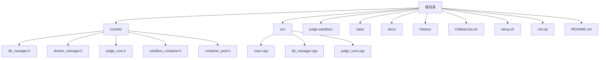
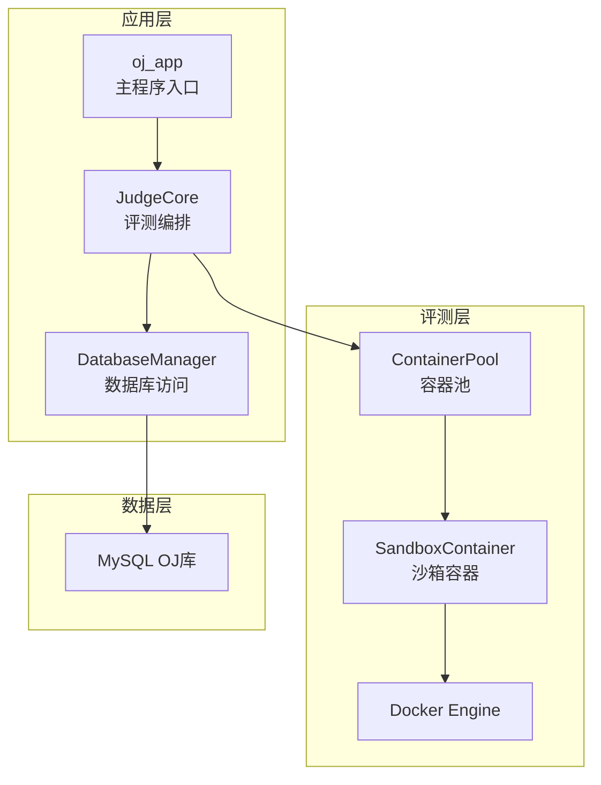
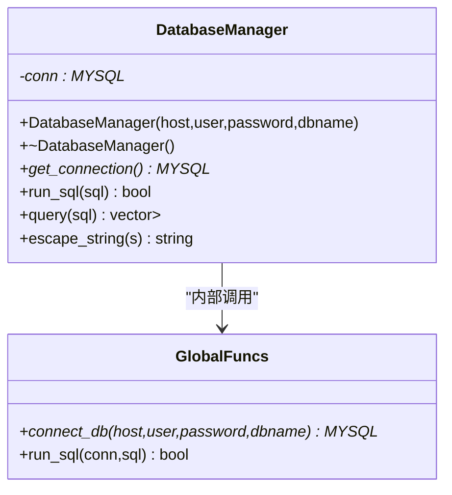
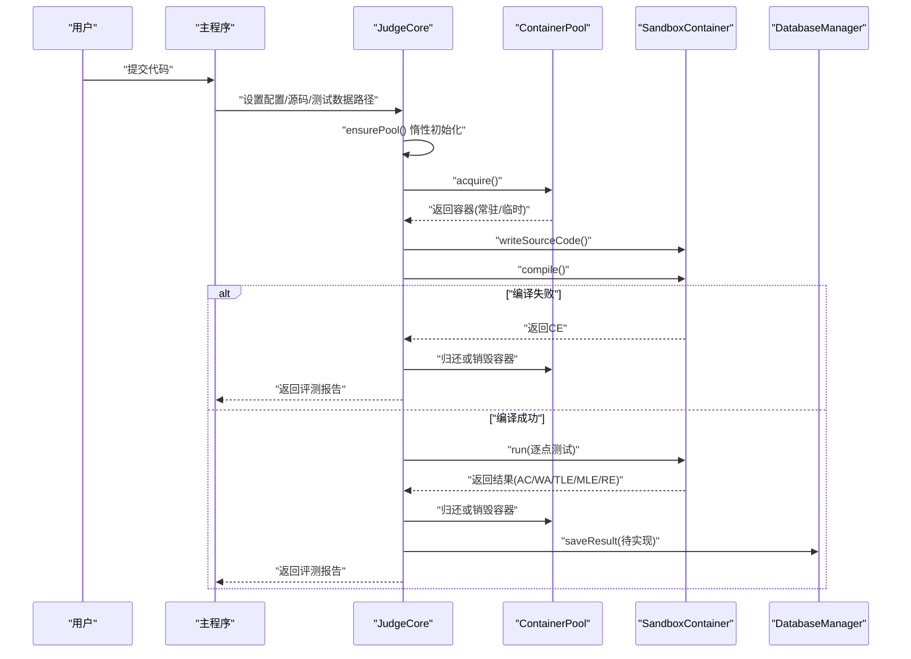
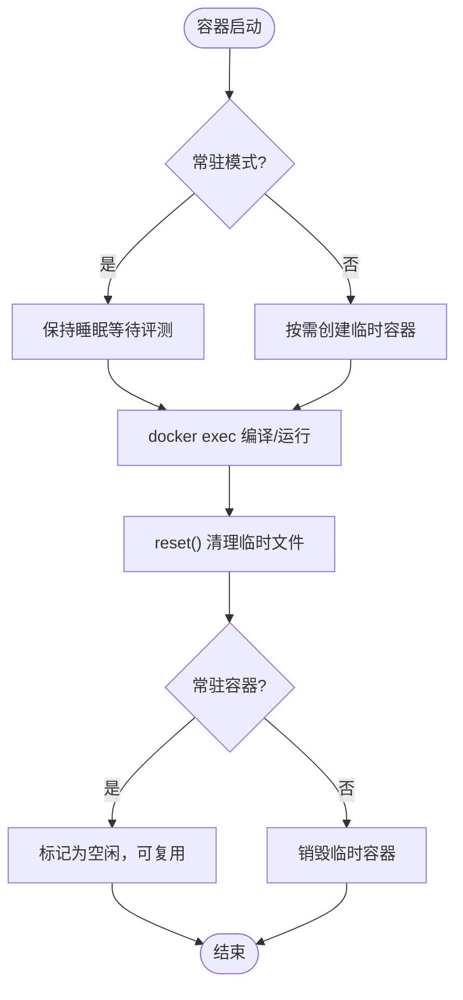
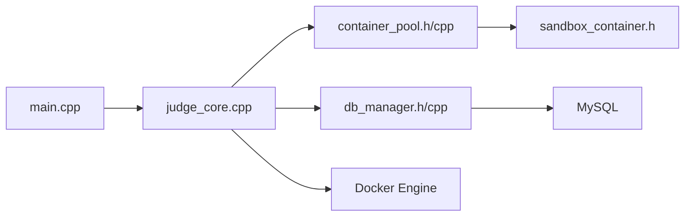

# 部署运维

<cite>
**本文引用的文件**
- [README.md](file://README.md)
- [setup.sh](file://setup.sh)
- [init.sql](file://init.sql)
- [CMakeLists.txt](file://CMakeLists.txt)
- [src/main.cpp](file://src/main.cpp)
- [include/db_manager.h](file://include/db_manager.h)
- [src/db_manager.cpp](file://src/db_manager.cpp)
- [include/docker_manager.h](file://include/docker_manager.h)
- [include/judge_core.h](file://include/judge_core.h)
- [src/judge_core.cpp](file://src/judge_core.cpp)
- [include/sandbox_container.h](file://include/sandbox_container.h)
- [include/container_pool.h](file://include/container_pool.h)
- [judge-sandbox/Dockerfile](file://judge-sandbox/Dockerfile)
</cite>

## 目录
1. [简介](#简介)
2. [项目结构](#项目结构)
3. [核心组件](#核心组件)
4. [架构总览](#架构总览)
5. [详细组件分析](#详细组件分析)
6. [依赖关系分析](#依赖关系分析)
7. [性能考量](#性能考量)
8. [故障排除指南](#故障排除指南)
9. [结论](#结论)
10. [附录](#附录)

## 简介
本文件面向OJ在线评测系统的生产部署与运维，围绕服务器配置、依赖安装、系统初始化、监控与日志、备份与恢复、故障排除、升级与维护、运维自动化以及安全加固与合规性等方面，提供可操作的流程与最佳实践。系统采用C++开发，评测核心基于Docker沙箱容器实现，数据库使用MySQL，构建系统采用CMake。

## 项目结构
仓库采用“按职责分层”的组织方式：
- include：对外公开的头文件，定义数据库、容器与评测核心接口
- src：实现文件，包含主程序入口、数据库管理、评测核心、容器与池化调度等
- judge-sandbox：Docker镜像构建上下文，提供评测沙箱基础环境
- data：示例测试数据目录（按题号子目录组织）
- docs：设计文档（如评测实现计划、提交设计）
- History：版本演进记录
- 根目录脚本：一键部署与数据库初始化脚本

图表来源
- [CMakeLists.txt:1-40](file://CMakeLists.txt#L1-L40)
- [src/main.cpp:1-14](file://src/main.cpp#L1-L14)
- [include/db_manager.h:1-60](file://include/db_manager.h#L1-L60)
- [include/docker_manager.h:1-18](file://include/docker_manager.h#L1-L18)
- [include/judge_core.h:1-189](file://include/judge_core.h#L1-L189)
- [include/sandbox_container.h:1-122](file://include/sandbox_container.h#L1-L122)
- [include/container_pool.h:1-85](file://include/container_pool.h#L1-L85)
- [judge-sandbox/Dockerfile:1-29](file://judge-sandbox/Dockerfile#L1-L29)

章节来源
- [CMakeLists.txt:1-40](file://CMakeLists.txt#L1-L40)
- [README.md:1-2](file://README.md#L1-L2)

## 核心组件
- 数据库管理：封装MySQL连接、SQL执行、查询结果映射与转义，提供安全的数据库访问能力
- 评测核心：负责加载测试数据、编排容器执行、资源统计与结果判定
- 沙箱容器：封装Docker容器生命周期与文件交互，支持常驻模式与临时容器
- 容器池：实现常驻容器预热、按需扩容、健康检查与回收
- 构建系统：CMake查找MySQL与OpenSSL依赖，生成可执行文件
- 部署脚本：一键创建目录、初始化数据库、提示编译步骤

章节来源
- [include/db_manager.h:1-60](file://include/db_manager.h#L1-L60)
- [src/db_manager.cpp:1-110](file://src/db_manager.cpp#L1-L110)
- [include/judge_core.h:1-189](file://include/judge_core.h#L1-L189)
- [src/judge_core.cpp:1-264](file://src/judge_core.cpp#L1-L264)
- [include/sandbox_container.h:1-122](file://include/sandbox_container.h#L1-L122)
- [include/container_pool.h:1-85](file://include/container_pool.h#L1-L85)
- [CMakeLists.txt:1-40](file://CMakeLists.txt#L1-L40)
- [setup.sh:1-41](file://setup.sh#L1-L41)

## 架构总览
系统采用“本地应用 + Docker沙箱 + MySQL数据库”的三层架构：
- 应用层：C++可执行程序，负责界面与业务流程
- 评测层：Docker容器沙箱，隔离编译与运行环境
- 数据层：MySQL数据库，存储题目、用户与提交记录

图表来源
- [src/main.cpp:1-14](file://src/main.cpp#L1-L14)
- [src/judge_core.cpp:1-264](file://src/judge_core.cpp#L1-L264)
- [include/container_pool.h:1-85](file://include/container_pool.h#L1-L85)
- [include/sandbox_container.h:1-122](file://include/sandbox_container.h#L1-L122)
- [include/db_manager.h:1-60](file://include/db_manager.h#L1-L60)
- [src/db_manager.cpp:1-110](file://src/db_manager.cpp#L1-L110)

## 详细组件分析

### 数据库管理模块
- 职责：封装MySQL连接、SQL执行、查询结果集映射、字符串转义
- 关键点：构造时建立连接，析构时关闭；提供查询结果的列名到值的映射；对输入进行转义防止注入
- 安全：使用转义函数与受控查询接口，避免直接拼接SQL

图表来源
- [include/db_manager.h:1-60](file://include/db_manager.h#L1-L60)
- [src/db_manager.cpp:1-110](file://src/db_manager.cpp#L1-L110)

章节来源
- [include/db_manager.h:1-60](file://include/db_manager.h#L1-L60)
- [src/db_manager.cpp:1-110](file://src/db_manager.cpp#L1-L110)

### 评测核心与容器编排
- 职责：加载测试数据、编排容器执行、资源统计、结果判定与持久化
- 关键点：惰性初始化容器池；优先使用常驻容器，超限时按需创建临时容器；遇到首个失败测试点即短路
- 安全：沙箱容器禁用网络、只读文件系统、丢弃全部capabilities，限制进程与文件句柄数

图表来源
- [src/judge_core.cpp:126-249](file://src/judge_core.cpp#L126-L249)
- [include/container_pool.h:33-61](file://include/container_pool.h#L33-L61)
- [include/sandbox_container.h:36-83](file://include/sandbox_container.h#L36-L83)
- [include/db_manager.h:14-42](file://include/db_manager.h#L14-L42)

章节来源
- [include/judge_core.h:1-189](file://include/judge_core.h#L1-L189)
- [src/judge_core.cpp:1-264](file://src/judge_core.cpp#L1-L264)
- [include/container_pool.h:1-85](file://include/container_pool.h#L1-L85)
- [include/sandbox_container.h:1-122](file://include/sandbox_container.h#L1-L122)

### 沙箱容器与Docker镜像
- 职责：封装容器生命周期、文件写入、容器内编译与运行、状态管理
- 关键点：常驻模式以“sleep infinity”保持存活；通过docker exec在容器内执行命令；评测后reset清理
- 镜像：基于Ubuntu 22.04，安装g++/gcc/make/time，创建runner用户，工作目录/sandbox

图表来源
- [include/sandbox_container.h:28-83](file://include/sandbox_container.h#L28-L83)
- [judge-sandbox/Dockerfile:1-29](file://judge-sandbox/Dockerfile#L1-L29)

章节来源
- [include/sandbox_container.h:1-122](file://include/sandbox_container.h#L1-L122)
- [judge-sandbox/Dockerfile:1-29](file://judge-sandbox/Dockerfile#L1-L29)

### 构建与依赖
- CMake：设置C++17标准，导出编译命令，查找mysqlclient与OpenSSL，链接库并生成可执行文件
- 依赖：MySQL客户端库、OpenSSL加密库

章节来源
- [CMakeLists.txt:1-40](file://CMakeLists.txt#L1-L40)

### 部署与初始化
- 一键脚本：创建build与test_data目录，初始化数据库（需要root权限），提示后续编译步骤
- 数据库初始化：创建OJ库与表，创建管理员与受限数据库用户，授予最小权限，插入示例数据

章节来源
- [setup.sh:1-41](file://setup.sh#L1-L41)
- [init.sql:1-278](file://init.sql#L1-L278)

## 依赖关系分析
- 组件耦合：评测核心依赖容器池与沙箱容器；容器池依赖沙箱容器；评测核心与数据库管理解耦，便于替换持久化策略
- 外部依赖：MySQL、OpenSSL、Docker引擎
- 潜在风险：容器池初始化失败或Docker不可用会导致评测失败；数据库连接异常影响提交记录写入

图表来源
- [src/main.cpp:1-14](file://src/main.cpp#L1-L14)
- [src/judge_core.cpp:1-264](file://src/judge_core.cpp#L1-L264)
- [include/container_pool.h:1-85](file://include/container_pool.h#L1-L85)
- [include/sandbox_container.h:1-122](file://include/sandbox_container.h#L1-L122)
- [include/db_manager.h:1-60](file://include/db_manager.h#L1-L60)
- [src/db_manager.cpp:1-110](file://src/db_manager.cpp#L1-L110)

## 性能考量
- 容器池策略：启动时预热少量常驻容器，减少冷启动开销；按需扩容至最大并发数，避免过载
- 资源限制：评测时严格设置CPU、内存、时间与输出大小限制，防止资源滥用
- I/O优化：测试数据按顺序扫描，遇到首个失败即短路，降低无效执行
- 数据库写入：评测结果持久化接口预留，建议批量写入与索引优化

章节来源
- [include/container_pool.h:10-19](file://include/container_pool.h#L10-L19)
- [include/judge_core.h:28-64](file://include/judge_core.h#L28-L64)
- [src/judge_core.cpp:174-185](file://src/judge_core.cpp#L174-L185)

## 故障排除指南
- 数据库初始化失败
  - 现象：脚本报错提示密码或服务状态
  - 排查：确认MySQL服务运行、root密码正确、init.sql存在
  - 处理：修正凭据后重新执行脚本
- 容器池初始化失败
  - 现象：评测报“容器池初始化失败”
  - 排查：检查Docker服务状态、镜像是否存在、权限是否足够
  - 处理：启动Docker服务、拉取/构建沙箱镜像后重试
- 编译失败（CE）
  - 现象：评测返回编译错误
  - 排查：查看容器内编译输出，确认语言支持与编译选项
  - 处理：修正语法或适配沙箱环境
- 无可用容器
  - 现象：评测报“系统繁忙”
  - 排查：检查容器池上限与健康状况
  - 处理：扩容容器池或等待容器归还
- 数据库连接异常
  - 现象：查询/执行失败并输出错误信息
  - 排查：核对连接参数、用户权限与网络连通性
  - 处理：修正配置或授权

章节来源
- [setup.sh:14-29](file://setup.sh#L14-L29)
- [src/judge_core.cpp:132-147](file://src/judge_core.cpp#L132-L147)
- [src/judge_core.cpp:159-171](file://src/judge_core.cpp#L159-L171)
- [src/db_manager.cpp:42-46](file://src/db_manager.cpp#L42-L46)

## 结论
本OJ系统通过容器化沙箱实现安全可靠的评测执行，结合CMake构建与MySQL数据持久化，具备清晰的模块边界与可扩展性。生产部署应重点关注Docker可用性、数据库权限与网络隔离、容器池容量与健康检查，以及评测结果的持久化与可观测性建设。

## 附录

### 生产环境部署流程
- 服务器准备
  - 安装Docker引擎与系统所需工具
  - 配置防火墙与安全组，开放必要端口
- 依赖安装
  - 安装MySQL客户端库与OpenSSL开发包
  - 安装CMake与编译工具链
- 系统初始化
  - 执行一键部署脚本创建目录并初始化数据库
  - 检查数据库用户权限与示例数据
- 构建与运行
  - 进入build目录，执行CMake与编译
  - 启动可执行程序，验证登录与评测流程

章节来源
- [setup.sh:1-41](file://setup.sh#L1-L41)
- [CMakeLists.txt:11-34](file://CMakeLists.txt#L11-L34)
- [src/main.cpp:1-14](file://src/main.cpp#L1-L14)

### 监控与日志管理
- 系统状态监控
  - Docker容器健康检查：定期检测容器存活与重启次数
  - 容器池指标：空闲/忙碌数量、临时容器占比、平均等待时间
- 性能指标收集
  - 评测耗时与峰值内存：记录每个测试点与总体指标
  - 数据库延迟：查询耗时与连接池使用率
- 日志分析
  - 应用日志：评测流程、错误堆栈、权限与连接失败
  - 容器日志：编译器输出、运行时异常
  - 数据库日志：慢查询与错误日志

[本节为通用运维建议，不直接分析具体文件]

### 备份与恢复策略
- 数据库备份
  - 全量/增量备份策略，保留多版本快照
  - 校验备份完整性与可恢复性
- 文件系统备份
  - 测试数据目录与工作目录定期快照
- 灾难恢复流程
  - 快速定位最近可用备份，恢复数据库与文件
  - 验证应用连通性与评测功能

[本节为通用运维建议，不直接分析具体文件]

### 升级与维护流程
- 版本更新
  - 评估容器镜像与依赖变更，灰度发布
- 配置变更
  - 调整容器池规模、资源限制与安全策略
- 性能调优
  - 分析评测瓶颈，优化容器池与资源限额

[本节为通用运维建议，不直接分析具体文件]

### 运维自动化工具与脚本
- 部署脚本：一键创建目录、初始化数据库、提示编译步骤
- 建议：结合CI/CD流水线自动构建与发布

章节来源
- [setup.sh:1-41](file://setup.sh#L1-L41)

### 运维团队职责分工与工作流程
- 基础设施：Docker与MySQL维护、网络与安全策略
- 平台运维：应用部署、监控告警、日志分析
- 评测保障：容器镜像维护、沙箱策略更新、评测稳定性

[本节为通用运维建议，不直接分析具体文件]

### 安全加固与合规性检查
- 容器安全
  - 禁用网络、只读文件系统、丢弃全部capabilities
  - 限制进程数与文件句柄数，禁止特权模式
- 数据库安全
  - 最小权限原则、弱密码策略、审计日志
- 合规性
  - 数据保护与隐私政策遵循、访问日志留存

章节来源
- [include/judge_core.h:54-64](file://include/judge_core.h#L54-L64)
- [init.sql:68-95](file://init.sql#L68-L95)