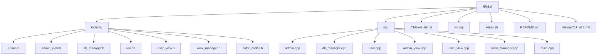
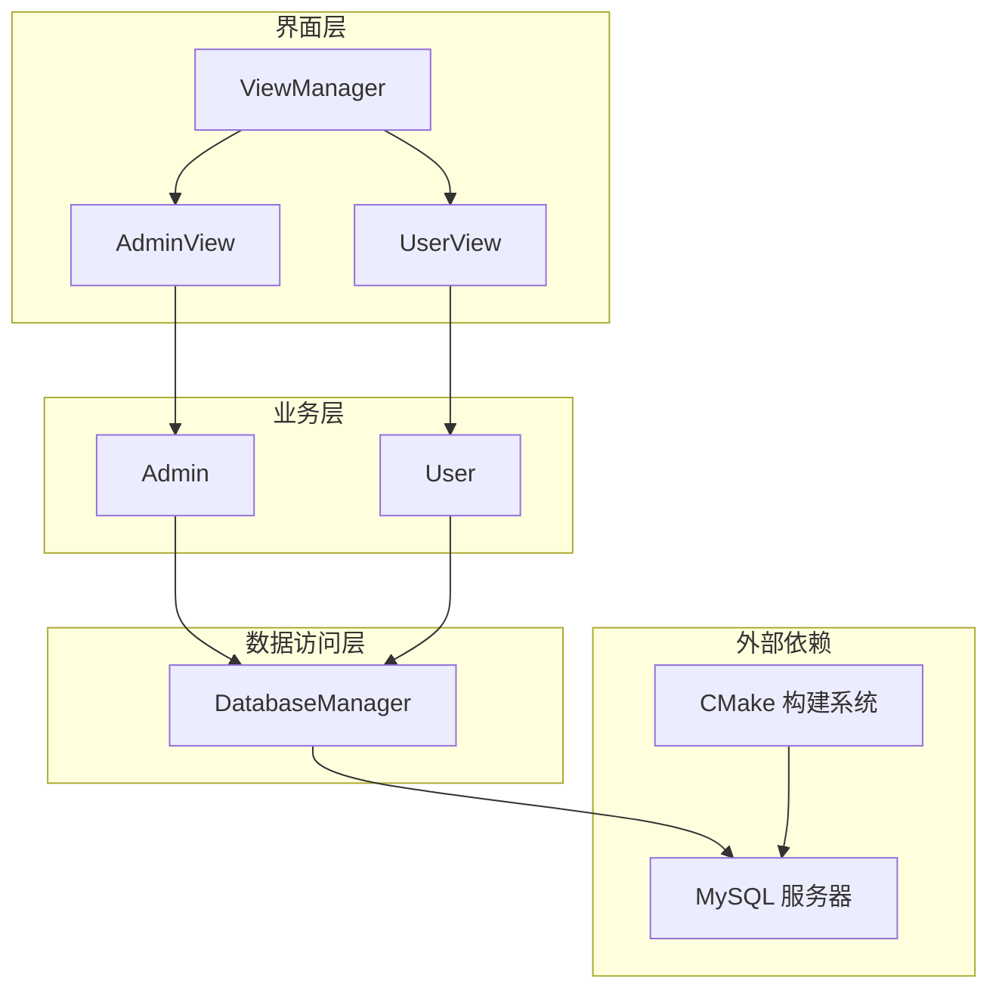
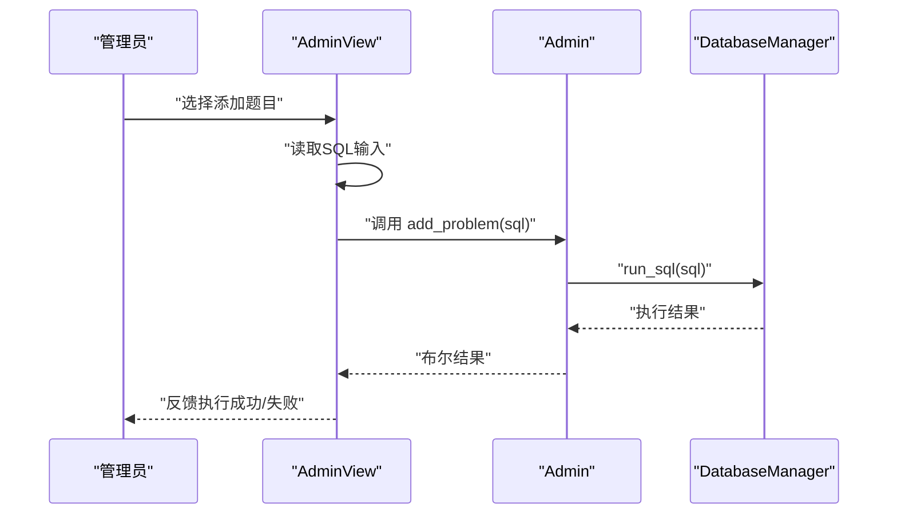
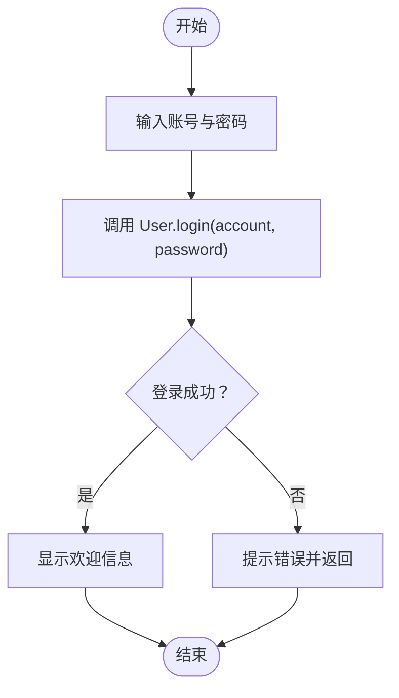
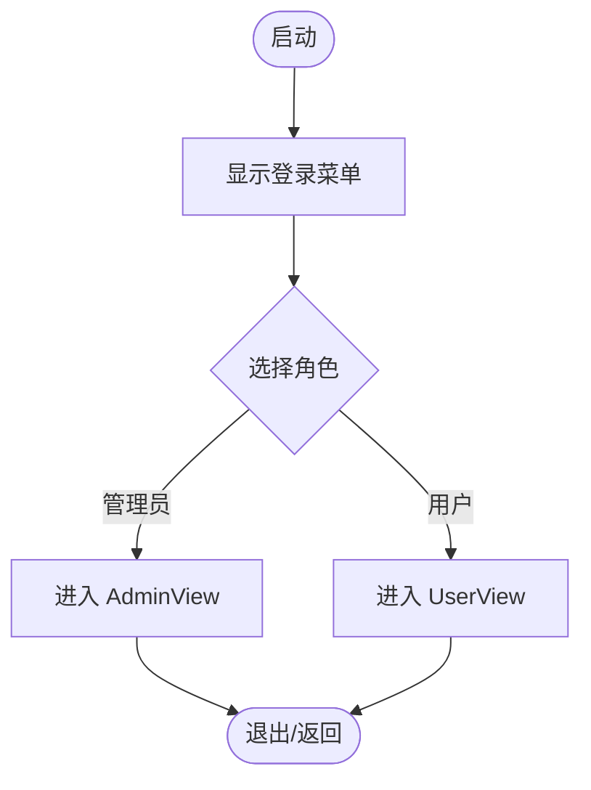
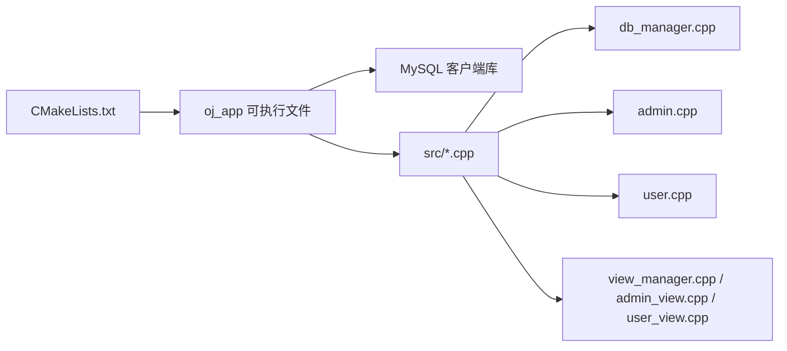

# 项目概述

<cite>
**本文引用的文件**
- [README.md](file://README.md)
- [CMakeLists.txt](file://CMakeLists.txt)
- [init.sql](file://init.sql)
- [setup.sh](file://setup.sh)
- [src/main.cpp](file://src/main.cpp)
- [include/db_manager.h](file://include/db_manager.h)
- [src/db_manager.cpp](file://src/db_manager.cpp)
- [include/admin.h](file://include/admin.h)
- [src/admin.cpp](file://src/admin.cpp)
- [include/user.h](file://include/user.h)
- [src/user.cpp](file://src/user.cpp)
- [include/view_manager.h](file://include/view_manager.h)
- [include/admin_view.h](file://include/admin_view.h)
- [include/user_view.h](file://include/user_view.h)
- [include/color_codes.h](file://include/color_codes.h)
- [History/OJ_v0.1.md](file://History/OJ_v0.1.md)
</cite>

## 目录
1. [简介](#简介)
2. [项目结构](#项目结构)
3. [核心组件](#核心组件)
4. [架构总览](#架构总览)
5. [详细组件分析](#详细组件分析)
6. [依赖分析](#依赖分析)
7. [性能考虑](#性能考虑)
8. [故障排查指南](#故障排查指南)
9. [结论](#结论)
10. [附录](#附录)

## 简介
本项目是一个基于命令行的交互式在线判题系统（Online Judge，简称OJ），面向管理员与普通用户两类角色，提供题目管理与评测流程的基础能力。系统采用C++17标准开发，使用MySQL作为持久化存储，通过CMake进行构建管理；同时提供一键初始化脚本与数据库权限设计，便于快速部署与演示。

- 核心目标
  - 为教学与练习场景提供轻量、可控、可扩展的本地化OJ平台。
  - 以CLI界面降低前端复杂度，聚焦后端业务与数据库交互。
  - 通过角色分离与最小权限原则，保障数据安全与可维护性。

- 主要功能特性
  - 管理员：发布题目、查看题目列表与详情。
  - 普通用户：注册/登录、浏览题目、提交代码、查看提交记录、修改密码。
  - 数据层：统一的数据库访问与批量SQL执行能力。
  - 界面层：按角色划分的命令行菜单与交互流程。
  - 颜色化输出：提升CLI体验与可读性。

- 技术架构
  - 后端：C++17，面向对象设计，职责清晰的类层次。
  - 数据库：MySQL，提供三张核心表支撑用户、题目与提交记录。
  - 构建：CMake，自动查找并链接MySQL客户端库。
  - 部署：一键初始化脚本，自动创建目录与数据库环境。

- 应用场景
  - 高校计算机基础课程/竞赛训练。
  - 企业内部技术面试/笔试平台原型。
  - 开源学习项目，展示OJ系统的关键模块。

- 解决的核心问题
  - 统一的题目与用户数据模型，避免重复造轮子。
  - 可扩展的CLI交互，便于后续接入评测内核与沙箱。
  - 最小权限数据库用户设计，兼顾演示与安全。

- 差异化优势
  - 以“管理员+用户”双角色为核心，界面与权限边界清晰。
  - 以SQL驱动的题目发布，便于快速迭代与运维。
  - 代码结构清晰，便于逐步实现评测内核与安全机制。

**章节来源**
- [README.md:1-2](file://README.md#L1-L2)
- [History/OJ_v0.1.md:3-9](file://History/OJ_v0.1.md#L3-L9)

## 项目结构
项目采用“头文件在include、实现文件在src”的分层组织方式，配合CMake构建与MySQL依赖管理，形成简洁的工程布局。

**图表来源**
- [CMakeLists.txt:1-36](file://CMakeLists.txt#L1-L36)
- [History/OJ_v0.1.md:296-320](file://History/OJ_v0.1.md#L296-L320)

**章节来源**
- [CMakeLists.txt:1-36](file://CMakeLists.txt#L1-L36)
- [History/OJ_v0.1.md:296-320](file://History/OJ_v0.1.md#L296-L320)

## 核心组件
- 程序入口与主控制器
  - 入口：main.cpp负责启动视图管理器，进入登录菜单。
  - 主控制器：ViewManager协调管理员与用户两种视图模式，提供清屏与输入缓冲区清理等通用能力。

- 视图层（按角色）
  - AdminView：管理员模式的菜单与操作处理，如查看题目列表、查看题目详情、添加题目（通过SQL）。
  - UserView：用户模式的菜单与操作处理，如登录/注册、查看题目、提交代码、查看提交记录、修改密码。

- 业务逻辑层
  - Admin：封装管理员相关的业务方法，如发布题目、列出题目、查看题目详情。
  - User：封装用户相关的业务方法，如登录、注册、修改密码、查看题目、提交代码、查看提交记录。

- 数据访问层
  - DatabaseManager：封装MySQL连接、执行SQL、查询结果集、从文件批量执行SQL等能力。

- 辅助工具
  - color_codes.h：ANSI颜色常量，用于CLI输出美化。

**章节来源**
- [src/main.cpp:1-12](file://src/main.cpp#L1-L12)
- [include/view_manager.h:1-43](file://include/view_manager.h#L1-L43)
- [include/admin_view.h:1-53](file://include/admin_view.h#L1-L53)
- [include/user_view.h:1-83](file://include/user_view.h#L1-L83)
- [include/admin.h:1-40](file://include/admin.h#L1-L40)
- [include/user.h:1-89](file://include/user.h#L1-L89)
- [include/db_manager.h:1-58](file://include/db_manager.h#L1-L58)
- [include/color_codes.h:1-18](file://include/color_codes.h#L1-L18)

## 架构总览
系统采用经典的分层架构：界面层（View）负责交互，业务层（Model）封装领域逻辑，数据访问层（DAO）负责数据库操作。管理员与用户通过各自的视图进入不同业务分支，共享同一数据访问层。

**图表来源**
- [src/main.cpp:1-12](file://src/main.cpp#L1-L12)
- [include/view_manager.h:1-43](file://include/view_manager.h#L1-L43)
- [include/admin_view.h:1-53](file://include/admin_view.h#L1-L53)
- [include/user_view.h:1-83](file://include/user_view.h#L1-L83)
- [include/admin.h:1-40](file://include/admin.h#L1-L40)
- [include/user.h:1-89](file://include/user.h#L1-L89)
- [include/db_manager.h:1-58](file://include/db_manager.h#L1-L58)

## 详细组件分析

### 数据库访问层（DatabaseManager）
- 设计要点
  - 封装MySQL连接生命周期，提供连接句柄获取、SQL执行、查询结果集解析、从文件批量执行SQL的能力。
  - 对外暴露简洁接口，内部处理错误与资源释放，保证调用方无需关心底层细节。

- 关键接口与行为
  - 连接管理：构造时建立连接，析构时关闭并释放资源。
  - SQL执行：run_sql支持任意SQL执行并打印结果或影响行数。
  - 查询：query将结果集转为结构化的键值映射集合，便于上层消费。
  - 文件执行：execute_sql_file按分号分割SQL语句并逐条执行，适合批量初始化。

- 复杂度与性能
  - 单次查询的时间复杂度与结果集大小线性相关；批量执行受SQL数量与数据库响应时间影响。
  - 建议在高频查询场景增加索引与缓存策略（可在后续版本引入）。

- 错误处理
  - 对连接失败、查询失败、文件打开失败等情况进行错误输出与短路返回，避免崩溃。

**章节来源**
- [include/db_manager.h:1-58](file://include/db_manager.h#L1-L58)
- [src/db_manager.cpp:1-176](file://src/db_manager.cpp#L1-L176)

### 管理员模块（Admin + AdminView）
- 设计要点
  - AdminView负责菜单展示与操作分发，Admin封装具体业务逻辑。
  - 管理员通过SQL发布题目，支持查看题目列表与详情（以JSON格式输出）。

- 业务流程（添加题目）

**图表来源**
- [include/admin_view.h:1-53](file://include/admin_view.h#L1-L53)
- [include/admin.h:1-40](file://include/admin.h#L1-L40)
- [src/admin.cpp:1-57](file://src/admin.cpp#L1-L57)
- [src/db_manager.cpp:22-25](file://src/db_manager.cpp#L22-L25)

- 列表与详情展示
  - 列表：查询problems表的部分字段，表格化输出。
  - 详情：查询单条记录并以JSON格式美化输出，便于阅读与调试。

**章节来源**
- [src/admin.cpp:1-57](file://src/admin.cpp#L1-L57)

### 用户模块（User + UserView）
- 设计要点
  - UserView负责登录/注册、题目浏览、提交代码、查看记录、修改密码等菜单与交互。
  - User封装用户态业务，当前实现为占位逻辑（TODO），后续将对接数据库完成真实业务。

- 业务流程（登录）

**图表来源**
- [include/user_view.h:1-83](file://include/user_view.h#L1-L83)
- [include/user.h:1-89](file://include/user.h#L1-L89)
- [src/user.cpp:6-19](file://src/user.cpp#L6-L19)

- 当前状态与待实现
  - 登录/注册/改密：占位实现，后续需对接数据库与密码哈希。
  - 题目列表/详情/提交/记录：占位实现，后续需完善查询与写入逻辑。

**章节来源**
- [src/user.cpp:1-86](file://src/user.cpp#L1-L86)

### 主控制器（ViewManager）
- 设计要点
  - 负责启动登录菜单、清屏、清空输入缓冲区等通用操作。
  - 作为界面层的中枢，根据用户选择切换至管理员或用户模式。

- 控制流

**图表来源**
- [include/view_manager.h:1-43](file://include/view_manager.h#L1-L43)
- [src/main.cpp:1-12](file://src/main.cpp#L1-L12)

**章节来源**
- [include/view_manager.h:1-43](file://include/view_manager.h#L1-L43)
- [src/main.cpp:1-12](file://src/main.cpp#L1-L12)

### 数据模型（数据库表）
- 表结构概览
  - problems：题目元数据（标题、描述、时限、内存、测试数据路径等）。
  - users：平台用户（账号、密码哈希、统计字段、时间戳等）。
  - submissions：提交记录（用户ID、题目ID、代码、评测状态、时间戳等）。

- 关系与约束
  - submissions.user_id 引用 users.id；submissions.problem_id 引用 problems.id。
  - users.account 唯一索引；按创建时间与账号建立索引以优化查询。

- 权限设计
  - oj_admin：对OJ.*具有全权限，用于后台管理。
  - oj_user：对problems只读；对users与submissions具备选择与插入/更新权限，行级隔离由应用控制。

**章节来源**
- [init.sql:14-60](file://init.sql#L14-L60)
- [init.sql:67-96](file://init.sql#L67-L96)

## 依赖分析
- 构建与编译
  - CMake要求：C++17标准、导出compile_commands.json、查找并链接MySQL客户端库。
  - 源文件收集：自动扫描src目录下的所有.cpp文件。
  - 可执行文件：oj_app，链接MySQL库。

- 运行时依赖
  - MySQL服务器：提供数据库连接与权限配置。
  - C++运行时：满足C++17标准的编译器与运行环境。

- 依赖关系图

**图表来源**
- [CMakeLists.txt:11-31](file://CMakeLists.txt#L11-L31)

**章节来源**
- [CMakeLists.txt:1-36](file://CMakeLists.txt#L1-L36)

## 性能考虑
- 查询与索引
  - 为users.account与users.created_at建立索引，有助于登录验证与统计查询。
  - submissions表的user_id与problem_id索引，有利于提交记录的检索与统计。

- 批量初始化
  - 使用execute_sql_file从init.sql批量执行DDL与DML，减少人工干预与错误概率。

- 后续优化建议
  - 引入连接池与超时控制，避免长事务与阻塞。
  - 对频繁查询的结果进行缓存，降低数据库压力。
  - 在提交代码流程中引入沙箱与编译/运行隔离，保障系统稳定性。

[本节为通用指导，不直接分析具体文件]

## 故障排查指南
- 构建失败
  - 确认已安装CMake与支持C++17的编译器。
  - 确认系统已安装MySQL客户端开发包，以便CMake正确查找并链接库。

- 运行时报错
  - 若出现“连接失败”，检查init.sql中创建的数据库用户与密码是否正确，以及MySQL服务状态。
  - 若出现“查询失败”，检查SQL语法与表结构是否匹配。

- 权限问题
  - 管理员与普通用户使用不同的数据库用户，需确保对应权限已授予。
  - 行级隔离依赖应用层在SQL中加入过滤条件，避免越权访问。

**章节来源**
- [CMakeLists.txt:11-31](file://CMakeLists.txt#L11-L31)
- [init.sql:67-96](file://init.sql#L67-L96)

## 结论
本项目以清晰的分层架构与角色分离，构建了OJ系统的基础骨架。通过CLI界面与最小权限数据库设计，既满足教学与演示需求，又为后续接入评测内核、沙箱与排行榜等功能预留了充分空间。建议在下一版本中优先补齐用户态与评测核心，逐步完善安全与性能。

[本节为总结性内容，不直接分析具体文件]

## 附录

### 技术栈概览
- 后端语言与标准：C++17
- 数据库：MySQL
- 构建系统：CMake
- 依赖管理：PkgConfig + pkg_check_modules(mysqlclient)

**章节来源**
- [CMakeLists.txt:4-13](file://CMakeLists.txt#L4-L13)
- [History/OJ_v0.1.md:5-7](file://History/OJ_v0.1.md#L5-L7)

### 系统特性清单
- 已实现
  - 管理员：查看题目列表、查看题目详情、通过SQL发布题目。
  - 用户：注册、登录、查看题目、提交代码、查看提交记录、修改密码。
  - CLI界面：清屏、彩色输出、菜单化交互。
- 待实现（v0.2+）
  - 用户态与数据库的真实交互。
  - 代码评测核心（编译+运行+判题）。
  - 沙箱安全机制。
  - 题目标签分类、排行榜、Docker部署支持。

**章节来源**
- [History/OJ_v0.1.md:324-352](file://History/OJ_v0.1.md#L324-L352)

### 快速开始与常用操作
- 初始化数据库
  - 执行init.sql以创建数据库、表与用户。
- 构建与运行
  - 使用CMake生成构建系统并编译，运行oj_app进入系统。
- 测试账号
  - 管理员：oj_admin / 090800
  - 普通用户：test_user / 123456（需先初始化数据库）

**章节来源**
- [setup.sh:14-41](file://setup.sh#L14-L41)
- [History/OJ_v0.1.md:355-378](file://History/OJ_v0.1.md#L355-L378)