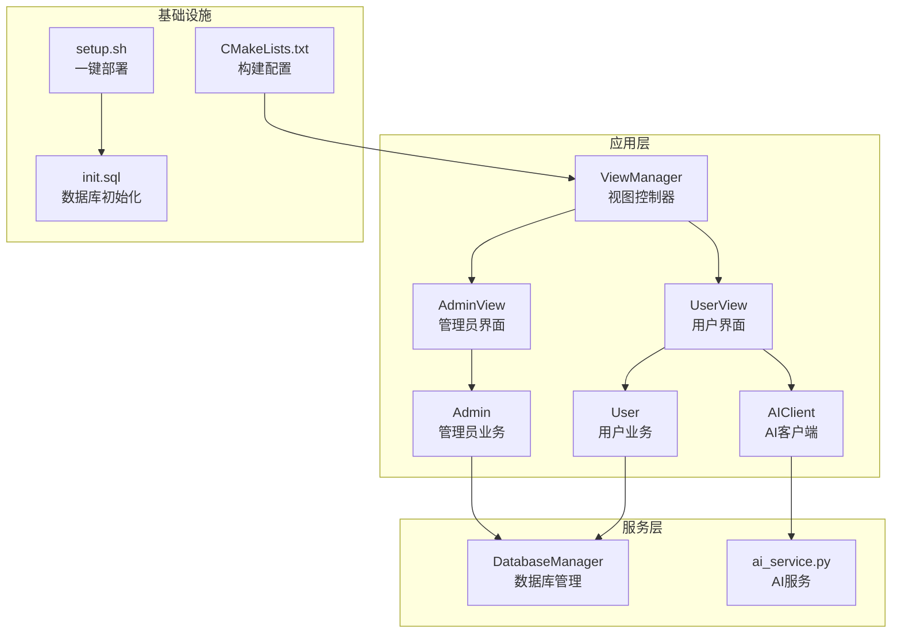
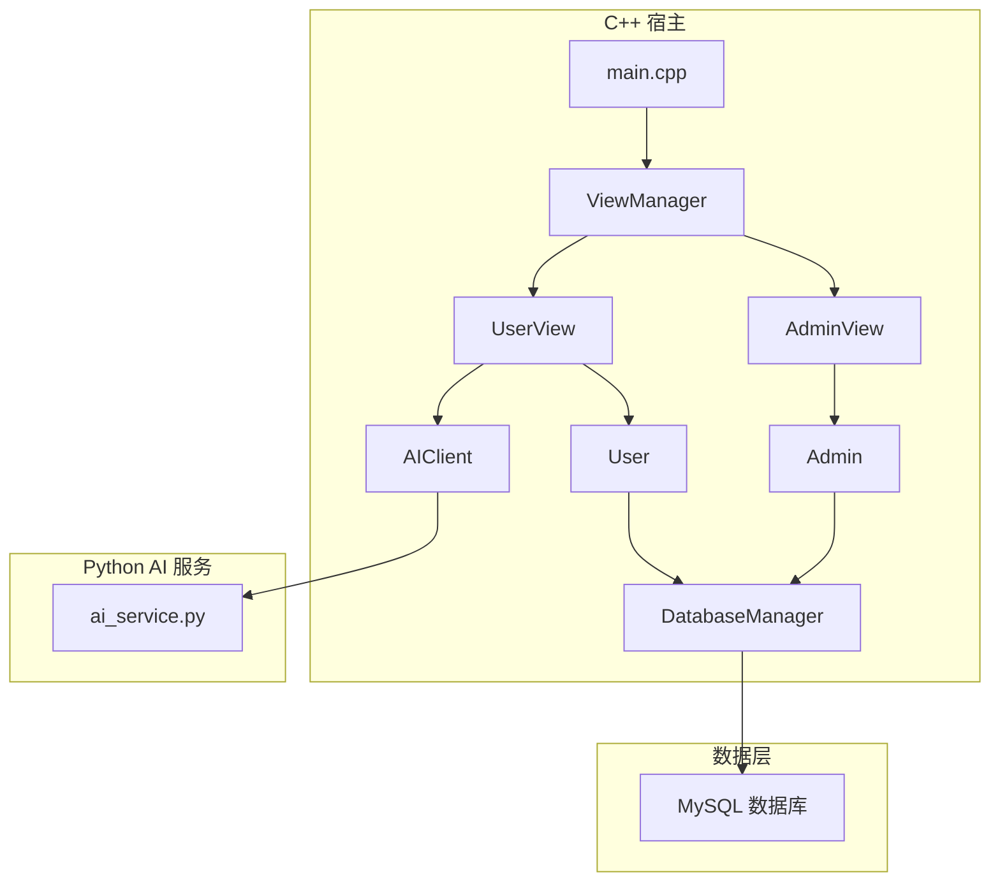
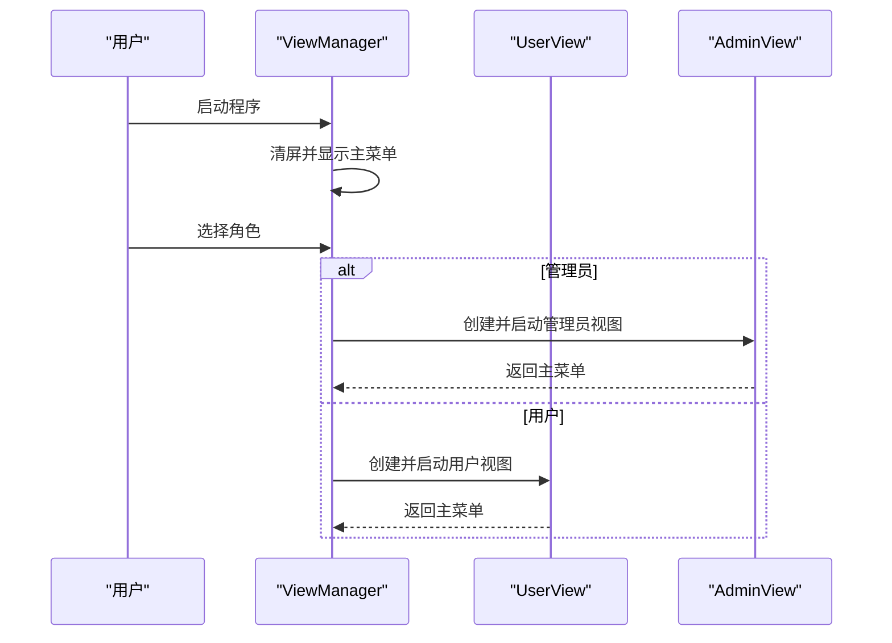
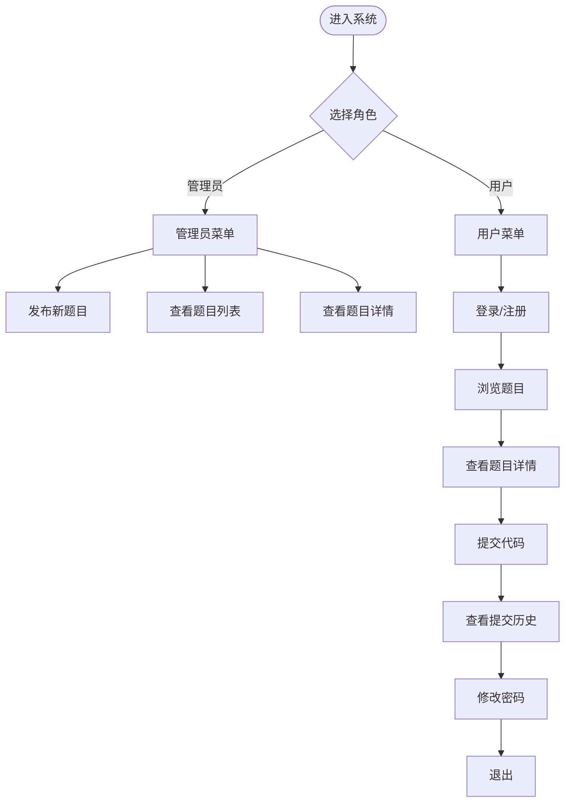
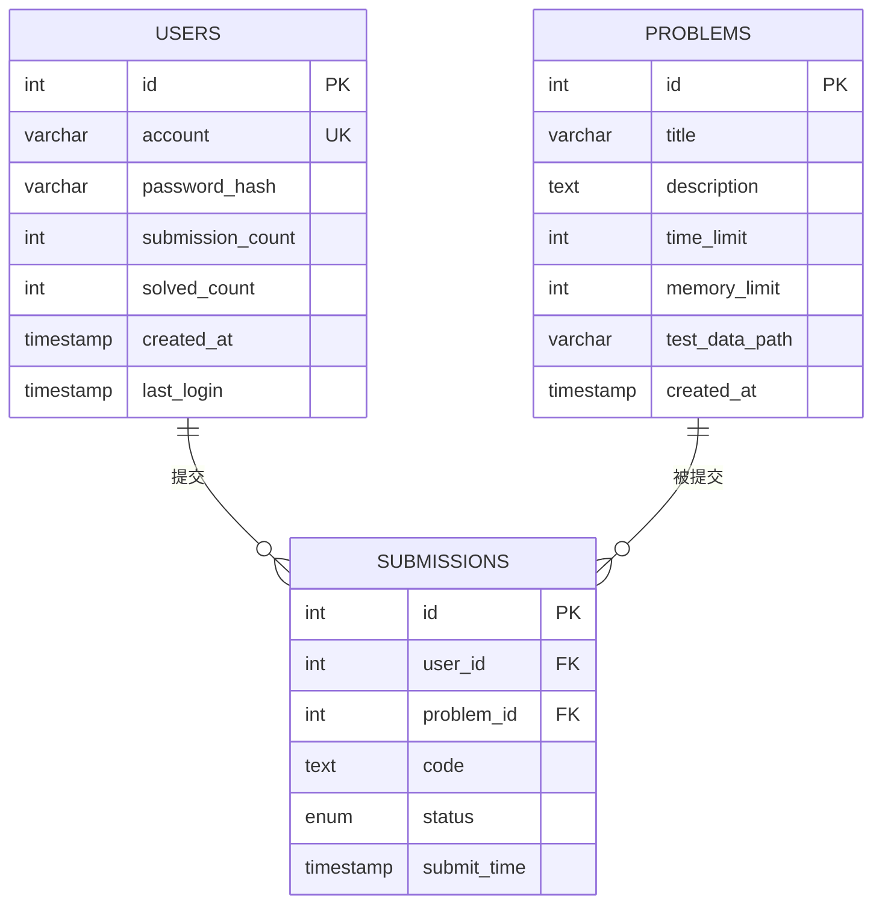
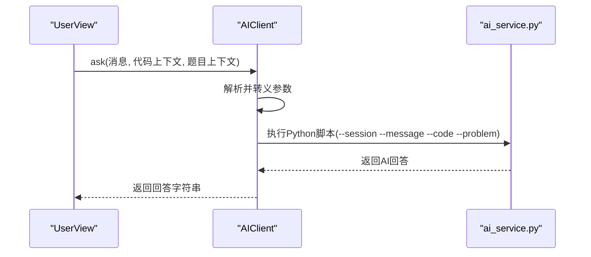
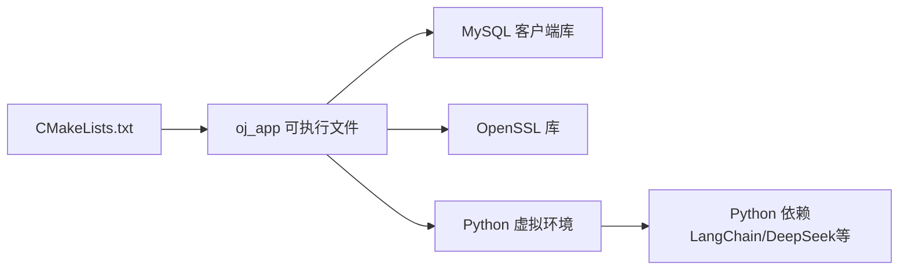

# 项目概述

<cite>
**本文引用的文件**
- [README.md](file://README.md)
- [ai.md](file://ai.md)
- [CMakeLists.txt](file://CMakeLists.txt)
- [init.sql](file://init.sql)
- [setup.sh](file://setup.sh)
- [include/admin.h](file://include/admin.h)
- [include/user.h](file://include/user.h)
- [include/db_manager.h](file://include/db_manager.h)
- [include/view_manager.h](file://include/view_manager.h)
- [include/admin_view.h](file://include/admin_view.h)
- [include/user_view.h](file://include/user_view.h)
- [include/ai_client.h](file://include/ai_client.h)
- [src/main.cpp](file://src/main.cpp)
- [src/view_manager.cpp](file://src/view_manager.cpp)
- [src/ai_client.cpp](file://src/ai_client.cpp)
- [ai/ai_service.py](file://ai/ai_service.py)
</cite>

## 目录
1. [简介](#简介)
2. [项目结构](#项目结构)
3. [核心组件](#核心组件)
4. [架构总览](#架构总览)
5. [详细组件分析](#详细组件分析)
6. [依赖关系分析](#依赖关系分析)
7. [性能考虑](#性能考虑)
8. [故障排查指南](#故障排查指南)
9. [结论](#结论)
10. [附录](#附录)

## 简介
本项目是一个命令行交互式的在线判题系统（Online Judge，简称 OJ），面向管理员与普通用户两类角色，提供题目浏览、用户认证、代码提交与评测、以及AI辅助学习等功能。系统采用“C++ 宿主 + Python AI 微服务”的解耦架构，通过命令行子进程方式调用本地AI服务，结合MySQL数据库完成数据持久化与权限控制。

- 核心目标
  - 提供简洁高效的命令行判题体验，支持管理员发布题目与维护系统，支持用户登录、做题、提交与查看历史。
  - 引入AI辅助能力，以“严师”模式引导用户思考，避免直接给出完整代码，提升学习效果。
  - 通过清晰的角色分离与数据库权限设计，保障系统安全与可维护性。

- 主要功能特性
  - 角色体系：管理员与用户双角色，分别具备不同的操作入口与权限范围。
  - 数据库集成：使用MySQL存储题目、用户与提交记录，配合专用数据库用户与行级隔离策略。
  - AI辅助：通过本地Python微服务提供智能问答与提示，支持会话记忆与上下文注入。
  - 命令行交互：纯文本界面，支持清屏、菜单导航与输入校验。

- 技术架构
  - C++ 主程序负责界面与流程控制，数据库访问通过封装的管理器类完成，AI交互通过本地Python脚本调用实现。
  - CMake构建系统管理依赖（MySQL客户端、OpenSSL）并生成可执行文件。
  - 一键部署脚本负责目录创建、数据库初始化与编译指引。

**章节来源**
- [README.md:1-2](file://README.md#L1-L2)
- [ai.md:1-76](file://ai.md#L1-L76)
- [CMakeLists.txt:1-40](file://CMakeLists.txt#L1-L40)
- [init.sql:1-143](file://init.sql#L1-L143)
- [setup.sh:1-41](file://setup.sh#L1-L41)

## 项目结构
项目采用按职责分层的组织方式：
- include：公共头文件，定义核心类接口（数据库管理、视图控制器、业务对象、AI客户端等）。
- src：实现文件，包含主程序入口、视图控制器与AI客户端等。
- ai：AI微服务（Python）与依赖清单，提供本地调用的智能问答能力。
- 根目录：构建与部署脚本、数据库初始化SQL、文档与历史版本说明。

**图表来源**
- [src/view_manager.cpp:1-77](file://src/view_manager.cpp#L1-L77)
- [include/view_manager.h:1-43](file://include/view_manager.h#L1-L43)
- [include/admin_view.h:1-58](file://include/admin_view.h#L1-L58)
- [include/user_view.h:1-92](file://include/user_view.h#L1-L92)
- [include/user.h:1-89](file://include/user.h#L1-L89)
- [include/admin.h:1-40](file://include/admin.h#L1-L40)
- [include/ai_client.h:1-28](file://include/ai_client.h#L1-L28)
- [include/db_manager.h:1-53](file://include/db_manager.h#L1-L53)
- [ai/ai_service.py:1-113](file://ai/ai_service.py#L1-L113)
- [CMakeLists.txt:1-40](file://CMakeLists.txt#L1-L40)
- [init.sql:1-143](file://init.sql#L1-L143)
- [setup.sh:1-41](file://setup.sh#L1-L41)

**章节来源**
- [CMakeLists.txt:1-40](file://CMakeLists.txt#L1-L40)
- [setup.sh:1-41](file://setup.sh#L1-L41)
- [init.sql:1-143](file://init.sql#L1-L143)

## 核心组件
- 视图控制器与界面
  - ViewManager：负责登录主菜单展示与角色选择，驱动管理员/用户视图进入各自流程。
  - AdminView：提供管理员菜单与操作入口，如查看题目、新增题目等。
  - UserView：提供用户菜单与操作入口，如登录/注册、做题、提交、查看历史、AI咨询等。
- 业务对象
  - User：封装用户登录、注册、改密、做题、提交、查看历史等行为。
  - Admin：封装管理员发布题目、查看题目等管理功能。
- 数据访问
  - DatabaseManager：封装MySQL连接、SQL执行与查询结果集处理。
- AI辅助
  - AIClient：封装本地Python AI服务的调用，支持会话ID、代码上下文与题目上下文注入。
  - ai_service.py：基于LangChain与DeepSeek的本地AI服务，实现“严师”模式与会话记忆。

**章节来源**
- [include/view_manager.h:1-43](file://include/view_manager.h#L1-L43)
- [include/admin_view.h:1-58](file://include/admin_view.h#L1-L58)
- [include/user_view.h:1-92](file://include/user_view.h#L1-L92)
- [include/user.h:1-89](file://include/user.h#L1-L89)
- [include/admin.h:1-40](file://include/admin.h#L1-L40)
- [include/db_manager.h:1-53](file://include/db_manager.h#L1-L53)
- [include/ai_client.h:1-28](file://include/ai_client.h#L1-L28)
- [ai/ai_service.py:1-113](file://ai/ai_service.py#L1-L113)

## 架构总览
系统采用“C++ 宿主 + Python AI 微服务”的解耦架构：
- C++ 宿主负责CLI交互、角色切换、业务流程编排与数据库访问。
- Python AI 服务负责智能问答、会话记忆与“严师”模式策略。
- 数据库层负责持久化与权限控制，通过专用用户与行级隔离策略保障安全。

**图表来源**
- [src/main.cpp:1-14](file://src/main.cpp#L1-L14)
- [src/view_manager.cpp:1-77](file://src/view_manager.cpp#L1-L77)
- [include/admin_view.h:1-58](file://include/admin_view.h#L1-L58)
- [include/user_view.h:1-92](file://include/user_view.h#L1-L92)
- [include/user.h:1-89](file://include/user.h#L1-L89)
- [include/admin.h:1-40](file://include/admin.h#L1-L40)
- [include/db_manager.h:1-53](file://include/db_manager.h#L1-L53)
- [include/ai_client.h:1-28](file://include/ai_client.h#L1-L28)
- [ai/ai_service.py:1-113](file://ai/ai_service.py#L1-L113)

## 详细组件分析

### 视图控制器与界面流程
- 登录主菜单与角色选择
  - ViewManager 展示主菜单并处理用户输入，根据选择进入管理员或用户视图。
- 用户视图流程
  - 未登录时显示游客菜单（登录/注册/做题/退出）；登录后显示用户菜单（做题/提交/历史/改密/AI咨询/退出）。
- 管理员视图流程
  - 管理员菜单包含查看题目、新增题目等管理操作。

**图表来源**
- [src/view_manager.cpp:32-70](file://src/view_manager.cpp#L32-L70)
- [include/view_manager.h:14-40](file://include/view_manager.h#L14-L40)

**章节来源**
- [src/view_manager.cpp:1-77](file://src/view_manager.cpp#L1-L77)
- [include/view_manager.h:1-43](file://include/view_manager.h#L1-L43)

### 用户与管理员业务流程
- 用户流程
  - 登录/注册 → 浏览题目 → 查看题目详情 → 提交代码 → 查看提交历史 → 修改密码 → 退出。
- 管理员流程
  - 发布题目（执行SQL） → 查看题目列表 → 查看题目详情 → 退出。

**图表来源**
- [include/admin.h:10-37](file://include/admin.h#L10-L37)
- [include/user.h:10-86](file://include/user.h#L10-L86)
- [include/admin_view.h:11-55](file://include/admin_view.h#L11-L55)
- [include/user_view.h:12-89](file://include/user_view.h#L12-L89)

**章节来源**
- [include/admin.h:1-40](file://include/admin.h#L1-L40)
- [include/user.h:1-89](file://include/user.h#L1-L89)
- [include/admin_view.h:1-58](file://include/admin_view.h#L1-L58)
- [include/user_view.h:1-92](file://include/user_view.h#L1-L92)

### 数据库管理与权限设计
- DatabaseManager
  - 提供连接初始化、SQL执行与查询结果集处理，封装底层MySQL接口。
- 数据库初始化
  - init.sql 负责创建数据库、表与示例数据，配置专用数据库用户与权限，实现行级隔离策略（通过应用程序WHERE条件控制）。
- 权限与隔离
  - oj_admin：全权限，用于系统维护。
  - oj_user：受限权限，仅允许对自身数据进行读写，应用程序通过用户ID进行行级隔离。

**图表来源**
- [init.sql:14-60](file://init.sql#L14-L60)

**章节来源**
- [include/db_manager.h:1-53](file://include/db_manager.h#L1-L53)
- [init.sql:1-143](file://init.sql#L1-L143)

### AI客户端与Python服务集成
- AIClient
  - 负责定位Python解释器与脚本路径、转义参数、执行子进程并收集结果；提供可用性检测。
- ai_service.py
  - 基于LangChain与DeepSeek，实现“严师”模式（禁止直接给完整代码）、会话记忆（按session_id隔离）、上下文注入（代码与题目信息）。
- 调用流程
  - 用户在用户视图触发AI咨询，UserView调用AIClient::ask，AIClient通过命令行参数传递消息、会话ID、代码上下文与题目上下文，Python服务处理后返回结果。

**图表来源**
- [src/ai_client.cpp:85-112](file://src/ai_client.cpp#L85-L112)
- [include/ai_client.h:6-25](file://include/ai_client.h#L6-L25)
- [ai/ai_service.py:40-83](file://ai/ai_service.py#L40-L83)

**章节来源**
- [src/ai_client.cpp:1-124](file://src/ai_client.cpp#L1-L124)
- [include/ai_client.h:1-28](file://include/ai_client.h#L1-L28)
- [ai/ai_service.py:1-113](file://ai/ai_service.py#L1-L113)

## 依赖关系分析
- 构建与链接
  - CMakeLists.txt 指定C++17标准、导出编译命令、查找MySQL与OpenSSL依赖、收集源文件并生成可执行文件，最终链接MySQL与OpenSSL库。
- 运行时依赖
  - 需要已安装并运行的MySQL服务，以及Python虚拟环境与依赖（由AI服务脚本加载）。
- 部署脚本
  - setup.sh 自动创建build与测试数据目录，执行init.sql初始化数据库，提示后续编译步骤。

**图表来源**
- [CMakeLists.txt:11-34](file://CMakeLists.txt#L11-L34)

**章节来源**
- [CMakeLists.txt:1-40](file://CMakeLists.txt#L1-L40)
- [setup.sh:1-41](file://setup.sh#L1-L41)

## 性能考虑
- AI调用
  - 本地Python服务通过命令行子进程调用，适合轻量交互；若频繁调用建议评估并发与延迟，必要时引入异步或本地HTTP服务。
- 数据库访问
  - 查询与更新均通过DatabaseManager封装，建议在高频场景下复用连接、合理使用索引与分页。
- 内存与会话
  - Python侧会话记忆限制轮次，避免上下文过长导致Token浪费与性能下降。

[本节为通用指导，无需列出具体文件来源]

## 故障排查指南
- 数据库初始化失败
  - 确认MySQL服务已启动且root密码正确；检查init.sql是否存在；参考一键部署脚本的提示信息。
- 编译失败
  - 确认已安装MySQL开发包与OpenSSL；在build目录执行CMake与make；查看CMake输出的库路径信息。
- AI服务不可用
  - 确认Python虚拟环境与ai_service.py存在；检查DEEPSEEK_API_KEY环境变量；验证网络连通性。
- 输入异常
  - 若出现无效输入，系统会清空缓冲并提示重新选择；请确保按提示输入数字或合法字符串。

**章节来源**
- [setup.sh:14-29](file://setup.sh#L14-L29)
- [CMakeLists.txt:36-40](file://CMakeLists.txt#L36-L40)
- [src/ai_client.cpp:114-123](file://src/ai_client.cpp#L114-L123)
- [src/view_manager.cpp:42-47](file://src/view_manager.cpp#L42-L47)

## 结论
本OJ系统以清晰的分层架构实现了命令行判题平台的核心能力：管理员与用户双角色、数据库集成与权限控制、以及AI辅助学习。通过C++与Python的协作，系统在保持简洁的同时具备良好的扩展性与可维护性。建议在后续迭代中完善AI服务的并发与缓存机制、增强数据库事务与错误处理，并持续优化用户体验与安全性。

[本节为总结性内容，无需列出具体文件来源]

## 附录

### 快速开始指南
- 环境要求
  - 操作系统：Linux（推荐Ubuntu/CentOS）
  - 依赖：CMake、g++、MySQL客户端、OpenSSL、Python 3.x与虚拟环境
- 安装步骤
  - 执行一键部署脚本，初始化数据库并创建必要目录。
  - 在build目录执行CMake与make生成可执行文件。
  - 运行可执行文件进入系统，按提示选择角色并登录。
- 基本使用
  - 管理员：登录后可发布题目、查看题目列表与详情。
  - 用户：登录后可浏览题目、查看详情、提交代码、查看历史、修改密码；可在做题过程中使用AI咨询（需AI服务可用）。

**章节来源**
- [setup.sh:14-40](file://setup.sh#L14-L40)
- [CMakeLists.txt:24-34](file://CMakeLists.txt#L24-L34)
- [src/main.cpp:5-12](file://src/main.cpp#L5-L12)