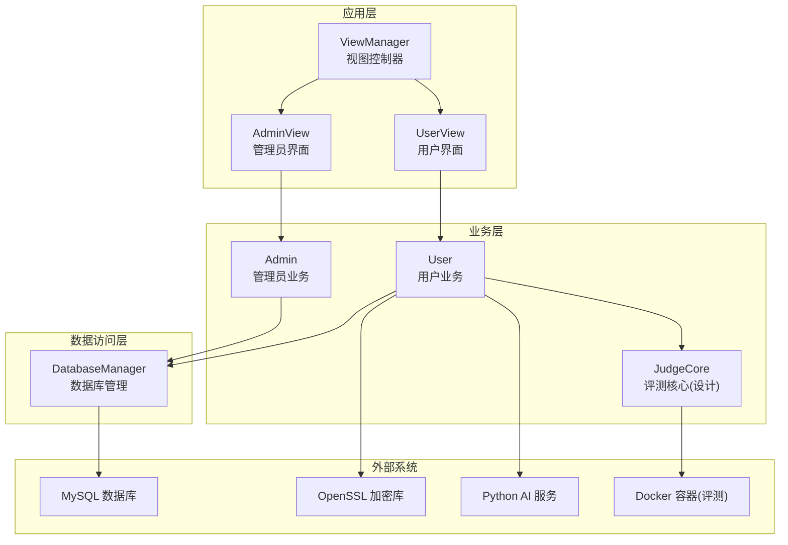
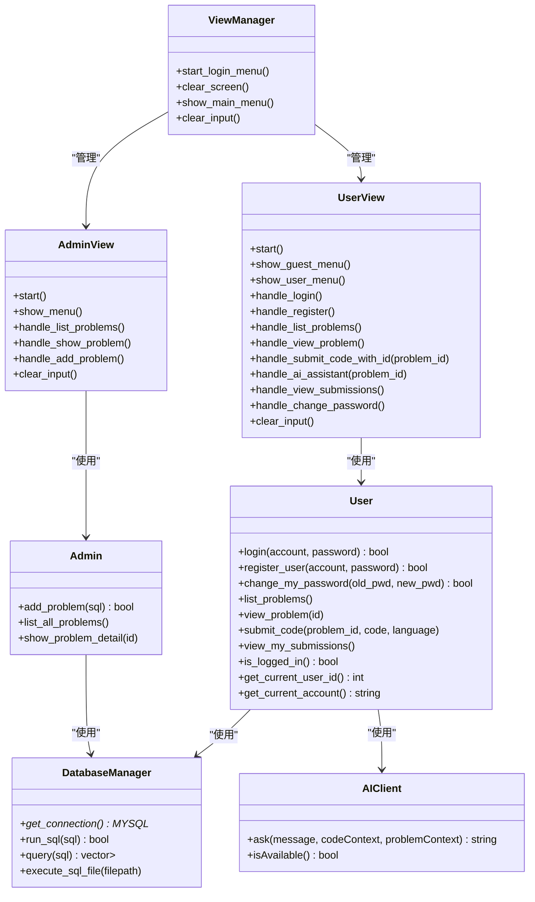
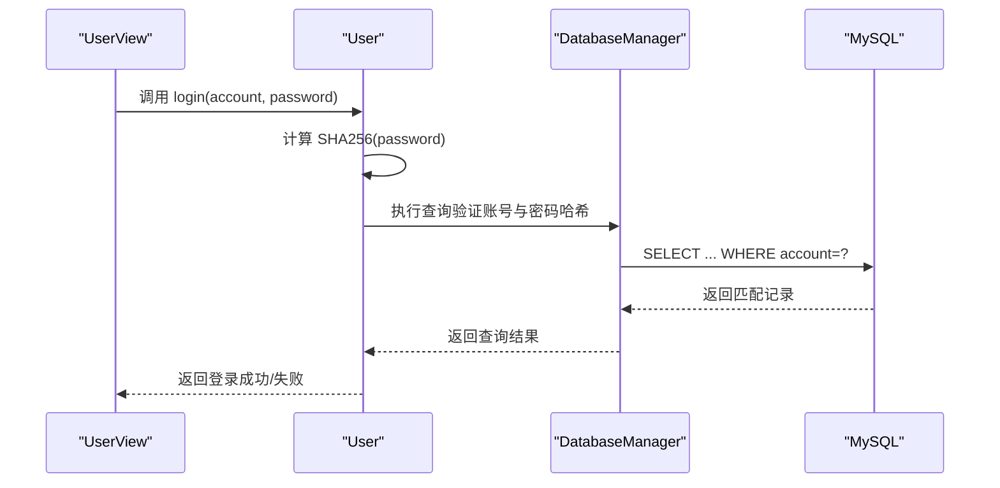
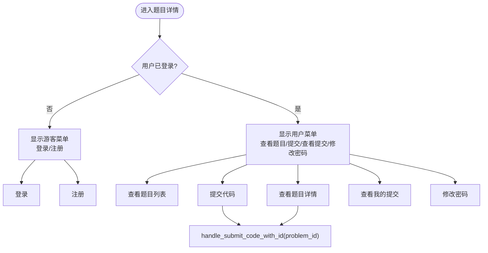
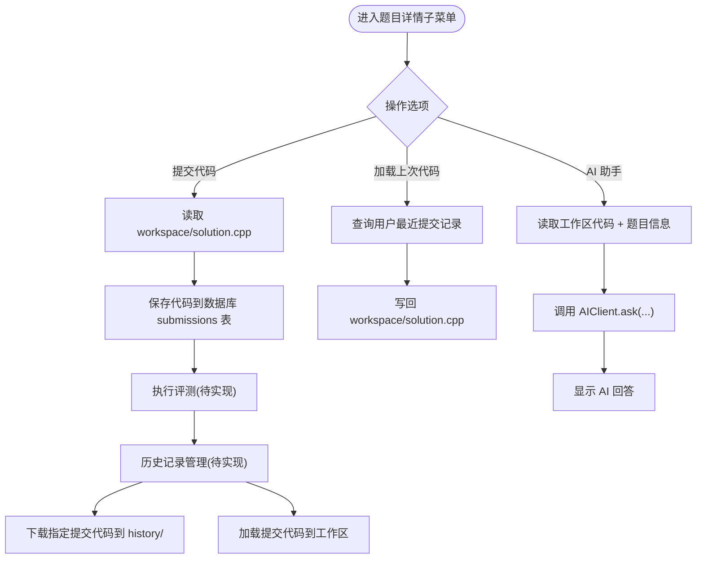
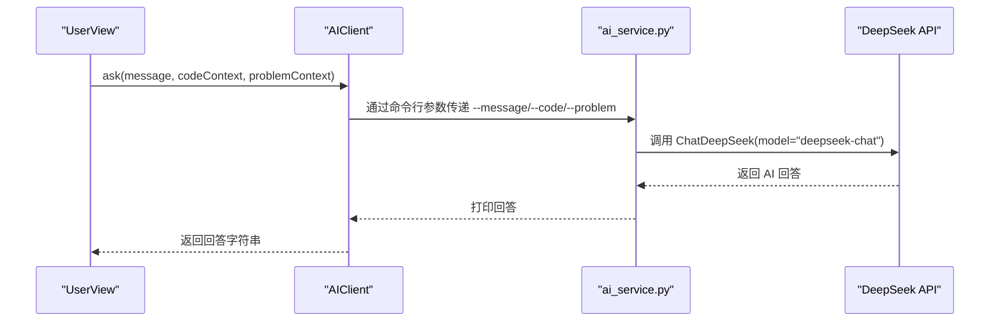
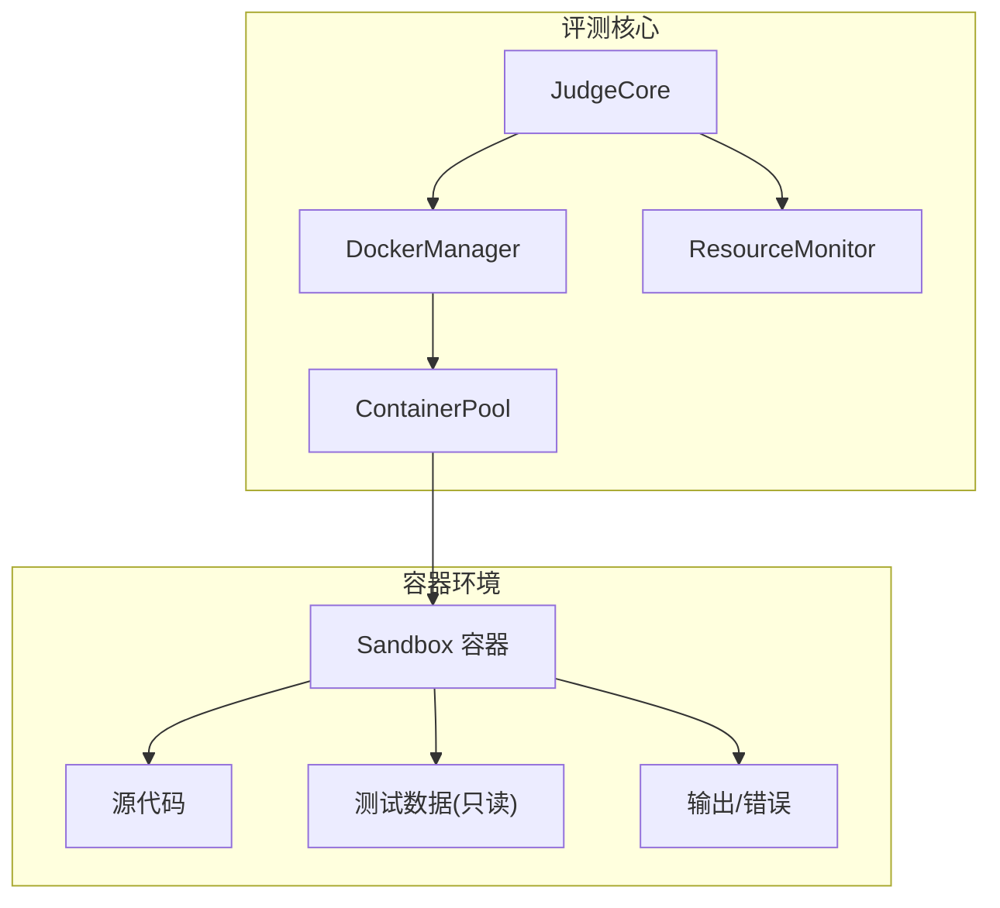
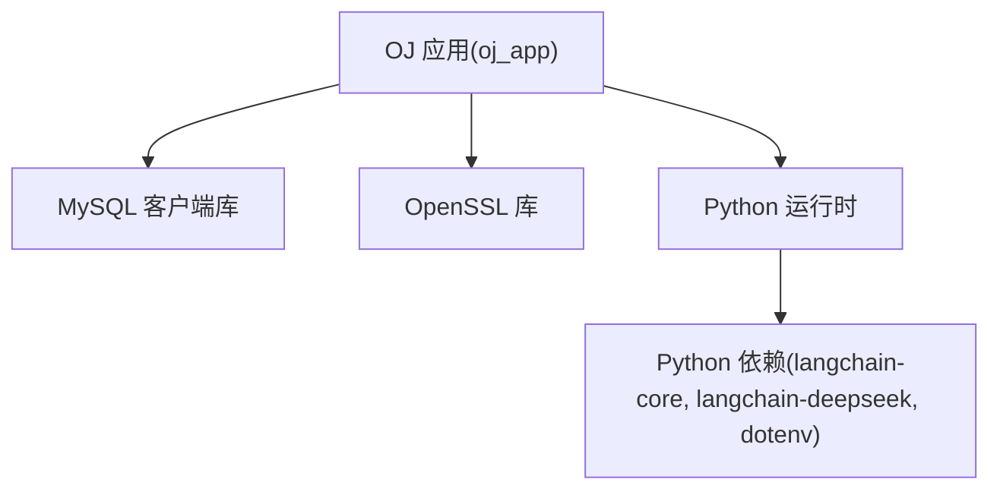

# 项目概述

<cite>
**本文引用的文件**
- [README.md](file://README.md)
- [OJ_v0.1.md](file://History/OJ_v0.1.md)
- [OJ_v0.2.md](file://History/OJ_v0.2.md)
- [CMakeLists.txt](file://CMakeLists.txt)
- [init.sql](file://init.sql)
- [setup.sh](file://setup.sh)
- [main.cpp](file://src/main.cpp)
- [view_manager.h](file://include/view_manager.h)
- [user.h](file://include/user.h)
- [admin.h](file://include/admin.h)
- [db_manager.h](file://include/db_manager.h)
- [user_view.h](file://include/user_view.h)
- [admin_view.h](file://include/admin_view.h)
- [ai_client.h](file://include/ai_client.h)
- [ai_service.py](file://ai/ai_service.py)
- [code_submission_design.md](file://docs/code_submission_design.md)
- [judge_implementation_plan.md](file://docs/judge_implementation_plan.md)
</cite>

## 目录
1. [简介](#简介)
2. [项目结构](#项目结构)
3. [核心组件](#核心组件)
4. [架构总览](#架构总览)
5. [详细组件分析](#详细组件分析)
6. [依赖分析](#依赖分析)
7. [性能考量](#性能考量)
8. [故障排查指南](#故障排查指南)
9. [结论](#结论)
10. [附录](#附录)

## 简介
本项目是一个基于 C++17 开发的命令行交互式编程练习平台（OJ 在线判题系统）。其核心目标是为用户提供一个安全、稳定、可扩展的编程训练与评测环境，涵盖用户认证、题目管理、代码提交与评测、以及 AI 辅助学习等功能。系统采用 MVC 架构模式，将视图层、业务逻辑层与数据访问层清晰分离；数据库采用 MySQL，加密方面使用 OpenSSL；AI 辅助学习通过独立的 Python 服务实现，C++ 端通过命令行调用与之交互。

发展历程与版本演进：
- v0.1：实现基础的管理员题目管理与用户功能模块，确立 MVC 架构与数据库表结构，支持 CLI 界面优化与清屏。
- v0.2：完成用户模块的完整数据库交互（登录、注册、改密），优化 CLI 清屏与 SQL 输出，引入 OpenSSL 用于 SHA256 密码哈希，为后续评测与 AI 功能奠定基础。
- v0.3+：计划实现代码评测核心（编译+运行+判题）、沙箱安全机制、题目标签分类、排行榜、Docker 部署支持等。

未来规划：
- 完成评测机实现（Docker 容器化 + 资源监控 + 安全隔离）。
- 实现统一工作区文件机制与历史代码管理。
- 完善 AI 助手功能，增强上下文感知与交互体验。
- 提供 Docker 部署方案与自动化运维工具。

## 项目结构
项目采用分层与模块化组织方式：
- include：核心头文件（视图、业务、数据库、AI 客户端等）
- src：核心实现（入口、视图、业务、数据库、AI 客户端等）
- ai：Python AI 服务（本地调用版本）
- docs：设计文档（代码提交与历史管理、评测机实现方案）
- History：版本历史文档
- 根目录：构建配置、初始化脚本、数据库脚本

图表来源
- [view_manager.h:11-40](file://include/view_manager.h#L11-L40)
- [user_view.h:12-89](file://include/user_view.h#L12-L89)
- [admin_view.h:11-54](file://include/admin_view.h#L11-L54)
- [user.h:10-86](file://include/user.h#L10-L86)
- [admin.h:10-36](file://include/admin.h#L10-L36)
- [db_manager.h:12-46](file://include/db_manager.h#L12-L46)
- [judge_implementation_plan.md:9-52](file://docs/judge_implementation_plan.md#L9-L52)

章节来源
- [CMakeLists.txt:1-40](file://CMakeLists.txt#L1-L40)
- [init.sql:1-278](file://init.sql#L1-L278)
- [setup.sh:1-41](file://setup.sh#L1-L41)

## 核心组件
- 视图控制器（ViewManager）：负责主菜单与角色切换，协调用户与管理员视图。
- 用户视图（UserView）：提供用户模式的菜单与交互，包括登录、注册、查看题目、提交代码、查看提交记录、修改密码、AI 助手等。
- 管理员视图（AdminView）：提供管理员模式的菜单与交互，包括查看题目列表、查看题目详情、发布新题目等。
- 用户业务（User）：封装用户相关的业务逻辑，包括认证、题目浏览、提交代码、查看提交记录等。
- 管理员业务（Admin）：封装管理员相关的业务逻辑，包括发布题目、查看题目等。
- 数据库管理（DatabaseManager）：封装 MySQL 连接与 SQL 执行，提供查询与批量执行能力。
- AI 客户端（AIClient）：封装与 Python AI 服务的交互，支持会话管理与参数传递。
- 评测核心（JudgeCore，设计阶段）：封装评测流程，结合 Docker 容器化与资源监控实现安全评测。

章节来源
- [view_manager.h:11-40](file://include/view_manager.h#L11-L40)
- [user_view.h:12-89](file://include/user_view.h#L12-L89)
- [admin_view.h:11-54](file://include/admin_view.h#L11-L54)
- [user.h:10-86](file://include/user.h#L10-L86)
- [admin.h:10-36](file://include/admin.h#L10-L36)
- [db_manager.h:12-46](file://include/db_manager.h#L12-L46)
- [ai_client.h:6-25](file://include/ai_client.h#L6-L25)

## 架构总览
系统采用经典的 MVC 架构：
- Model：User、Admin、DatabaseManager 封装业务与数据访问。
- View：UserView、AdminView、ViewManager 负责界面与交互。
- Controller：ViewManager 作为主控制器，协调视图与业务逻辑。

图表来源
- [view_manager.h:11-40](file://include/view_manager.h#L11-L40)
- [user_view.h:12-89](file://include/user_view.h#L12-L89)
- [admin_view.h:11-54](file://include/admin_view.h#L11-L54)
- [user.h:10-86](file://include/user.h#L10-L86)
- [admin.h:10-36](file://include/admin.h#L10-L36)
- [db_manager.h:12-46](file://include/db_manager.h#L12-L46)
- [ai_client.h:6-25](file://include/ai_client.h#L6-L25)

## 详细组件分析

### 用户认证与密码哈希
- 用户登录与注册通过 DatabaseManager 与 MySQL 交互，密码采用 SHA256 哈希（OpenSSL）进行存储与校验。
- v0.2 版本明确使用 OpenSSL EVP 接口实现 SHA256 哈希，简化版实现便于理解与教学。

图表来源
- [user_view.h:46-51](file://include/user_view.h#L46-L51)
- [user.h:24-32](file://include/user.h#L24-L32)
- [db_manager.h:35-42](file://include/db_manager.h#L35-L42)
- [OJ_v0.2.md:122-128](file://History/OJ_v0.2.md#L122-L128)

章节来源
- [OJ_v0.2.md:112-128](file://History/OJ_v0.2.md#L112-L128)
- [db_manager.h:12-46](file://include/db_manager.h#L12-L46)

### 题目管理与浏览
- 管理员可通过 AdminView 与 Admin 业务类发布题目、查看题目列表与详情。
- 用户可通过 UserView 与 User 业务类浏览题目列表与详情，并在题目详情子菜单中进行提交或调用 AI 助手。

图表来源
- [user_view.h:36-83](file://include/user_view.h#L36-L83)
- [user.h:45-64](file://include/user.h#L45-L64)
- [admin_view.h:34-49](file://include/admin_view.h#L34-L49)
- [admin.h:22-33](file://include/admin.h#L22-L33)

章节来源
- [OJ_v0.1.md:163-212](file://History/OJ_v0.1.md#L163-L212)
- [OJ_v0.2.md:132-171](file://History/OJ_v0.2.md#L132-L171)

### 代码提交与历史管理（设计阶段）
- 统一工作区文件机制：用户始终在 workspace/solution.cpp 编辑代码，提交时读取该文件内容保存至数据库 submissions 表。
- AI 助手读取工作区代码与题目上下文，提供精准建议。
- 历史记录管理：用户可查看提交列表，按 ID 下载任意历史代码到本地 history/ 目录，并可加载到工作区继续编辑。

图表来源
- [code_submission_design.md:36-128](file://docs/code_submission_design.md#L36-L128)
- [code_submission_design.md:131-187](file://docs/code_submission_design.md#L131-L187)
- [code_submission_design.md:283-420](file://docs/code_submission_design.md#L283-L420)

章节来源
- [code_submission_design.md:1-629](file://docs/code_submission_design.md#L1-L629)

### AI 助手集成
- C++ 端通过 AIClient 调用 Python AI 服务，支持会话管理与参数传递（问题、代码上下文、题目上下文）。
- Python 服务使用 LangChain 与 DeepSeek 模型，采用“严师”模式，引导用户思考而非直接给出答案。

图表来源
- [ai_client.h:6-25](file://include/ai_client.h#L6-L25)
- [ai_service.py:40-91](file://ai/ai_service.py#L40-L91)

章节来源
- [ai_service.py:1-113](file://ai/ai_service.py#L1-L113)

### 评测机实现（设计阶段）
- 评测核心通过 Docker 容器化实现安全隔离，结合容器池管理与资源监控，支持并行评测。
- 安全机制包括 Seccomp 系统调用过滤、capabilities 丢弃、只读文件系统、禁用网络等。
- 资源监控使用 cgroup 与 Docker Stats API，精确判定 TLE/MLE/RE 等结果。

图表来源
- [judge_implementation_plan.md:9-52](file://docs/judge_implementation_plan.md#L9-L52)
- [judge_implementation_plan.md:127-216](file://docs/judge_implementation_plan.md#L127-L216)
- [judge_implementation_plan.md:220-310](file://docs/judge_implementation_plan.md#L220-L310)
- [judge_implementation_plan.md:312-390](file://docs/judge_implementation_plan.md#L312-L390)

章节来源
- [judge_implementation_plan.md:1-748](file://docs/judge_implementation_plan.md#L1-L748)

## 依赖分析
- 构建系统：CMake 3.10+，C++17 标准，生成 compile_commands.json 便于开发工具集成。
- 外部库：MySQL 客户端（mysqlclient）、OpenSSL（SHA256 密码哈希）。
- Python 依赖：LangChain、ChatDeepSeek、dotenv 等（见 requirements.txt）。
- 数据库：MySQL，包含 problems、users、submissions 三张核心表，权限按角色划分。

图表来源
- [CMakeLists.txt:11-34](file://CMakeLists.txt#L11-L34)
- [ai/requirements.txt](file://ai/requirements.txt)

章节来源
- [CMakeLists.txt:1-40](file://CMakeLists.txt#L1-L40)
- [init.sql:68-95](file://init.sql#L68-L95)

## 性能考量
- 容器预热与复用：系统启动时预创建最小容器池，减少启动延迟；评测完成后重置而非销毁，提升复用效率。
- 资源限制与监控：通过 cgroup 与 Docker Stats API 实时监控内存、CPU、进程数，精确判定 TLE/MLE/RE。
- 并行评测：容器池动态管理，支持多任务并发，提高整体吞吐量。
- I/O 与缓存：评测容器使用内存文件系统与只读挂载，降低磁盘 I/O 并提升安全性。

章节来源
- [judge_implementation_plan.md:641-685](file://docs/judge_implementation_plan.md#L641-L685)

## 故障排查指南
- 数据库初始化失败：确认 init.sql 存在且 MySQL root 密码正确；使用 setup.sh 自动化初始化。
- 构建失败：检查 CMake、MySQL、OpenSSL 是否正确安装；参考 CMakeLists.txt 中的依赖查找与链接配置。
- AI 助手不可用：检查 DEEPSEEK_API_KEY 环境变量；确认 Python 依赖安装；查看 ai_service.py 的错误输出。
- 提交代码未生效：确认 workspace/solution.cpp 是否存在且可读；检查 User::submit_code 的实现进度。
- 评测异常：检查 Docker 服务状态与权限；查看 JudgeCore 的异常分类与恢复机制。

章节来源
- [setup.sh:14-29](file://setup.sh#L14-L29)
- [CMakeLists.txt:11-34](file://CMakeLists.txt#L11-L34)
- [ai_service.py:42-90](file://ai/ai_service.py#L42-L90)
- [code_submission_design.md:115-128](file://docs/code_submission_design.md#L115-L128)
- [judge_implementation_plan.md:591-637](file://docs/judge_implementation_plan.md#L591-L637)

## 结论
本项目以 C++17 为基础，结合 MySQL、OpenSSL 与 Python AI 服务，构建了一个模块化、可扩展的在线判题系统。v0.1 与 v0.2 版本奠定了 MVC 架构与用户认证、题目浏览等核心功能，v0.3+ 将重点推进评测机实现、统一工作区与历史管理、AI 助手增强以及 Docker 部署。通过容器化与资源监控，系统在安全性与性能上具备良好保障，适合教学与实战训练场景。

## 附录
- 常用操作速查：数据库初始化、构建与运行、测试账号。
- 数据库表结构：problems、users、submissions 的字段与索引设计。
- 版本历史：v0.1 与 v0.2 的功能清单与变更日志。

章节来源
- [OJ_v0.1.md:355-383](file://History/OJ_v0.1.md#L355-L383)
- [OJ_v0.2.md:330-358](file://History/OJ_v0.2.md#L330-L358)
- [init.sql:14-61](file://init.sql#L14-L61)