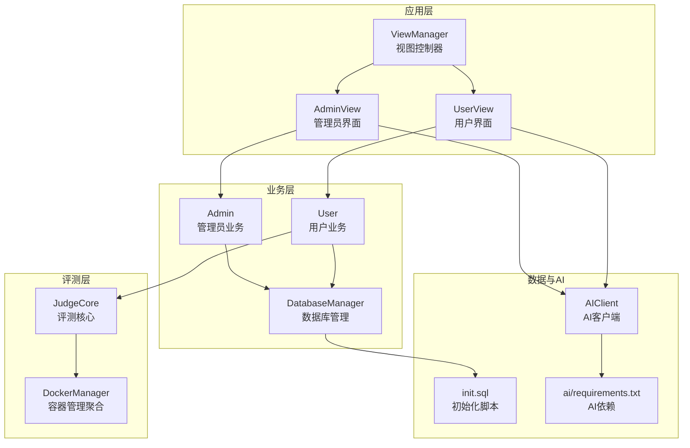
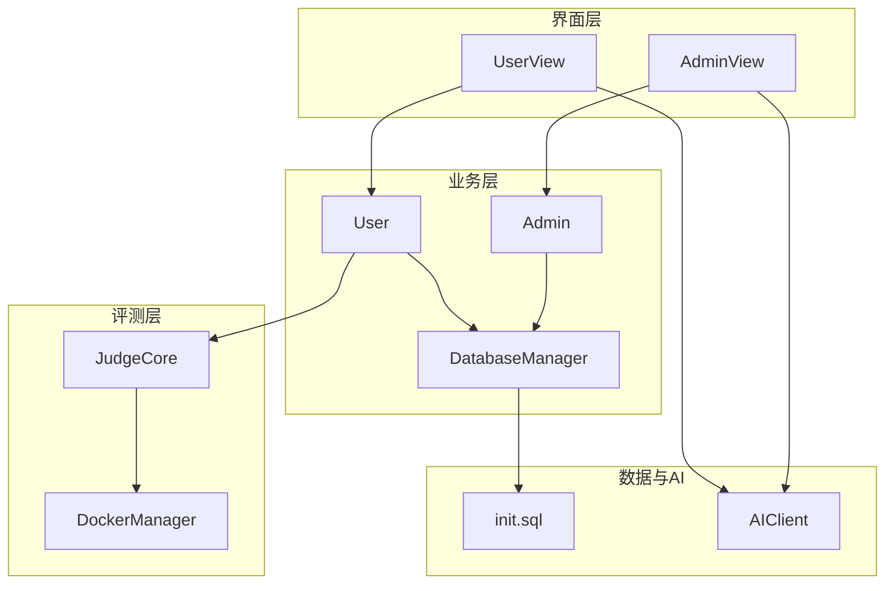
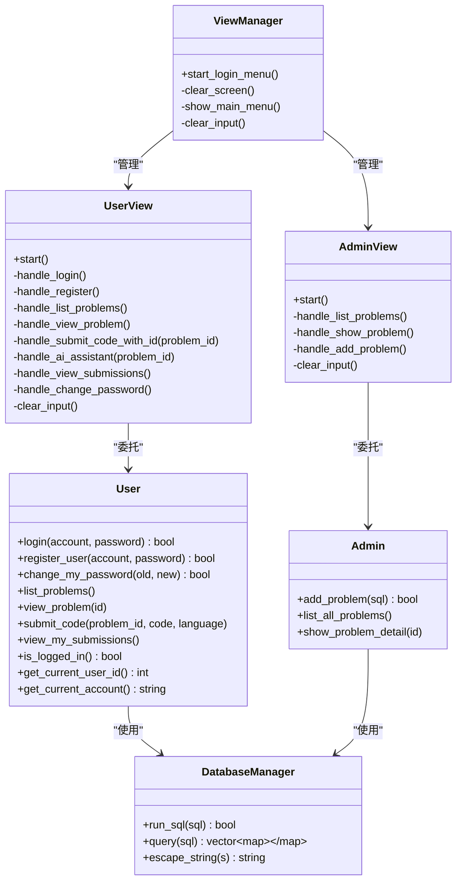
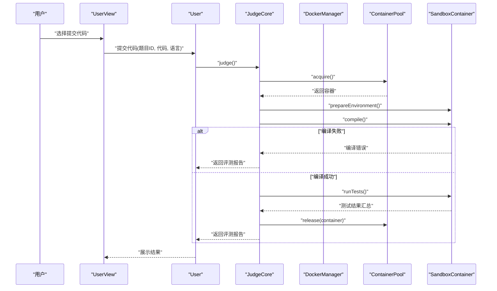
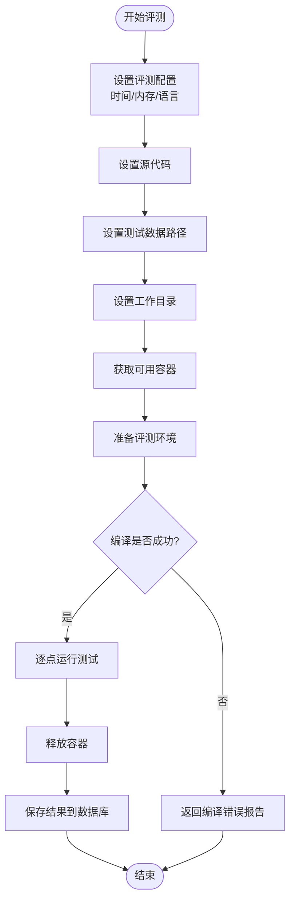
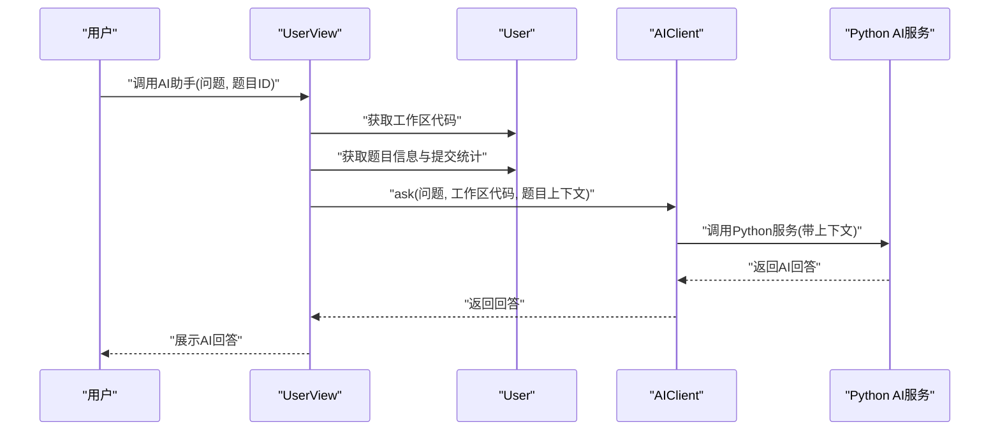
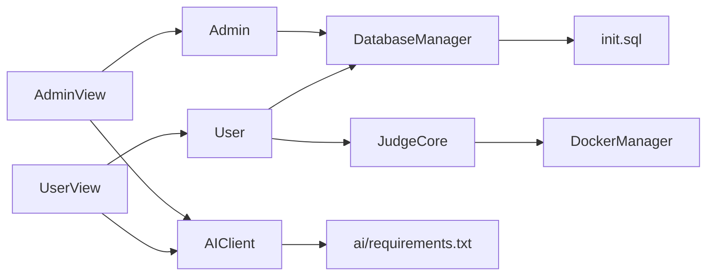

# 系统介绍

<cite>
**本文引用的文件**
- [README.md](file://README.md)
- [src/main.cpp](file://src/main.cpp)
- [include/view_manager.h](file://include/view_manager.h)
- [include/user_view.h](file://include/user_view.h)
- [include/admin_view.h](file://include/admin_view.h)
- [include/user.h](file://include/user.h)
- [include/admin.h](file://include/admin.h)
- [include/judge_core.h](file://include/judge_core.h)
- [include/db_manager.h](file://include/db_manager.h)
- [include/docker_manager.h](file://include/docker_manager.h)
- [docs/code_submission_design.md](file://docs/code_submission_design.md)
- [docs/judge_implementation_plan.md](file://docs/judge_implementation_plan.md)
- [init.sql](file://init.sql)
- [setup.sh](file://setup.sh)
- [include/ai_client.h](file://include/ai_client.h)
- [ai/requirements.txt](file://ai/requirements.txt)
</cite>

## 目录
1. [简介](#简介)
2. [项目结构](#项目结构)
3. [核心组件](#核心组件)
4. [架构总览](#架构总览)
5. [详细组件分析](#详细组件分析)
6. [依赖分析](#依赖分析)
7. [性能考量](#性能考量)
8. [故障排查指南](#故障排查指南)
9. [结论](#结论)
10. [附录](#附录)

## 简介
本项目是一个面向命令行的交互式编程练习与在线评测系统（OJ），旨在为用户提供标准化、可重复、可量化的编程训练与评测体验。系统通过容器化沙箱与资源监控，提供安全、稳定、可扩展的评测环境，覆盖编程学习、技能训练、竞赛准备等多种使用场景。

- 核心目标与定位
  - 提供“所见即所得”的命令行交互体验，降低编程学习门槛。
  - 以标准化评测流程替代主观判卷，提升训练效率与反馈质量。
  - 支持个性化AI辅助，结合工作区代码与题目上下文，提供精准建议。
  - 通过历史提交管理与工作区统一文件机制，帮助用户沉淀与回顾学习过程。

- 主要应用场景
  - 编程学习：按题型分类的题目库，配套测试数据与标准评测。
  - 技能训练：定时/不定时刷题，查看评测报告与历史记录，形成闭环反馈。
  - 竞赛准备：在接近真实比赛的资源限制与评测环境下反复演练。

- 解决的核心问题与价值
  - 标准化评测：统一编译、运行、资源限制与结果判定，消除主观误差。
  - 安全隔离：容器沙箱 + 多层安全配置，保障系统稳定与安全。
  - 个性化AI：自动读取工作区代码与题目信息，提供上下文感知的智能建议。
  - 可追溯性：提交记录与历史代码下载，便于复习与复盘。

- 用户群体与使用方式
  - 普通用户：登录后浏览题目、提交代码、查看评测报告与历史记录、使用AI助手。
  - 管理员：发布/维护题目、查看题目列表与详情、管理平台数据。
  - 教育机构：可基于系统搭建课程练习与阶段性评测，支持教学与考核。

## 项目结构
系统采用“命令行界面 + 业务逻辑 + 评测内核 + 数据库 + AI服务”的分层组织方式，核心入口为命令行主程序，界面层负责用户交互，业务层封装用户与管理员功能，评测内核负责编译、运行与结果判定，数据库提供持久化能力，AI模块提供智能辅助。

**图表来源**
- [src/main.cpp:1-14](file://src/main.cpp#L1-L14)
- [include/view_manager.h:1-43](file://include/view_manager.h#L1-L43)
- [include/user_view.h:1-92](file://include/user_view.h#L1-L92)
- [include/admin_view.h:1-58](file://include/admin_view.h#L1-L58)
- [include/user.h:1-102](file://include/user.h#L1-L102)
- [include/admin.h:1-40](file://include/admin.h#L1-L40)
- [include/db_manager.h:1-60](file://include/db_manager.h#L1-L60)
- [include/judge_core.h:1-189](file://include/judge_core.h#L1-L189)
- [include/docker_manager.h:1-18](file://include/docker_manager.h#L1-L18)
- [include/ai_client.h:1-28](file://include/ai_client.h#L1-L28)
- [init.sql:1-278](file://init.sql#L1-L278)
- [ai/requirements.txt:1-7](file://ai/requirements.txt#L1-L7)

**章节来源**
- [src/main.cpp:1-14](file://src/main.cpp#L1-L14)
- [include/view_manager.h:1-43](file://include/view_manager.h#L1-L43)
- [include/user_view.h:1-92](file://include/user_view.h#L1-L92)
- [include/admin_view.h:1-58](file://include/admin_view.h#L1-L58)
- [include/user.h:1-102](file://include/user.h#L1-L102)
- [include/admin.h:1-40](file://include/admin.h#L1-L40)
- [include/db_manager.h:1-60](file://include/db_manager.h#L1-L60)
- [include/judge_core.h:1-189](file://include/judge_core.h#L1-L189)
- [include/docker_manager.h:1-18](file://include/docker_manager.h#L1-L18)
- [include/ai_client.h:1-28](file://include/ai_client.h#L1-L28)
- [init.sql:1-278](file://init.sql#L1-L278)
- [ai/requirements.txt:1-7](file://ai/requirements.txt#L1-L7)

## 核心组件
- 视图控制器与界面层
  - ViewManager：负责登录菜单与角色切换，协调用户界面与管理员界面。
  - UserView：提供用户模式下的菜单与交互，包括登录、注册、查看题目、提交代码、查看历史、修改密码、AI助手等。
  - AdminView：提供管理员模式下的菜单与交互，包括查看题目、添加题目、查看详情等。

- 业务层
  - User：封装用户登录、注册、修改密码、查看题目、提交代码、查看历史等功能，并与评测核心交互。
  - Admin：封装管理员发布题目、查看题目列表与详情等业务逻辑。

- 数据与持久化
  - DatabaseManager：封装MySQL连接、SQL执行与查询、字符串转义等通用能力。
  - init.sql：初始化数据库、创建表结构与示例数据、配置数据库用户与权限。

- 评测内核
  - JudgeCore：对外暴露评测接口，封装配置、源码、测试数据、工作目录设置，以及评测执行、结果持久化与清理。
  - DockerManager：容器管理聚合头文件，包含沙箱容器与容器池等组件。

- AI辅助
  - AIClient：封装与Python AI服务的交互，支持传入消息、代码上下文与题目上下文。
  - ai/requirements.txt：声明AI服务所需的Python依赖。

**章节来源**
- [include/view_manager.h:1-43](file://include/view_manager.h#L1-L43)
- [include/user_view.h:1-92](file://include/user_view.h#L1-L92)
- [include/admin_view.h:1-58](file://include/admin_view.h#L1-L58)
- [include/user.h:1-102](file://include/user.h#L1-L102)
- [include/admin.h:1-40](file://include/admin.h#L1-L40)
- [include/db_manager.h:1-60](file://include/db_manager.h#L1-L60)
- [include/judge_core.h:1-189](file://include/judge_core.h#L1-L189)
- [include/docker_manager.h:1-18](file://include/docker_manager.h#L1-L18)
- [include/ai_client.h:1-28](file://include/ai_client.h#L1-L28)
- [ai/requirements.txt:1-7](file://ai/requirements.txt#L1-L7)
- [init.sql:1-278](file://init.sql#L1-L278)

## 架构总览
系统采用“界面层-业务层-评测层-数据与AI”的分层架构，评测核心通过容器化沙箱实现安全隔离与资源监控，数据库提供持久化能力，AI模块提供上下文感知的智能辅助。

**图表来源**
- [include/user_view.h:1-92](file://include/user_view.h#L1-L92)
- [include/admin_view.h:1-58](file://include/admin_view.h#L1-L58)
- [include/user.h:1-102](file://include/user.h#L1-L102)
- [include/admin.h:1-40](file://include/admin.h#L1-L40)
- [include/db_manager.h:1-60](file://include/db_manager.h#L1-L60)
- [include/judge_core.h:1-189](file://include/judge_core.h#L1-L189)
- [include/docker_manager.h:1-18](file://include/docker_manager.h#L1-L18)
- [include/ai_client.h:1-28](file://include/ai_client.h#L1-L28)
- [init.sql:1-278](file://init.sql#L1-L278)

## 详细组件分析

### 用户与管理员角色模型

**图表来源**
- [include/view_manager.h:1-43](file://include/view_manager.h#L1-L43)
- [include/user_view.h:1-92](file://include/user_view.h#L1-L92)
- [include/admin_view.h:1-58](file://include/admin_view.h#L1-L58)
- [include/user.h:1-102](file://include/user.h#L1-L102)
- [include/admin.h:1-40](file://include/admin.h#L1-L40)
- [include/db_manager.h:1-60](file://include/db_manager.h#L1-L60)

**章节来源**
- [include/view_manager.h:1-43](file://include/view_manager.h#L1-L43)
- [include/user_view.h:1-92](file://include/user_view.h#L1-L92)
- [include/admin_view.h:1-58](file://include/admin_view.h#L1-L58)
- [include/user.h:1-102](file://include/user.h#L1-L102)
- [include/admin.h:1-40](file://include/admin.h#L1-L40)
- [include/db_manager.h:1-60](file://include/db_manager.h#L1-L60)

### 评测核心与容器化执行

**图表来源**
- [include/user_view.h:60-78](file://include/user_view.h#L60-L78)
- [include/user.h:55-65](file://include/user.h#L55-L65)
- [include/judge_core.h:150-177](file://include/judge_core.h#L150-L177)
- [include/docker_manager.h:1-18](file://include/docker_manager.h#L1-L18)

**章节来源**
- [include/user_view.h:60-78](file://include/user_view.h#L60-L78)
- [include/user.h:55-65](file://include/user.h#L55-L65)
- [include/judge_core.h:150-177](file://include/judge_core.h#L150-L177)
- [include/docker_manager.h:1-18](file://include/docker_manager.h#L1-L18)
- [docs/judge_implementation_plan.md:395-440](file://docs/judge_implementation_plan.md#L395-L440)

### 评测流程与结果处理

**图表来源**
- [include/judge_core.h:117-177](file://include/judge_core.h#L117-L177)
- [docs/judge_implementation_plan.md:442-468](file://docs/judge_implementation_plan.md#L442-L468)

**章节来源**
- [include/judge_core.h:117-177](file://include/judge_core.h#L117-L177)
- [docs/judge_implementation_plan.md:442-468](file://docs/judge_implementation_plan.md#L442-L468)

### AI上下文感知与工作区协同

**图表来源**
- [include/user_view.h:70-78](file://include/user_view.h#L70-L78)
- [include/user.h:68-90](file://include/user.h#L68-L90)
- [include/ai_client.h:12-17](file://include/ai_client.h#L12-L17)
- [docs/code_submission_design.md:131-210](file://docs/code_submission_design.md#L131-L210)

**章节来源**
- [include/user_view.h:70-78](file://include/user_view.h#L70-L78)
- [include/user.h:68-90](file://include/user.h#L68-L90)
- [include/ai_client.h:12-17](file://include/ai_client.h#L12-L17)
- [docs/code_submission_design.md:131-210](file://docs/code_submission_design.md#L131-L210)

## 依赖分析
- 组件耦合与内聚
  - 界面层与业务层通过职责清晰的接口解耦，界面层仅负责交互，业务层封装领域逻辑。
  - 评测内核与容器管理通过聚合头文件解耦，便于后续扩展与替换。
  - 数据层通过DatabaseManager集中管理连接与查询，降低各模块对底层细节的依赖。

- 外部依赖与集成点
  - MySQL：提供持久化存储与权限控制。
  - Docker：提供容器化评测环境与安全隔离。
  - Python AI服务：提供上下文感知的智能辅助能力。

**图表来源**
- [include/user_view.h:1-92](file://include/user_view.h#L1-L92)
- [include/admin_view.h:1-58](file://include/admin_view.h#L1-L58)
- [include/user.h:1-102](file://include/user.h#L1-L102)
- [include/admin.h:1-40](file://include/admin.h#L1-L40)
- [include/db_manager.h:1-60](file://include/db_manager.h#L1-L60)
- [include/judge_core.h:1-189](file://include/judge_core.h#L1-L189)
- [include/docker_manager.h:1-18](file://include/docker_manager.h#L1-L18)
- [include/ai_client.h:1-28](file://include/ai_client.h#L1-L28)
- [init.sql:1-278](file://init.sql#L1-L278)
- [ai/requirements.txt:1-7](file://ai/requirements.txt#L1-L7)

**章节来源**
- [include/user_view.h:1-92](file://include/user_view.h#L1-L92)
- [include/admin_view.h:1-58](file://include/admin_view.h#L1-L58)
- [include/user.h:1-102](file://include/user.h#L1-L102)
- [include/admin.h:1-40](file://include/admin.h#L1-L40)
- [include/db_manager.h:1-60](file://include/db_manager.h#L1-L60)
- [include/judge_core.h:1-189](file://include/judge_core.h#L1-L189)
- [include/docker_manager.h:1-18](file://include/docker_manager.h#L1-L18)
- [include/ai_client.h:1-28](file://include/ai_client.h#L1-L28)
- [init.sql:1-278](file://init.sql#L1-L278)
- [ai/requirements.txt:1-7](file://ai/requirements.txt#L1-L7)

## 性能考量
- 容器预热与复用
  - 系统启动时预创建最小数量的评测容器，减少首次评测延迟。
  - 评测完成后重置容器状态而非销毁，提高容器复用率。
- 资源监控与限制
  - 基于cgroup的内存、CPU与进程数监控，确保评测过程稳定可控。
  - 通过墙钟时间与CPU时间双重限制，避免超时与资源滥用。
- 并发评测
  - 容器池动态管理，支持多任务并发评测，提升整体吞吐。

**章节来源**
- [docs/judge_implementation_plan.md:641-685](file://docs/judge_implementation_plan.md#L641-L685)

## 故障排查指南
- 数据库初始化失败
  - 确认MySQL服务已启动且root密码正确。
  - 检查init.sql是否存在且可读。
  - 参考一键部署脚本的初始化流程。

- Docker相关问题
  - 确认Docker已安装并加入当前用户组。
  - 检查沙箱镜像是否构建成功。
  - 如容器启动失败，尝试重启Docker服务并重试。

- AI服务不可用
  - 确认Python依赖已安装（requirements.txt）。
  - 检查AIClient的Python脚本路径与参数传递。
  - 查看AI服务日志，确认上下文参数是否正确传入。

**章节来源**
- [setup.sh:14-29](file://setup.sh#L14-L29)
- [docs/judge_implementation_plan.md:688-724](file://docs/judge_implementation_plan.md#L688-L724)
- [ai/requirements.txt:1-7](file://ai/requirements.txt#L1-L7)
- [include/ai_client.h:12-25](file://include/ai_client.h#L12-L25)

## 结论
本系统通过命令行交互、容器化评测与AI辅助，构建了一个标准化、可扩展、易用的编程练习与评测平台。其清晰的分层架构、完善的评测流程与安全隔离机制，使其既能满足个人学习与技能训练，也能支撑竞赛准备与教学场景。未来可进一步完善工作区文件机制、历史记录管理与AI上下文增强，持续提升用户体验与智能化水平。

## 附录
- 快速开始
  - 执行一键部署脚本初始化数据库与目录结构。
  - 按提示进行编译与运行，进入系统后选择用户或管理员模式。
- 数据库与权限
  - 系统包含初始化脚本与示例数据，支持管理员与普通用户两种数据库用户。
- AI服务依赖
  - Python端依赖通过requirements.txt声明，确保AI功能正常运行。

**章节来源**
- [setup.sh:31-41](file://setup.sh#L31-L41)
- [init.sql:68-95](file://init.sql#L68-L95)
- [ai/requirements.txt:1-7](file://ai/requirements.txt#L1-L7)