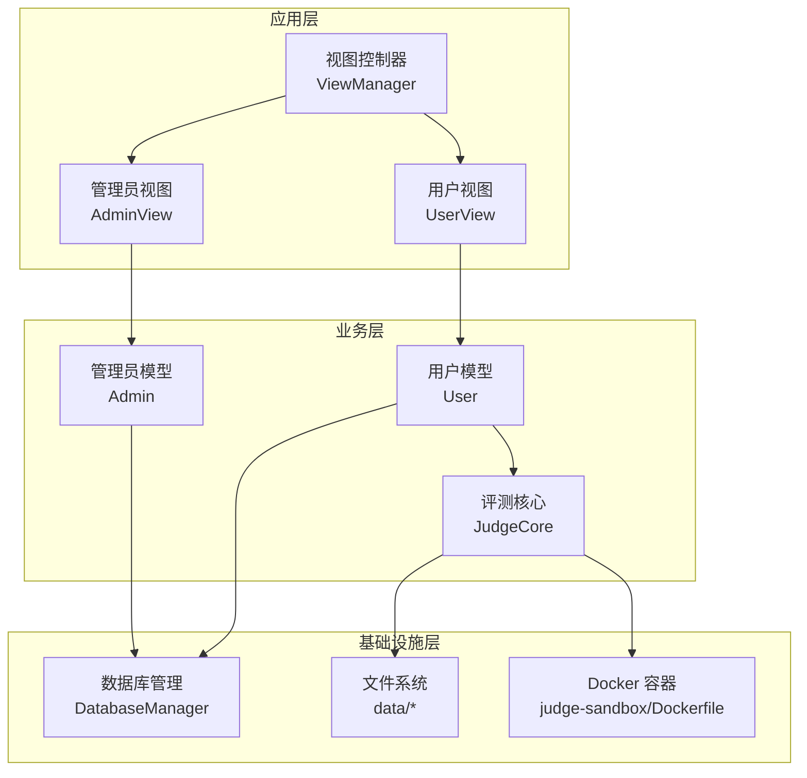
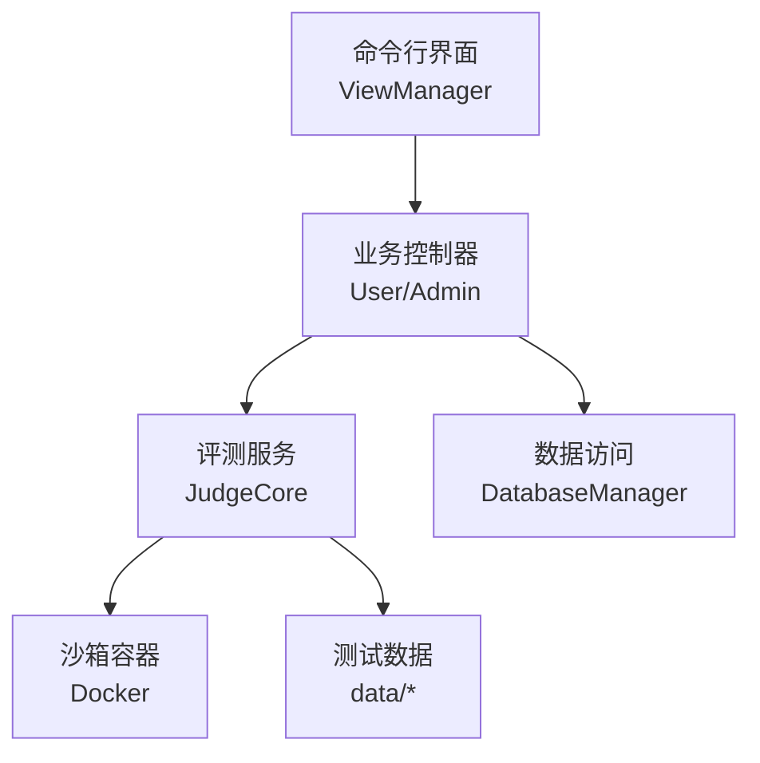
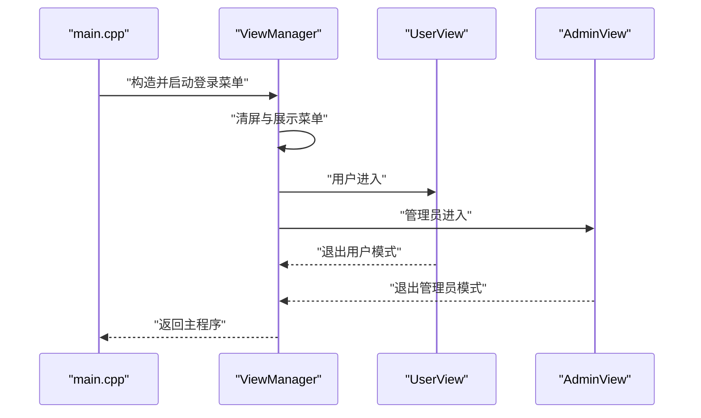
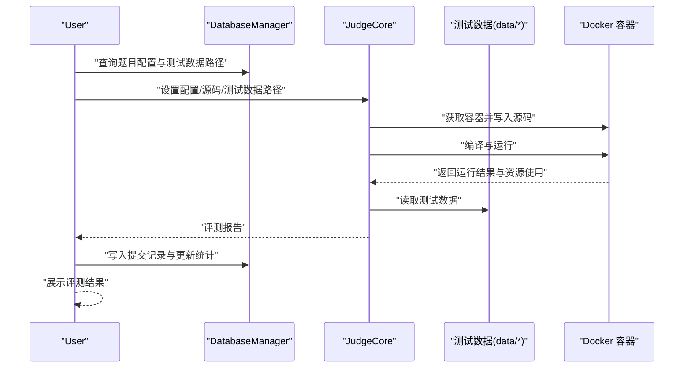
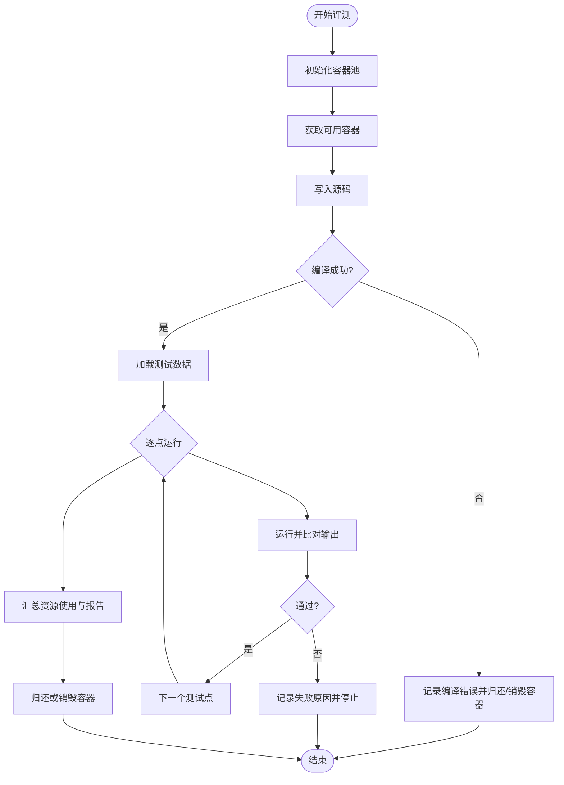
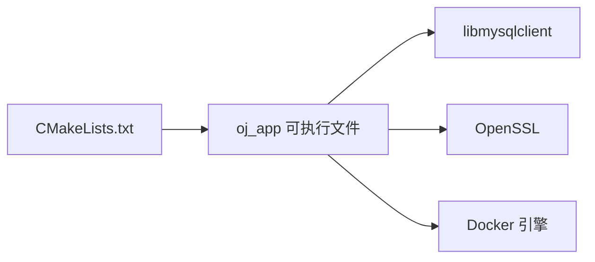

# 项目概述

<cite>
**本文引用的文件**
- [README.md](file://README.md)
- [CMakeLists.txt](file://CMakeLists.txt)
- [setup.sh](file://setup.sh)
- [init.sql](file://init.sql)
- [src/main.cpp](file://src/main.cpp)
- [include/view_manager.h](file://include/view_manager.h)
- [src/view_manager.cpp](file://src/view_manager.cpp)
- [include/user.h](file://include/user.h)
- [src/user.cpp](file://src/user.cpp)
- [include/admin.h](file://include/admin.h)
- [src/admin.cpp](file://src/admin.cpp)
- [include/db_manager.h](file://include/db_manager.h)
- [include/judge_core.h](file://include/judge_core.h)
- [src/judge_core.cpp](file://src/judge_core.cpp)
- [docs/code_submission_design.md](file://docs/code_submission_design.md)
</cite>

## 目录
1. [简介](#简介)
2. [项目结构](#项目结构)
3. [核心组件](#核心组件)
4. [架构总览](#架构总览)
5. [详细组件分析](#详细组件分析)
6. [依赖分析](#依赖分析)
7. [性能考虑](#性能考虑)
8. [故障排查指南](#故障排查指南)
9. [结论](#结论)
10. [附录](#附录)

## 简介
本项目是一个命令行交互式的在线评测（Online Judge，简称 OJ）系统，面向编程练习与能力评测。系统围绕“用户—题目—评测—反馈”的闭环设计，提供在线代码提交、自动评测、结果展示、用户管理与管理员维护等功能。系统采用模块化设计与分层架构，结合容器化沙箱实现安全可靠的代码执行与资源隔离，同时预留与 AI 辅助服务的集成接口，支持以“工作区文件”为中心的代码持久化与历史管理。

系统目标与定位：
- 作为命令行交互平台，降低学习门槛，聚焦算法与编程实践。
- 通过容器化沙箱保障评测过程的安全与稳定，避免资源滥用与系统风险。
- 为初学者提供清晰的评测反馈，为进阶用户提供可扩展的评测配置与历史追踪能力。
- 为后续引入 AI 辅助提供基础能力，如工作区代码读取、题目上下文传递与历史记录回溯。

## 项目结构
项目采用模块化组织方式，核心目录与职责如下：
- include/：对外公开的头文件，定义各模块的接口与数据结构。
- src/：各模块的实现文件，包含业务逻辑与控制流程。
- data/：评测测试数据目录，按题目 ID 组织输入输出文件。
- docs/：设计文档与实现计划，指导后续功能扩展。
- ai/：AI 服务相关依赖与脚本（当前为占位，配合后续集成）。
- judge-sandbox/：评测沙箱的 Dockerfile，用于构建评测容器镜像。
- workspace/：工作区目录（由设计文档规划），用于统一存放用户代码文件。
- 根目录脚本：CMakeLists.txt（构建配置）、setup.sh（一键部署）、init.sql（数据库初始化）。

图表来源
- [include/view_manager.h:11-40](file://include/view_manager.h#L11-L40)
- [include/user.h:11-99](file://include/user.h#L11-L99)
- [include/admin.h:10-37](file://include/admin.h#L10-L37)
- [include/judge_core.h:111-186](file://include/judge_core.h#L111-L186)
- [include/db_manager.h:12-53](file://include/db_manager.h#L12-L53)
- [CMakeLists.txt:23-27](file://CMakeLists.txt#L23-L27)

章节来源
- [CMakeLists.txt:1-40](file://CMakeLists.txt#L1-L40)
- [setup.sh:1-41](file://setup.sh#L1-L41)
- [init.sql:1-278](file://init.sql#L1-L278)

## 核心组件
- 视图控制器（ViewManager）：负责命令行界面的主菜单与角色选择，协调用户视图与管理员视图的启动与退出。
- 用户模型（User）：封装用户登录、注册、密码修改、题目浏览、提交评测、历史查看等业务逻辑，并与数据库与评测核心交互。
- 管理员模型（Admin）：提供题目发布、题目列表与详情查看等后台维护能力。
- 评测核心（JudgeCore）：封装评测配置、源码写入、编译、运行、资源监控、结果比对与报告生成，使用容器池实现资源隔离与并发控制。
- 数据库管理（DatabaseManager）：封装 MySQL 连接、SQL 执行与查询结果返回，提供转义与安全防护。
- 构建与部署：CMakeLists.txt 定义编译标准、依赖查找与链接；setup.sh 与 init.sql 提供一键部署与数据库初始化。

章节来源
- [include/view_manager.h:11-40](file://include/view_manager.h#L11-L40)
- [include/user.h:11-99](file://include/user.h#L11-L99)
- [include/admin.h:10-37](file://include/admin.h#L10-L37)
- [include/judge_core.h:111-186](file://include/judge_core.h#L111-L186)
- [include/db_manager.h:12-53](file://include/db_manager.h#L12-L53)
- [src/main.cpp:5-12](file://src/main.cpp#L5-L12)

## 架构总览
系统采用分层与模块化相结合的架构：
- 表现层：命令行界面与视图控制器，负责用户交互与流程调度。
- 业务层：用户与管理员模型，封装领域业务与数据访问。
- 领域服务层：评测核心，负责评测流程与资源控制。
- 基础设施层：数据库与容器沙箱，提供数据持久化与执行隔离。

图表来源
- [include/view_manager.h:11-40](file://include/view_manager.h#L11-L40)
- [include/user.h:11-99](file://include/user.h#L11-L99)
- [include/admin.h:10-37](file://include/admin.h#L10-L37)
- [include/judge_core.h:111-186](file://include/judge_core.h#L111-L186)
- [include/db_manager.h:12-53](file://include/db_manager.h#L12-L53)

## 详细组件分析

### 视图控制器与入口流程
- 入口：main.cpp 启动 ViewManager，进入登录菜单。
- 登录菜单：支持管理员与用户两种角色，分别进入对应的视图模块。
- 控制器职责：清屏、菜单展示、输入校验与流程跳转。

图表来源
- [src/main.cpp:5-12](file://src/main.cpp#L5-L12)
- [src/view_manager.cpp:32-70](file://src/view_manager.cpp#L32-L70)
- [include/view_manager.h:11-40](file://include/view_manager.h#L11-L40)

章节来源
- [src/main.cpp:5-12](file://src/main.cpp#L5-L12)
- [src/view_manager.cpp:14-76](file://src/view_manager.cpp#L14-L76)
- [include/view_manager.h:11-40](file://include/view_manager.h#L11-L40)

### 用户模块与评测流程
- 用户登录/注册：通过 DatabaseManager 查询与更新用户表，使用 SHA256 哈希保护密码。
- 题目浏览与详情：查询题目表并格式化输出，支持中文标题宽度计算与截断。
- 代码提交：读取题目配置（时间/内存限制、测试数据路径），调用 JudgeCore 执行评测，生成评测报告并写入 submissions 表，更新用户统计。
- 历史查看：查询 submissions 表并格式化输出最近提交记录。

图表来源
- [src/user.cpp:266-498](file://src/user.cpp#L266-L498)
- [include/user.h:55-75](file://include/user.h#L55-L75)
- [src/judge_core.cpp:126-249](file://src/judge_core.cpp#L126-L249)
- [include/judge_core.h:111-186](file://include/judge_core.h#L111-L186)

章节来源
- [src/user.cpp:41-139](file://src/user.cpp#L41-L139)
- [src/user.cpp:141-264](file://src/user.cpp#L141-L264)
- [src/user.cpp:266-498](file://src/user.cpp#L266-L498)
- [include/user.h:11-99](file://include/user.h#L11-L99)

### 管理员模块与数据库维护
- 题目发布：直接执行 SQL，便于快速添加题目。
- 题目列表与详情：查询题目表并格式化输出，支持 JSON 美化输出。

章节来源
- [src/admin.cpp:12-58](file://src/admin.cpp#L12-L58)
- [include/admin.h:10-37](file://include/admin.h#L10-L37)

### 评测核心与沙箱执行
- 配置与安全：支持时间/内存/输出限制、只读文件系统、禁用网络、Seccomp 等安全策略。
- 测试数据加载：按 1.in/1.out...N.in/N.out 自动匹配。
- 结果比对：忽略行尾空白进行输出比对，首个失败点决定测试点结果。
- 容器池：惰性初始化，常驻+临时容器组合，提升并发与资源利用率。

图表来源
- [src/judge_core.cpp:126-249](file://src/judge_core.cpp#L126-L249)
- [include/judge_core.h:28-102](file://include/judge_core.h#L28-L102)

章节来源
- [src/judge_core.cpp:12-34](file://src/judge_core.cpp#L12-L34)
- [src/judge_core.cpp:73-94](file://src/judge_core.cpp#L73-L94)
- [src/judge_core.cpp:126-249](file://src/judge_core.cpp#L126-L249)
- [include/judge_core.h:28-102](file://include/judge_core.h#L28-L102)

### 数据库与权限设计
- 数据库初始化：创建数据库、用户表、题目表、提交记录表，并设置管理员与受限用户权限。
- 权限策略：管理员全权限，普通用户仅对自身数据具备读写权限，行级隔离由应用层 WHERE 条件保障。
- 示例数据：内置多道题目与示例用户，便于快速验证。

章节来源
- [init.sql:8-95](file://init.sql#L8-L95)
- [init.sql:97-278](file://init.sql#L97-L278)

### AI 辅助与工作区设计（规划）
- 工作区文件：统一使用 workspace/solution.cpp 作为用户编辑与提交的代码文件，提交时读取并保存到数据库。
- AI 上下文：读取工作区代码与题目信息，拼装为问题上下文传给 AI 服务，避免跨用户数据泄露。
- 历史管理：支持按提交 ID 下载到 history/ 目录，或加载到工作区继续编辑。

章节来源
- [docs/code_submission_design.md:36-128](file://docs/code_submission_design.md#L36-L128)
- [docs/code_submission_design.md:131-210](file://docs/code_submission_design.md#L131-L210)
- [docs/code_submission_design.md:283-420](file://docs/code_submission_design.md#L283-L420)

## 依赖分析
- 构建与编译：CMakeLists.txt 指定 C++17 标准、导出编译数据库、查找 MySQL 与 OpenSSL，并链接生成可执行文件。
- 运行时依赖：MySQL 客户端库、OpenSSL 库、Docker（用于评测沙箱）。
- 部署与初始化：setup.sh 负责创建目录与执行数据库初始化脚本；init.sql 完成数据库与用户权限配置。

图表来源
- [CMakeLists.txt:11-34](file://CMakeLists.txt#L11-L34)

章节来源
- [CMakeLists.txt:11-34](file://CMakeLists.txt#L11-L34)
- [setup.sh:14-29](file://setup.sh#L14-L29)

## 性能考虑
- 容器池策略：惰性初始化与常驻+临时容器组合，减少容器创建开销，提升并发评测效率。
- 资源限制：严格的时间、内存与输出大小限制，避免单题占用过多系统资源。
- I/O 优化：测试数据按序号自动匹配，减少文件扫描成本；输出比对忽略行尾空白，提高稳定性。
- 数据库访问：查询与更新集中在关键路径（提交与统计），建议在高并发场景下增加索引与连接池策略。

## 故障排查指南
- 登录失败：检查账号是否存在与密码哈希是否匹配；确认数据库连接正常。
- 评测失败：检查 Docker 是否可用、容器池初始化是否成功；核对测试数据路径与可读权限。
- 数据库异常：确认 init.sql 已正确执行，用户权限已刷新；检查 oj_user 的权限范围。
- 输入异常：登录菜单对非数字输入进行清屏与提示，注意输入缓冲区清理。

章节来源
- [src/user.cpp:41-73](file://src/user.cpp#L41-L73)
- [src/judge_core.cpp:131-147](file://src/judge_core.cpp#L131-L147)
- [setup.sh:17-29](file://setup.sh#L17-L29)

## 结论
本 OJ 系统以模块化与分层架构为核心，结合容器化沙箱实现安全、稳定的在线评测能力，并通过统一的工作区与历史管理设计为后续 AI 辅助提供良好基础。系统在命令行环境下提供了清晰的交互流程与完善的错误处理，适合教学与自测场景。建议在后续迭代中完善工作区文件机制、历史下载与 AI 集成，持续优化评测性能与用户体验。

## 附录
- 使用场景示例
  - 初学者练习：查看题目列表与详情，编写代码并提交评测，查看历史记录与评测报告。
  - 教师/助教：使用管理员角色发布题目、查看题目详情与列表，辅助学生学习。
  - 自动化评测：通过统一工作区与历史管理，支持批量下载与对比分析。
- 系统边界说明
  - 数据边界：用户仅能访问自身数据，管理员具备发布与查看权限，行级隔离由应用层 WHERE 条件保障。
  - 执行边界：评测在容器内进行，禁止网络访问、限制文件系统与 capabilities，避免对宿主机造成影响。
  - 接口边界：AI 服务仅接收经应用层拼装的问题上下文，不直接访问数据库或用户代码文件。